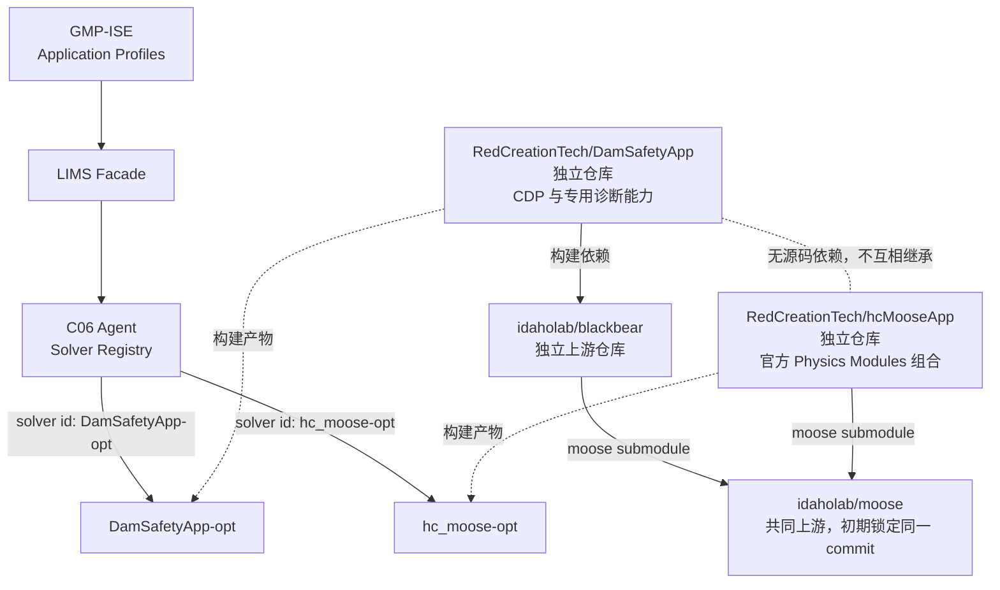

# MOOSE 官方算例与 hcMooseApp 开发任务清单

> 编制日期：2026-09-28
> 当前状态：Round A 已验收；Round B / TASK-MOOSECASE-006 已通过远端准出
> 本地仓库基线：`main@2dda489fbacd4621dbe817cbf8c1a9b47d065615`
> 计算节点：`kevin@192.168.0.138`（2026-09-28 由 `192.168.0.121` 切换，同一物理节点）
> 任务轨道：`TASK-MOOSECASE-*`

Round A 的产出物边界、五个算例说明和人工验证步骤见：
[MOOSE 官方算例 Round A 产出物说明与人工验证](MOOSE官方算例RoundA产出物说明与人工验证.md)。

Round B 的 CAE 逐项人工准出见：
[MOOSE 官方算例 Round B CAE 人工验证手册](MOOSE官方算例RoundB-CAE人工验证手册.md)。

## 1. 目标

在计算节点 `192.168.0.138` 上建立 GMP-ISE 自有的 MOOSE Application：

| 项目 | 冻结名称 |
|---|---|
| Stork 参数 | `HcMoose` |
| C++ Application 类 | `HcMooseApp` |
| Makefile `APPLICATION_NAME` | `hc_moose` |
| Executable | `hc_moose-opt` |
| GMP-ISE Application Profile | `hc_moose-opt` |
| UI 名称 | `HC MOOSE CAE [prototype]` |

首期只组合 MOOSE 官方 Physics Modules，不开发自定义物理 Object：

```makefile
ALL_MODULES     := no
HEAT_TRANSFER   := yes
SOLID_MECHANICS := yes
CONTACT         := yes
```

以同一 MOOSE commit 依次完成五个官方算例：

| ID | 能力 | 冻结参考输入 |
|---|---|---|
| MC01 | 瞬态热传导 | `modules/heat_transfer/tutorials/introduction/therm_step03.i` |
| MC02 | 热-结构耦合 | `modules/combined/tutorials/introduction/thermal_mechanical/thermomech_step01.i` |
| MC03 | 无摩擦接触 | `modules/contact/tutorials/introduction/step01.i` |
| MC04 | J2 各向同性塑性 | `modules/solid_mechanics/test/tests/recompute_radial_return/isotropic_plasticity_finite_strain.i` |
| MC05 | Newmark 动力学 | `modules/solid_mechanics/test/tests/dynamics/time_integration/newmark.i` |

最终闭环为：

```text
官方 .i 冻结
  -> 工程语义拆解
  -> hcGmsh Capability Gap
  -> 最小产品实现
  -> 结构化 UI 生成 .i
  -> hc_moose-opt 实算
  -> 数值与物理趋势验收
  -> 人工操作文档和演示素材
```

首批五个案例最终各形成一份可独立执行的人工操作文档，完整覆盖：

```text
新建项目并选择 hc_moose-opt
  -> CAE 几何/网格/材料/物理/边界/分析步预处理
  -> 结构化生成并核对 .i
  -> 导出不可变 Job Snapshot
  -> 经 LIMS/C06 提交到 192.168.0.138 的 hc_moose-opt
  -> 监控计算并取得结果目录
  -> 在 GMP-ISE 导入结果目录
  -> 场结果、历史曲线和定量指标后处理
```

五份人工操作文档是主要用户产出；每个案例同时保留 `case.yaml`、官方参考、自动合同、验收记录和截图等工程证据，不能只交付操作文字。

## 2. 已核实现状

### 2.1 本地 GMP-ISE

- 工作区当前干净，`HEAD == origin/main == 2dda489f`。
- 已有 `DamSafetyApp-opt`、`blackbear-opt`、`combined-opt` 三个 Application Profile。
- `ApplicationProfile` 已包含 `solver_program`、`compute_environment`、mapping、检查命令和单位合同，但没有强类型 solver identity。
- 远端作业固定走 `GMP-ISE -> LIMS Facade -> C06 Agent`；桌面端不直连计算节点，也不保存节点凭据。

### 2.2 计算节点 192.168.0.138

- SSH 已验证可只读访问，用户为 `kevin`。
- `DamSafetyApp` 是独立 Git 仓库：`/home/kevin/DamSafetyApp`，remote 为 `RedCreationTech/DamSafetyApp`。
- BlackBear 物理上位于 `/home/kevin/DamSafetyApp/.upstream/blackbear`，但有自己的 `.git` 和 `idaholab/blackbear` remote，是独立 Git 仓库；DamSafetyApp 通过 `.gitignore` 排除整个 `.upstream/`，并未把 BlackBear 源码提交进自身仓库。
- 当前 MOOSE 源码位于 `/home/kevin/DamSafetyApp/.upstream/blackbear/moose`，它是 BlackBear 仓库声明的 Git submodule，也是独立 Git 工作树。
- `combined-opt` 不是独立仓库；它属于 MOOSE 仓库的 `modules/combined` 目录。当前 DamSafetyApp 上游树中没有构建该二进制，节点另一套无关工作树中存在一个 `combined-opt`。
- MOOSE commit 为 `4bce02d91b56c7ed845a5747df4d24f415592504`。
- BlackBear commit 为 `1c190fd3d2b5f06a3518923f550a0e0a90b015d4`。
- 当前 `DamSafetyApp-opt --version` 报告 `snapshot-20-10-27-55470-g4bce02d91b`，动态链接同一 MOOSE 源码树。
- 节点已有 Miniforge 和可复用构建环境 `/home/kevin/DamSafetyApp/.build/env`。
- 冻结 MOOSE commit 自带的 versioner 要求 `moose-dev=2026.07.30`；现有 DamSafetyApp 环境使用同一版本和 MPICH 构建。
- 节点当前可用空间约 166 GB；现有完整构建环境约 5.4 GB。
- MC01～MC05 候选输入在该 MOOSE commit 中均真实存在；因此先以此 commit 做 Baseline v1 资格验证，不先升级 upstream。

### 2.3 当前远端执行约束

- C06 Agent 当前每次启动只加载一个 `AGENT_SOLVER`，不是多求解器注册表。
- 已有 `dam-safety-app` 和 `blackbear` 两个启动画像，但切换画像需要重启 Agent。
- Agent 实际执行命令来自服务端配置；manifest 中的程序名只做白名单校验，不能据此按 Job 切换二进制。
- 因此“编译出 `hc_moose-opt`”与“GMP-ISE 可选择并提交 `hc_moose-opt`”是两个独立准出项。
- GMP-ISE 下拉列表来自本地 `templates/moose/profiles/*.json`；显示某个 profile 只代表客户端声明了该应用档案，不证明当前计算节点已经构建或注册同名二进制。

## 3. 范围与红线

### 3.1 本轮范围

1. 在 138 上创建、构建、测试并冻结 `HcMooseApp`。
2. 记录 app commit、MOOSE commit、构建环境和二进制 SHA-256。
3. 用 `hc_moose-opt` 对 MC01～MC05 执行官方输入资格验证。
4. 建立 `hc_moose-opt` Application Profile 和独立 mapping 文件。
5. 先完成 MC01 的冻结、语义拆解和 Capability Gap，再决定产品代码最小改动。
6. 逐例完成 MC01～MC05，每例通过全部闸门后才进入下一例。

### 3.2 明确不做

- 不在 macOS 本机构建 MOOSE。
- 不使用 `ALL_MODULES=yes`。
- 不为首批案例开发 `HcHeatConduction`、`HcContact` 等自定义物理 Object。
- 不为了复制官方 `[Mesh]` 而实现整套 MeshGenerator UI。
- 不建设任意 Kernel、Variable 或 MOOSE Schema IDE。
- 不用 Custom Block、手改生成 `.i` 或终端输入替代正式 GUI 验收。
- 不在 MC01 Gap 明确前大规模修改 GMP-ISE 产品代码。
- 不擅自执行全量 GUI 巡览，不擅自提交或推送 Git。

## 4. 统一转换与验收规则

### 4.1 官方输入转换类型

| 类型 | 含义 | 示例 |
|---|---|---|
| A. Exact Mapping | MOOSE Object 一一对应 | `HeatConduction` |
| B. CAE Native Equivalent | 由 hcGmsh 原生能力表达同一工程语义 | `GeneratedMeshGenerator -> Gmsh Mesh + FileMesh` |
| C. Auto Generated | 一个工程对象展开为多个 MOOSE Object | 各向同性塑性材料链 |
| D. Unsupported | 当前不能可靠表示 | 登记 Gap，阻止准出 |

### 4.2 三层等价验收

1. CAE Model Semantic：几何、网格、材料、载荷、边界和分析步等价。
2. MOOSE Physics Semantic：关键 Block、Object、参数、引用和求解过程等价。
3. Numerical Result：标量、曲线、场量及物理趋势在冻结容差内一致。

不要求生成 `.i` 与官方文件逐字相同，也不以节点编号作为唯一数值基准。

## 5. Batch 0：HC MOOSE Baseline

### TASK-MOOSECASE-005A 远端环境冻结

- **目标**：记录可复现构建所需的真实环境，不改动现有 DamSafetyApp 部署。
- **工作**：记录 OS、编译器、MPI/PETSc/libMesh、环境路径、MOOSE commit 和当前磁盘空间；确认构建目录与现有发布目录隔离。
- **产出**：`VERSION.md` 或等价 solver identity 文件；远端环境盘点记录。
- **准出**：能够从记录回答“使用了哪个 MOOSE、哪个环境、在哪里构建”。

### TASK-MOOSECASE-005B 创建 HcMooseApp

- **目标**：在 `/home/kevin/hcMooseApp` 建立最小官方 MOOSE Application。
- **工作**：从已创建的 private 仓库 `git@github.com:RedCreationTech/hcMooseApp.git` 初始化节点工作树；使用当前 MOOSE 版本自带的 Application 生成方式创建骨架；以 `moose/` submodule 精确锁定 MOOSE commit；只开启 Heat Transfer、Solid Mechanics、Contact；保持标准 `Makefile`、`run_tests`、`include/`、`src/`、`test/`。
- **禁止**：复制 DamSafetyApp 的 CDP 自定义源码；预建首期不需要的 Object 或模块。
- **准出**：`hc_moose-opt` 构建成功，`--version` 可追溯到冻结 MOOSE commit，最小 app smoke test 通过。

### TASK-MOOSECASE-005C 冻结求解器身份

- **目标**：让每次计算可以准确回答实际求解器身份。
- **最小身份字段**：

```yaml
id: hc_moose-opt
application: HcMooseApp
application_commit: <40hex>
moose_commit: 4bce02d91b56c7ed845a5747df4d24f415592504
build: opt
binary_sha256: <64hex>
modules:
  - HEAT_TRANSFER
  - SOLID_MECHANICS
  - CONTACT
```

- **准出**：身份来自 Git、构建产物和 SHA-256，不由人工手填猜测；重建后差异可审计。

### TASK-MOOSECASE-005D 官方输入资格验证

- **目标**：在不改官方输入物理语义的前提下，验证 Baseline v1 是否覆盖 MC01～MC05。
- **工作**：逐例保存输入 SHA-256、依赖闭包、运行目录和 `--check-input` 结果；必要时记录官方测试 harness 所注入的参数。
- **分支规则**：只有出现关键 Object 缺失或无法兼容的硬证据时，才提出升级 MOOSE commit；五例必须使用同一 commit。
- **准出**：五例均有明确 PASS，或有带原始错误证据的升级决策。

### TASK-MOOSECASE-006 远端求解器接入与身份握手

- **目标**：让 GMP-ISE 选择 `hc_moose-opt` 后，服务端实际执行同一二进制并返回可核对身份。
- **现状差距**：C06 Agent 是单活动求解器模型；需先确认采用多求解器注册表还是临时启动画像。
- **最低安全合同**：客户端只能提交注册表中的 solver id；服务端决定真实 argv；路径不由客户端传入；Job 固化实际 app/MOOSE/binary/node 身份；身份不匹配时阻止 production 提交。
- **兼容合同**：新增显式 `solver_id` 作为求解器选择参数；已有调用方未提供 `solver_id` 时继续解析为配置中的 `default_solver_id = dam-safety-app`，保持当前默认行为并记录 `selection_mode = legacy_default`。新 GMP-ISE profile 必须显式提交 `hc_moose-opt`；未知 id 返回 422，不允许回退到默认求解器。
- **审计合同**：Job 同时记录 requested/resolved solver id 和实际 solver identity；manifest 中的展示命令不再拥有选择二进制的权力，也不接受客户端传入可执行路径。
- **准出**：一次 `hc_moose-opt` 作业和一次既有 DamSafetyApp 作业互不串用二进制，Job 记录可证明实际执行身份。

### Batch 0 总准出

- [x] `hc_moose-opt` 可构建、可运行、可追溯。
- [x] MC01～MC05 在同一 MOOSE commit 完成资格检查。
- [x] 现有 DamSafetyApp 发布和 Agent 作业目录未被覆盖。
- [ ] GMP-ISE 声明的 profile 与计算节点实际求解器身份可比较。
- [ ] 不依赖人工记忆或 PATH 偶然命中求解器。

## 6. Batch 1：MC01 瞬态热传导

### TASK-MOOSECASE-010 冻结官方参考

- 冻结 MOOSE commit、官方相对路径、输入 SHA-256、依赖文件和参考结果。
- 原始官方输入先完成 `--check-input` 和 solve；失败时记录原因，不先改写成 hcGmsh 版本。
- 新建 `doc/moose-official-cases/MC01-transient-heat/`，保存 `README.md`、`official-reference.md` 和 `case.yaml`。

### TASK-MOOSECASE-020 逐 Block 语义拆解

- 把 Mesh、Variables、Kernels、Materials、ICs、BCs、Executioner、Postprocessors 和 Outputs 映射为工程语义。
- 每个对象标记 A/B/C/D 转换类型，并指向现有 GMP-ISE 对象或明确 Gap。

### TASK-MOOSECASE-030 Capability Gap

- 先完成整个 MC01 Gap，再合并为最小产品任务。
- 优先复用已有 FunctionDirichletBC、Transient、输出和 FileMesh 能力。
- 不因缺一个底层 Object 就创建通用编辑器。

### TASK-MOOSECASE-040 最小功能补齐

- 只实现 MC01 真正缺少的 Thermal Physics、Temperature、Thermal Material、Initial Temperature 及必要结果表达。
- 新建独立 `templates/moose/mapping-hcmoose-v1.json`，不扩散到现有 production profile。
- 新建 `templates/moose/profiles/hc_moose-opt.json`，初始始终为 `prototype`。

### TASK-MOOSECASE-050 自动合同

- 增加一个最小定向合同 `moosecase_mc01_transient_heat_contract`。
- 至少检查对象类型、参数、引用、边界、Executioner、Output、保存重开和重复生成确定性。
- 关键语义使用结构化解析，不以若干字符串 contains 充当全部证据。

### TASK-MOOSECASE-060～110 人工闭环与内容包

- 060：从空项目开始的人工操作说明，覆盖预处理、生成 `.i`、远端提交、结果目录导入和后处理。
- 070：严格按文档完成真实 GUI 复现。
- 080：Generated vs Official 三层语义等价检查。
- 090：求解、数值指标和物理趋势验收。
- 100：统一截图和必要录屏。
- 110：形成 README、操作说明、验收记录、reference 和 screenshots 内容包。

## 7. MC02～MC05 顺序

每个案例复用 MC01 的 010～110 闸门，不并行铺开大规模产品实现：

1. MC02：在 MC01 上增加 Solid Mechanics、HeatSource 和 Thermal Expansion。
2. MC03：只做 frictionless + penalty，重点验证 Physical Group 到 primary/secondary 的稳定引用。
3. MC04：普通用户只选择 Isotropic Plasticity，由生成器展开官方材料链。
4. MC05：首轮只实现 Newmark，以及 displacement/velocity/acceleration 历史结果。

一个案例未达到人工闭环 D，不开始下一个案例的大规模实现。

## 8. 测试策略

### 8.1 远端 HcMooseApp

- 每次 Makefile/module/app 改动运行最小 `run_tests` 或对应单例测试。
- 每个官方案例先跑 `--check-input`，再跑一次真实 solve。
- 保存命令、退出码、关键日志、输入和输出 SHA-256。

### 8.2 本地 GMP-ISE

- 每次产品代码修改只运行直接相关的 1～2 个定向用例。
- 没有直接用例时，先新增最小 CTest 或 GUI Tour 合同再验证。
- 涉及 profile/mapping/schema 时运行相关 CTest。
- 全量真实点击巡览和全量 CTest 只在用户明确要求时执行。
- 巡览基线只增不减。

## 9. 里程碑

| 里程碑 | 完成条件 | 状态 |
|---|---|---|
| M0 | Round A 关键决策确认 | ✅ 完成 |
| M1 | `hc_moose-opt` 远端构建与身份冻结 | ✅ 完成 |
| M2 | MC01～MC05 Baseline v1 资格验证 | ✅ 完成 |
| M3 | 远端接入与身份握手 | ✅ 完成（待提交） |
| M4 | MC01 达 D | 未开始 |
| M5 | MC02 达 D | 未开始 |
| M6 | MC03 达 D | 未开始 |
| M7 | MC04 达 D | 未开始 |
| M8 | MC05 达 D，Profile 可评估 production | 未开始 |

## 10. 决策记录

### Q-MOOSE-01 远端 Agent 是否本轮升级为按 Job 选择求解器？

- **背景**：当前 C06 Agent 启动时只加载一个 `AGENT_SOLVER`。只新增 `hc-moose.env` 虽然代码最少，但需要停机切换，并可能让 DamSafetyApp 作业误用 `hc_moose-opt`。
- **推荐**：纳入本轨道，但分两步实施。先完成 TASK-MOOSECASE-005 和五例直接资格检查；确认 app 基线可用后，再做 TASK-MOOSECASE-006 的最小多求解器注册表与按 Job solver id 路由。不要阻塞 `hcMooseApp` 创建，也不要用重启画像作为正式产品方案。
- **备选**：本轮只增加 `hc-moose` 启动画像，人工停机切换；实现快，但不能支持 GMP-ISE 多 Application Profile 的正式并存。
- **决策**：✅ 已确认（2026-09-28）。采用推荐方案：TASK-MOOSECASE-005 与 MC01～MC05 直接资格验证先行；基线确认可用后，TASK-MOOSECASE-006 实现最小多求解器注册表和按 Job solver id 路由。人工重启画像只保留为运维诊断手段，不作为正式产品工作流。

### Q-MOOSE-02 hcMooseApp 的代码真源和 MOOSE 依赖如何管理？

- **背景**：138 当前可复用 `/home/kevin/DamSafetyApp/.upstream/blackbear/moose`，但该路径属于 DamSafetyApp/BlackBear 的内部构建树。直接长期引用它代码最少，却会让 `hcMooseApp` 的可复现性受另一个应用目录影响。
- **推荐**：建立独立仓库 `RedCreationTech/hcMooseApp`，节点工作目录固定为 `/home/kevin/hcMooseApp`；仓库把 MOOSE 作为 `moose/` Git submodule，精确锁定 `4bce02d91b56c7ed845a5747df4d24f415592504`。构建环境可以复用节点已有工具链，但源码身份不复用 DamSafetyApp 的内部路径。
- **备选**：先建立本地 Git 仓库，通过 `MOOSE_DIR=/home/kevin/DamSafetyApp/.upstream/blackbear/moose` 构建；初始占用更少，但发布、重建和迁移节点时必须额外恢复这条外部路径合同。
- **决策**：✅ 已确认（2026-09-28）。采用推荐方案：建立独立仓库 `RedCreationTech/hcMooseApp`，节点目录固定为 `/home/kevin/hcMooseApp`，MOOSE 作为 `moose/` Git submodule 精确锁定；只复用节点已有编译工具链，不依赖 DamSafetyApp 的内部源码路径。

### Q-MOOSE-03 HC MOOSE Baseline v1 从哪个 MOOSE commit 起步？

- **背景**：当前产品与 138 上的 DamSafetyApp/BlackBear 已统一使用 `4bce02d91b56c7ed845a5747df4d24f415592504`；MC01～MC05 候选输入在该 commit 中均存在，但尚未由新的 `hc_moose-opt` 完成五例资格检查。直接升级 upstream 会同时引入语法、依赖和结果基线变化。
- **推荐**：Baseline v1 先锁定 `4bce02d91b56c7ed845a5747df4d24f415592504`。只有 TASK-MOOSECASE-005D 给出关键 Object 缺失、官方输入无法兼容或已知缺陷阻断的证据时，才单独立项选择一个新 commit，并让 MC01～MC05 整体迁移，不允许逐例使用不同版本。
- **备选**：创建 `hcMooseApp` 时直接跟踪当日 upstream；能获得最新功能，但会扩大首轮变量，且与现有 CDP/BlackBear 基线失去直接可比性。
- **决策**：✅ 已确认（2026-09-28）。Baseline v1 锁定 `4bce02d91b56c7ed845a5747df4d24f415592504`；只有 TASK-MOOSECASE-005D 形成硬阻断证据时才评估整体升级，MC01～MC05 不得混用 MOOSE commit。

### Q-MOOSE-04 MC01 冻结 therm_step03.i 还是 therm_step03a.i？

- **核对结果**：在冻结 commit 中，两份输入只有两个实质差异：`therm_step03a.i` 增加 `HeatSource(value = 1e4)`，并更改 CSV `file_base`；其余 Mesh、Variable、传导/时间导数、材料、BC、Executioner 和 LineValueSampler 相同。
- **推荐**：MC01 冻结 `therm_step03.i`。它只引入 Temperature、HeatConduction、HeatConductionTimeDerivative、Thermal Material 和瞬态结果；`HeatSource` 留给 MC02 热-力耦合批次，保持“每个案例只扩一圈能力”的顺序。
- **备选**：使用 `therm_step03a.i`，让 MC01 同时覆盖体热源；案例更完整，但会扩大首例 Gap，并与 MC02 的增量边界重叠。
- **决策**：✅ 已确认（2026-09-28）。MC01 冻结 `modules/heat_transfer/tutorials/introduction/therm_step03.i`；`therm_step03a.i` 不作为首例基线，`HeatSource` 留到 MC02 引入。

### Q-MOOSE-05 hcMooseApp 是否使用独立 Conda 构建环境？

- **核对结果**：冻结 MOOSE commit 的 `scripts/versioner.py moose-dev` 返回 `2026.07.30`；138 上现有 DamSafetyApp 环境正使用 `moose-dev 2026.07.30`、MPICH、`moose-libmesh 2026.06.05_ab36c00` 和 `moose-petsc 3.25.2`。节点当前剩余约 164 GB，现有环境约 5.4 GB。
- **推荐**：在 `/home/kevin/hcMooseApp/.build/env` 创建独立前缀，仓库提交最小 `environment.yml`，锁定官方 channel、conda-forge、`moose-dev=2026.07.30=mpich`；首次构建后把实际关键包版本写入 solver identity。不要直接把 DamSafetyApp 的私有环境路径作为运行时依赖。
- **备选**：直接复用 `/home/kevin/DamSafetyApp/.build/env`；能节省初始环境空间和创建时间，但两个应用会共享可变工具链，之后任一方更新环境都可能改变另一方的构建或运行身份。
- **决策**：✅ 已确认（2026-09-28）。在 `/home/kevin/hcMooseApp/.build/env` 创建独立 Conda 前缀，以仓库内最小 `environment.yml` 锁定 `moose-dev=2026.07.30=mpich`；实际关键包版本同时进入 solver identity，不依赖 DamSafetyApp 私有环境。

### Q-MOOSE-06 hcMooseApp 与 DamSafetyApp 的关系及仓库可见性

- **关系定位**：`hcMooseApp` 与 `DamSafetyApp` 是并列的兄弟 Application，不是父子、插件或 fork 关系，也不互相链接源码。
- **职责边界**：`DamSafetyApp` 继续承载 CDP 和专用诊断能力；`hcMooseApp` 首期只组合 MOOSE 官方 Heat Transfer、Solid Mechanics、Contact Modules，承载 MOOSECASE 官方算例轨道。
- **共享边界**：二者初期锁定同一 MOOSE commit，并共用 LIMS/C06 计算基础设施；但各自拥有独立仓库、MOOSE checkout、Conda 环境、二进制、版本和 solver identity。
- **运行关系**：GMP-ISE 通过 Application Profile 选择 solver id，LIMS 转发作业，C06 Agent 的 Solver Registry 路由到对应二进制；目录嵌套不参与求解器选择。



- **仓库事实**：用户已创建 private 仓库 `git@github.com:RedCreationTech/hcMooseApp.git`。2026-09-28 从本机和 138 执行只读 `git ls-remote` 均成功；无 `HEAD/main` 输出，当前为空仓库。
- **公开规则**：MC01～MC05 达 D，且完成凭据、路径和许可证检查后，再由用户单独决定是否公开；不得自动改变可见性。
- **决策**：✅ 已确认（2026-09-28）。采用上述兄弟应用关系和 private 仓库方案。

### Q-MOOSE-07 下一开发轮次在哪里停止？

- **背景**：`hcMooseApp` 创建、C06 多求解器改造和 GMP-ISE 的 MC01 产品能力分属三个风险不同的改动面；一次全部展开会使构建问题、路由问题和 UI Gap 相互干扰。当前 C06 每次启动只有一个 `AGENT_SOLVER`：若不改 C06 而强行走完整提交链，连续运行五个 `hcMooseApp` 案例只需切换一次画像，但在 hc 画像生效期间，既有 DamSafetyApp 调用存在误用求解器的风险；在两类应用间切换时才需要再次重启。
- **推荐**：采用两个连续轮次。
  - **Round A**：只完成 TASK-MOOSECASE-005A～005D。直接在 138 调用 `hc_moose-opt` 做 app 测试和 MC01～MC05 资格验证，因此完全不启动、停止或修改 C06；完成后暂停并报告证据。
  - **Round B**：用户确认 Round A 后实施 TASK-MOOSECASE-006，以向后兼容的 `default_solver_id` 保持既有调用方不变，并支持新调用显式传 `solver_id`。006 准出后，才开始 MC01 的正式 GUI 提交和完整人工操作文档。
- **备选**：Round A 同时增加临时 `hc-moose` 启动画像，通过停机切换完成端到端提交；代码较少，但会占用现有服务、留下误路由窗口，并在 006 完成后被废弃。
- **提交约束**：两个轮次的 Git commit/push 均继续等待用户明确授权。
- **决策**：✅ 已确认（2026-09-28）。采用两个连续轮次：Round A 只完成 TASK-MOOSECASE-005A～005D，直接在 138 验证 `hc_moose-opt`，不操作 C06；Round B 在用户确认 Round A 后实施向后兼容的 TASK-MOOSECASE-006，准出后才开始 MC01 正式 GUI 闭环和五份人工操作文档。

### Q-MOOSE-08 Round A 的五例资格验证做到什么深度？

- **核对结果**：冻结 MOOSE 测试定义中，MC01 是 `CSVDiff`，MC02/MC04/MC05 是 `Exodiff`，MC03 是检查不出现 `Solve Did NOT Converge` 的 `RunApp`；五例均已有官方运行级基准，不只是解析样例。
- **推荐**：五例都执行两层资格验证：先 `--check-input`，再在隔离工作目录中真实 solve。MC01 比较官方 CSV，MC02/MC04/MC05 使用官方 Exodus 基准，MC03 检查退出码、收敛和预期输出；同时保存输入 hash、命令、退出码、关键日志、结果 hash 和比较结论。官方源目录保持只读，不把输出写回 submodule。
- **边界**：Round A 只证明 `hc_moose-opt` 能正确运行官方输入，不宣称 GMP-ISE 已能从 GUI 组成这些案例；后者仍由 MC01～MC05 各自的 B/C/D 闸门证明。
- **备选**：五例只做 `--check-input`，仅 MC01 solve；耗时更少，但可能漏掉链接、材料初始化、非线性收敛和输出阶段问题。
- **决策**：✅ 已确认（2026-09-28）。MC01～MC05 全部先执行 `--check-input`，再在隔离目录真实求解并使用各自官方运行级基准比较；结果只作为 `hc_moose-opt` Application 资格证据，不替代 GMP-ISE GUI 闭环证据。

### Q-MOOSE-09 Application、仓库、可执行文件采用哪组名称？

- **核对结果**：冻结 MOOSE 的 `scripts/stork.sh` 接收不带 `App` 后缀的 CamelCase 名称，并自动生成 `<Name>App` C++ 类、snake_case `APPLICATION_NAME` 和同名可执行文件。传 `HcMoose` 会得到 `HcMooseApp`、`hc_moose` 和 `hc_moose-opt`；传 `HcMooseApp` 会错误地产生 `HcMooseAppApp` 和 `hc_moose_app-opt`。
- **推荐**：冻结以下合同，不要求 Git 仓库名与 Makefile 名逐字相同：GitHub 仓库 `RedCreationTech/hcMooseApp`；Stork 参数 `HcMoose`；C++ 类 `HcMooseApp`；`APPLICATION_NAME = hc_moose`；可执行文件、profile id 和 solver id 均为 `hc_moose-opt`；UI 显示 `HC MOOSE CAE [prototype]`。
- **禁止**：生成后批量手改 Stork 的命名产物，或为了匹配仓库 CamelCase 名称而接受 `HcMooseAppApp`。
- **决策**：✅ 已确认（2026-09-28）。冻结为：仓库 `RedCreationTech/hcMooseApp`；Stork 参数 `HcMoose`；C++ 类 `HcMooseApp`；`APPLICATION_NAME = hc_moose`；可执行文件、profile id 和 solver id 均为 `hc_moose-opt`；UI 显示 `HC MOOSE CAE [prototype]`。

### Q-MOOSE-10 五例源码、资格证据和人工文档分别归哪个仓库？

- **背景**：MOOSE 官方 `.i` 已存在于精确锁定的 `moose/` submodule；若在 `hcMooseApp` 和 GMP-ISE 中各复制一份，后续会出现三份内容和 hash 漂移。另一方面，Application 构建证据与 CAE 操作文档的维护者和回归入口不同，不应混放。
- **推荐**：按所有权分开，官方输入不重复 vendor。

| 内容 | 唯一归属 |
|---|---|
| `HcMooseApp` 源码、`moose/` submodule、`environment.yml` | `RedCreationTech/hcMooseApp` |
| Round A 资格脚本、五例官方路径/hash、运行命令、比较摘要、solver identity | `RedCreationTech/hcMooseApp` |
| 官方 `.i` 与 gold 文件 | 锁定的 `moose/` submodule，不复制 |
| GMP-ISE profile、mapping、结构化生成合同 | `Gmsh-moose-parview` |
| 五份人工操作文档、`case.yaml`、截图、Generated vs Official 验收记录 | `Gmsh-moose-parview/doc/moose-official-cases/` |
| 大体量 Exodus/CSV 运行产物 | 不入 Git；记录 hash、指标和可恢复位置 |

- **交叉引用**：GMP-ISE 的 `case.yaml` 记录 `hcMooseApp` commit、MOOSE commit、官方相对路径和 SHA-256；`hcMooseApp` 资格摘要反向记录案例 ID，但不复制 GUI 文档。
- **备选**：把所有五例输入、gold、文档和截图都放进 `hcMooseApp`；目录集中，但会让求解器仓库承担桌面产品文档与素材，并重复 MOOSE submodule 已有内容。
- **决策**：✅ 已确认（2026-09-28）。采用推荐的双仓库所有权边界：Application 与 Round A 资格证据归 `hcMooseApp`；GMP-ISE profile/mapping、GUI 合同、五份人工操作文档和验收材料归 `Gmsh-moose-parview`；官方输入/gold 不重复 vendor，大体量结果不入 Git。

## 11. 决策收口与后续闸门

Q-MOOSE-01～10 已全部确认。Round A 的构建、提交后重建、应用测试、五例资格验证和身份冻结均已完成，并于 2026-09-28 由用户确认验收。Round B 已启动。

以下事项不阻塞 Round A，只在对应阶段到达后确认：

1. **Round B 实施前**：基于 C06 Agent 与 LIMS 实际代码审计，冻结 Solver Registry 的物理配置格式和 `solver_id` 透传字段位置；向后兼容原则已经由 Q-MOOSE-01/Q-MOOSE-07 确认。
2. **每个 MCxx 进入数值验收前**：从官方 gold 和工程展示目标中冻结该例的标量、曲线、场量容差；不得提前用一套全局容差覆盖不同物理问题。
3. **MC01～MC05 全部达 D 后**：由用户确认是否把 `HC MOOSE CAE` 从 `prototype` 晋级为 `production`，以及是否继续保持 GitHub private。

Git commit/push 仍遵循仓库约定，必须获得用户明确授权；“方案定稿”本身不构成提交或推送授权。

## 12. Round A 执行记录（2026-09-28）

### 12.1 节点与既有服务

- 计算节点已切换为 `kevin@192.168.0.138`，SSH 正常。
- C06 Agent 在本轮前后均为 PID `97370`，`http://192.168.0.138:8357/healthz` 返回 `status=ok`；本轮未启动、停止或修改 C06。
- LIMS 作业查询接口返回 HTTP 200，记录的 Agent 地址已是 `http://192.168.0.138:8357`。

### 12.2 hcMooseApp 构建

- 节点工作树：`/home/kevin/hcMooseApp`。
- private remote：`git@github.com:RedCreationTech/hcMooseApp.git`。
- 骨架由冻结 MOOSE 的 Stork 以参数 `HcMoose` 生成；`moose/` submodule 锁定 `4bce02d91b56c7ed845a5747df4d24f415592504`。
- 独立环境：`/home/kevin/hcMooseApp/.build/env`。INL channel 首次解析遇到 HTTP 502，随后使用 Conda 原生 `--clone` 从节点已有同版本环境创建独立前缀，未把 DamSafetyApp 环境作为运行时路径依赖。
- 关键环境：GCC `14.4.0`、MPICH `5.0.1`、`moose-dev 2026.07.30 mpich`、`moose-libmesh 2026.06.05_ab36c00 mpich_1`、`moose-petsc 3.25.2 mpich_0`。
- `hc_moose-opt` 构建成功；应用自带 `simple_diffusion` 回归为 `1 passed, 0 failed`。
- `hcMooseApp` commit：`2a51c4ece428a2ff74cc2d32e18b1d94f506298c`，已推送至 `origin/main`。
- 最终二进制 SHA-256：`7e14a4e8206dc3ac0848a3bb2df32f863f0b6f5ec53415d28951924780cc71d6`。
- 可重复验收入口：`/home/kevin/hcMooseApp/scripts/qualify.sh`；隔离结果目录：`/home/kevin/hcMooseApp/.build/qualification/`。

### 12.3 五例资格结果

| ID | 官方输入 SHA-256 | `--check-input` | solve | 官方比较 |
|---|---|---:|---:|---|
| MC01 | `fad5d56aa77103d450fa72a532feac04a94c388a7647a8244cf807b99c8b444d` | PASS | PASS | CSVDiff PASS；生成 CSV 与 gold 的 SHA-256 相同 |
| MC02 | `fe30665a305737b5523512a8b58b1d758b0026409897e092ac6f1dce16a78793` | PASS | PASS | Exodiff PASS |
| MC03 | `a4db7af628c1dd90eb77fc62f9994360cb1c8c09bd8d96ca1dc9d0d1f1568acd` | PASS | PASS | 未出现 `Solve Did NOT Converge` |
| MC04 | `414cb5f01da236da526640c4e3e4bf12d433fcf44fa3a525cdbc41b920b9aa46` | PASS | PASS | Exodiff PASS |
| MC05 | `1e56dd08f872b9cc72a981a19421e787b820d5ad92d49596287fda92fcc3be86` | PASS | PASS | Exodiff PASS，使用官方 `abs_zero=1e-9` |

验收脚本已在同一二进制上独立复跑一次，仍为五例全部通过。官方 `.i` 和 gold 未复制进应用仓库，运行产物只保存在被忽略的 `.build/qualification/`。

### 12.4 提交后复验与边界

首次提交后已执行 `make clean`、重新构建应用、复跑 `run_tests` 和 `scripts/qualify.sh`。最终结果仍为应用测试 `1 passed, 0 failed`、MC01～MC05 全部通过；节点工作树干净，`HEAD == origin/main == 2a51c4ece428a2ff74cc2d32e18b1d94f506298c`。

Round A 至此收口。2026-09-28，用户明确确认“Round A 已经完成”，同意进入 Round B。

## 13. Round B 执行记录（2026-09-28）

### 13.1 开工状态

- TASK-MOOSECASE-006 已开始实施。
- 实施边界保持已确认合同：C06 以服务端 Solver Registry 解析 `solver_id`；未提供时使用 `default_solver_id = dam-safety-app`；未知 id 返回 422；客户端不得提供可执行文件路径。
- 涉及三个现有仓库：C06 Agent 负责求解器解析与执行身份；LIMS 负责验证 manifest 原样透传；GMP-ISE 负责从 Application Profile 显式提交 `solver_id`。
- Round B 新代码的 commit/push 继续等待用户在验证结果后单独授权。

### 13.2 实施结果

- C06 Agent 新增 `deploy/solver-registry.json`，注册 `dam-safety-app`、`blackbear-opt`、`hc_moose-opt`；默认仍为 `dam-safety-app`。
- C06 启动时校验注册二进制存在且 SHA-256 与声明一致；Job 记录 `solver_selection`、`solver_identity`、实际命令和各层 commit。
- 未携带 `solver_id` 的旧请求解析为 `dam-safety-app / legacy_default`；显式未知 id 在文件落盘和求解前返回 422，不回退。
- 默认启动方式使用注册表；旧 `C06_SOLVER_PROFILE` 仅在运维人员显式设置时作诊断回退，不再作产品路由。
- LIMS Facade 运行代码无需修改；现有 multipart manifest 原样转发已增加 `solver_id` 回归断言。
- GMP-ISE `ApplicationProfile -> Job Snapshot -> SimClient` 已打通可选 `solver_id`；旧 v1 快照不生成该字段，继续触发 C06 默认兼容。现有 DamSafetyApp、BlackBear 和 Combined 档案均声明同名注册 id；未注册的 `combined-opt` 会明确失败，不再误跑 DamSafetyApp。
- 为支持 Round B 从 CAE 完成人工路由验收，已增加严格标记为 `prototype` 的 `hc_moose-opt` GUI 路由档案，暂时复用现有 `mapping-v1.json`；该档案不声明 MC01 已能结构化生成。`mapping-hcmoose-v1.json` 及 MC01 热传导对象仍属于 TASK-MOOSECASE-040。

### 13.3 测试与远端准出

| 层级 | 证据 | 结果 |
|---|---|---|
| C06 定向测试 | `tests/test_solver_profiles.py` + `tests/test_api_e2e.py` | 20 passed |
| C06 诊断回退复验 | `tests/test_solver_profiles.py` | 2 passed |
| GMP-ISE 编译 | `cmake --build build -j4` | PASS；仅现有 Qt 弃用警告 |
| GMP-ISE 合同 | `gmp_ise_phase0` | 1/1 passed |
| LIMS 回归文件 | Python 语法编译 | PASS；本地 `api/.venv` 未安装 pytest，未执行 pytest |

138 上线前已确认 `queued/preparing/running` 均为空。C06 首次从 PID `97370` 受控重启，制品 manifest 身份字段补齐后再次确认无活跃作业并重启；最终 PID 为 `218941`。健康接口返回 `status=ok`、`default_solver_id=dam-safety-app`及三个注册求解器身份。

| 验收路由 | Job | 选择记录 | 实际二进制 SHA-256 | 结果 |
|---|---|---|---|---|
| LIMS -> C06 -> HcMooseApp（MC01） | `job_20260928_105412_cuge9k` | `hc_moose-opt / explicit` | `7e14a4e8206dc3ac0848a3bb2df32f863f0b6f5ec53415d28951924780cc71d6` | succeeded |
| LIMS -> C06 -> DamSafetyApp（旧请求无 id） | `job_20260928_105516_t6z5jp` | `dam-safety-app / legacy_default` | `576ea2c938ac6d0b4fbccce541ec9265bb5d77c4726745d067db450bd23f0a8a` | succeeded |
| LIMS -> C06 未知 id | 未创建 Job | `unknown-opt` | -- | HTTP 422 / `agent_error` |

为选取一个既有 DamSafetyApp 可运行的短验证输入，曾将 MC01 和 MC03 用于旧请求路由预检；由于 DamSafetyApp 未注册 `HeatConduction` / `[Contact]` 语法，留下三条预期的 `check_input_failed` 记录：`job_20260928_105427_d5thdq`、`job_20260928_105436_jqg7k7`、`job_20260928_105449_vatyte`。这三条记录的实际命令均指向 DamSafetyApp，不是路由串用；正向准出改用已知成功的 DamSafetyApp CDP 短算例。

TASK-MOOSECASE-006 的远端准出条件已满足：HcMooseApp 与旧 DamSafetyApp 作业互不串用二进制，并且 Job 可根据 requested/resolved id、commit 和 binary SHA-256 审计。三个仓库的 Round B 变更均未提交、未推送，等待用户授权。
