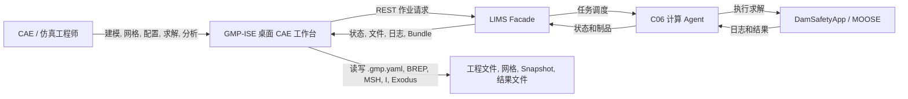
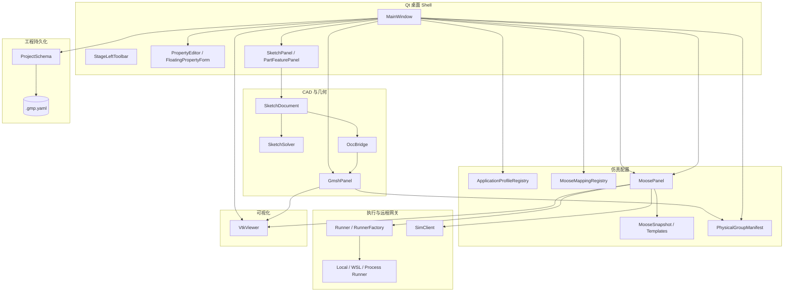
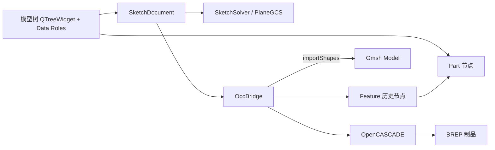
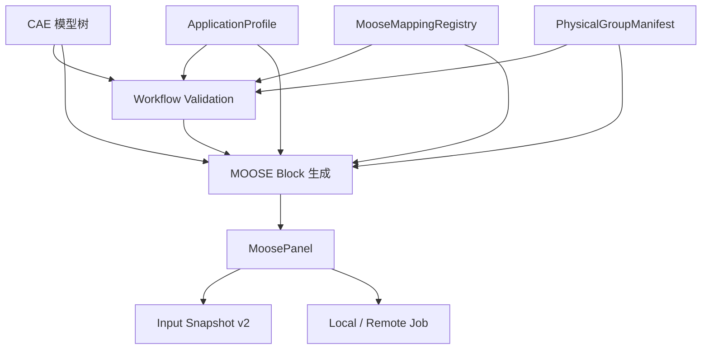

# HC-Gmsh 架构评审 v0.1 - 当前架构

> 评审模式: A - 架构评审, 只读.  
> 仓库: `RedCreationTech/hcGmsh`  
> 基线分支: `main`  
> 基线提交: `5210ba5b632bc529f63ff0ca49db8a5f0d4db275`  
> 基线日期: 2026-09-17  
> 范围: 仅进行架构分析. 不修改代码, 不创建分支, 不提交远端.

## 证据标记

- **已验证**: 可以由当前基线提交中的源码, 构建文件, Schema, 测试或使用手册直接确认.
- **推断**: 基于已验证代码关系形成的架构判断.
- **建议**: 面向 v0.2 或后续版本的目标设计, 不代表当前已经实现.

## 1. 执行摘要

**已验证.** 当前仓库已经明确定位为 Qt 6/C++ 实现的 CAE 工作台, 覆盖几何建模, Gmsh 网格, MOOSE 输入和作业, Exodus/VTK 后处理. 从最新源码看, 它已经明显超出 "Gmsh GUI 封装" 的阶段. 项目已经具备版本化工程 Schema, CAE 模型树, Sketch/Part/Feature 工作流, Assembly 实例, Material, Section, Physics, Step, BC, Load, Interaction, Constraint, Selection, Mesh, Input Cases, Job 和 Results 等对象.

**推断.** 当前最准确的架构定位是:

> **GMP-ISE 是一个桌面 CAE 集成工作台, 正在形成自己的 CAD/CAE 领域模型. 它以 OpenCASCADE/PlaneGCS/Gmsh 负责建模和网格, 以 MOOSE 为主要求解目标, 以本地/远程 Runner 负责作业执行, 以 VTK/Exodus 负责后处理.**

当前最主要的架构问题, 已经不是功能缺失, 而是业务能力增长速度快于领域架构演进速度. 大量应用编排和业务逻辑集中在 Qt Widget, 特别是 `MainWindow`, `GmshPanel`, `MoosePanel`, `VtkViewer`, `PropertyEditor`. 因此下一阶段不应只做目录整理, 而应该把稳定的领域核心和应用服务从 UI 中抽离.

## 2. 当前产品边界

### 2.1 用户工作流

当前代码已经支持下列完整业务意图:

```text
工程 Project
  -> 草图 Sketch
  -> 部件 Part / 特征 Feature
  -> 装配 Assembly
  -> Physical Group / Selection
  -> Material / Section / Physics / Step / BC / Load / Interaction
  -> Mesh
  -> MOOSE 输入生成
  -> 工作流校验 / Snapshot
  -> Local 或 Remote Job
  -> Exodus / Mesh Results
  -> VTK 可视化 / 检查
```

Phase 5 验收材料进一步确认, 当前实现已经在验证以下真实链路:

- 两个独立 Part 的建立和重建.
- Part 到当前 Feature 的引用.
- Feature 的历史保留.
- Assembly 实例和位姿变换.
- Physical Group 的生成, 保存和恢复.
- Contact / Load 到 MOOSE 输入的真实映射.
- 工程保存和另存为时工作目录及网格路径迁移.
- 上游修改后下游对象的 `stale` 传播.
- 两次同步生成 `.i` 输入的稳定一致性.

因此, 当前系统已经具备一个中小型 CAE 平台的骨架, 而不是单一前处理工具.

### 2.2 外部运行系统

远程仿真链路不是客户端直接连接计算 Agent, 当前设计为:

```text
GMP-ISE
  -> LIMS Facade
      -> C06 Agent
          -> DamSafetyApp / MOOSE
```

`SimClient` 是远程作业基础设施边界, 负责:

- 提交 Snapshot.
- 查询 Job.
- 查询执行状态.
- 获取文件列表.
- 拉取日志.
- 取消任务.
- 下载实时文件.
- 查询 Bundle.
- 下载结果制品并进行 SHA-256 校验.

这一边界相对清晰, 应作为后续架构重构中重点保护的已有资产.

## 3. 当前技术栈

| 领域 | 当前技术 | 架构角色 | 状态 |
|---|---|---|---|
| 语言 | C++17 | 主实现语言 | 已验证 |
| 桌面 UI | Qt 6 Widgets, Qt Network | 应用 Shell 和 GUI | 已验证 |
| 构建 | CMake 3.21+ | 构建和功能开关 | 已验证 |
| CAD 内核 | OpenCASCADE | BRep 和 3D 特征构建 | 条件构建 |
| 草图求解 | PlaneGCS / `libplanegcs` | 2D 几何约束求解 | 条件构建 |
| 几何和网格 | Gmsh | 几何导入, Assembly 几何, Physical Group, 网格 | 条件构建 |
| 仿真 | MOOSE / DamSafetyApp Profile | 求解合同和输入生成目标 | 已集成 |
| 后处理 | VTK / Exodus | 网格和结果渲染 | 条件构建 |
| 工程持久化 | yaml-cpp | `.gmp.yaml` | 已验证 |
| 远程作业 | Qt Network + LIMS Facade | 远程计算网关 | 已验证 |
| 并行 | MPI | 本地并行能力 | 可选 |
| ParaView/Catalyst | ParaView/Catalyst | 预留集成能力 | 默认关闭 |

当前 CMake 功能开关包括:

```text
GMP_ENABLE_MPI
GMP_ENABLE_CATALYST
GMP_ENABLE_PARAVIEW
GMP_ENABLE_GMSH_GUI
GMP_ENABLE_WSL_RUNNER
GMP_ENABLE_VTK_VIEWER
```

## 4. C4 Level 1 - 系统上下文



### 4.1 上下文解释

- `GMP-ISE` 负责交互建模, CAE 配置, 输入生成, 追溯和结果查看.
- `MOOSE` 当前是外部求解运行时, 不是内嵌领域内核.
- 远程计算通过 LIMS Facade 隔离, 客户端不直接持有 C06 凭据.
- 工程状态和计算环境解耦保存, 这是正确的产品化方向.

## 5. C4 Level 2 - 桌面应用内部逻辑容器

当前只构建一个主要可执行文件 `gmp_ise`. 因此下面的 Container 是逻辑分区, 不是独立进程.



## 6. C4 Level 3 - 组件视图

### 6.1 CAD 和 Feature 工作流



`SketchDocument` 是当前最接近领域对象的组件之一. 它已经拥有:

- Line, Circle, Arc 等强类型图元.
- Coincident, Horizontal, Vertical, Parallel, Perpendicular, EqualLength, EqualRadius, Fixed, Distance, Radius, Angle 等约束.
- `shape_id` 形式的逻辑图形身份.
- 图元 CRUD.
- 命中测试.
- 图形整体移动.
- 闭环检测.
- YAML 序列化.

它同时服务于三个方向:

```text
Sketch 交互绘制
  -> PlaneGCS 约束求解
  -> OpenCASCADE Part Feature 构建
```

因此 `SketchDocument` 应当视为未来 `hc_cad` 的核心资产, 不建议推倒重写.

### 6.2 当前 Feature 语义

这是本次正式审计对早期判断的重要修正.

**已验证.** 当前已经存在 Feature 历史, 但不是 FreeCAD/SolidWorks 类型的可重放参数化 Feature Graph. 当前语义更接近:

```text
每次成功 Feature 操作
  -> 追加一条 Feature 历史记录

Part.feature
  -> 指向最近一次成功且当前生效的 Feature

Part.brep
  -> 指向当前 Feature 产出的 BREP

Assembly Instance
  -> 引用 Part
  -> 构建时读取 Part 当前 BREP

旧 Feature
  -> 保留历史
  -> 不会全部按顺序重新执行形成当前实体
```

因此准确结论不是 "缺少 Feature Tree", 而是:

> **已有模型树和 Feature 历史, 但缺少可重算的 Feature Dependency Graph.**

### 6.3 Assembly 和网格工作流


Assembly 当前已经支持:

- `part` 引用.
- X/Y/Z 平移.
- X/Y/Z 欧拉旋转.
- X/Y/Z 缩放.
- 可见性.
- 排序.
- 项目持久化.
- 重开恢复.
- Assembly 专用 Physical Group.
- 自定义作用面组保存和重绑定.

对于 Assembly 作用面, 当前已经避免简单依赖裸 Gmsh Tag, 而是增加:

```text
owner
+
bbox 几何包围盒签名
+
原始 tag 仅作为提示
```

这比直接保存 Gmsh tag 更可靠, 但还不等于完整的 CAD Topological Naming.

### 6.4 仿真输入生成工作流



当前 MOOSE 生成能力已经覆盖或正在覆盖:

- Variables.
- Materials.
- Functions.
- BCs.
- Loads.
- Contact / Interactions.
- Physics.
- Executioner.
- AuxVariables.
- AuxKernels.
- Postprocessors.
- Times.
- Outputs.

当前 `ApplicationProfile + MooseMappingRegistry` 是很好的元数据架构基础. Profile 负责 "当前求解应用支持什么", Mapping Registry 负责 "某种对象如何映射为 MOOSE block". 这套设计应保留并进一步上移到领域层.

### 6.5 可视化工作流

```text
Gmsh Mesh / Exodus
    -> VtkViewer
        -> Mesh 显示
        -> Scalar
        -> Deformation
        -> Slice
        -> Picking
        -> Result Navigation
```

但当前 `VtkViewer` 同时承担 Sketch 交互:

```text
Sketch Tool
Selection
Snap
Drag
Constraint insertion
Sketch solve
```

这说明 CAD 交互视口和 Results 视口当前共享同一个大型 Widget, 后续需要拆分.

## 7. 当前工程数据模型

### 7.1 Schema 版本

当前工程文件为:

```text
.gmp.yaml
schema_version = 2
```

Schema v2 已经包含:

- `application_profile`.
- `unit_contract`.
- `model`.
- `mesh_snapshot`.
- `gmsh`.
- `moose`.
- `viewer`.

### 7.2 当前代码中的模型根节点

`ProjectSchema.cpp` 当前模型根节点为:

```text
Parts
Sketches
Features
Datums
Materials
Sections
Assembly
Physics
Steps
BC
Loads
Interactions
Constraints
Selections
Functions
Variables
Outputs
Mesh
Input Cases
Jobs
Results
```

### 7.3 当前模型节点表示

当前运行时节点主要仍然通过:

```text
QTreeWidgetItem
  + name
  + kind
  + status
  + QVariantMap params
```

进行管理.

`PropertyEditor` 直接依赖 `QTreeWidgetItem*`, 并通过 Data Role 读取和写入:

```text
KindRole
ParamsRole
StatusRole
```

这意味着模型树并不是单纯的 View, 而是当前有效领域状态的一部分.

这会限制:

- Headless.
- CLI.
- AI Agent.
- 批处理.
- 自动化测试.
- 多 UI.
- 领域事务.
- Undo/Redo.
- 可靠重算.

## 8. 当前代码模块地图

| 文件/组件 | 当前主要职责 | 当前层次判断 |
|---|---|---|
| `main.cpp` | 程序入口 | App |
| `MainWindow` | UI Shell + 模型树 + 项目 + 编排 + 生成 + Job/Result 协调 | UI + Application + Domain 混合 |
| `StageLeftToolbar` | 模块和舞台命令 | UI |
| `PropertyEditor` | 属性编辑 + 类型表单 + 校验 | UI + Domain Validation |
| `FloatingPropertyForm` | 浮动属性编辑 | UI |
| `SketchPanel` | 草图工具面板 | UI |
| `SketchDocument` | 草图数据模型 | Domain |
| `SketchSolver` | PlaneGCS 适配 | CAD Adapter |
| `PartFeaturePanel` | Part Feature 操作 UI | UI |
| `OccBridge` | Sketch -> OCC Feature -> Gmsh | CAD Adapter |
| `GmshPanel` | Gmsh UI + Geometry + Assembly + Physical Group + Mesh | UI + Engine Service |
| `PhysicalGroupManifest` | 网格语义清单 | Domain Contract |
| `ApplicationProfile` | 求解应用能力档案 | Domain/Metadata |
| `MooseMappingRegistry` | MOOSE 映射定义 | Domain/Metadata |
| `MooseSnapshot` | 输入快照和可追溯性 | Application/Domain |
| `MoosePanel` | 输入编辑 + 模板 + 本地执行 + Snapshot + Remote Job | UI + Application |
| `Runner` | 本地/进程执行抽象 | Infrastructure Port |
| `SimClient` | LIMS Facade 网络适配 | Infrastructure Adapter |
| `VtkViewer` | Sketch + Mesh + Exodus + Results 渲染 | UI + Visualization + CAD Interaction |
| `ProjectSchema` | YAML 合同转换 | Persistence Adapter |

## 9. 构建架构

当前 CMake 仍然以一个主目标聚合绝大多数源码:

```text
gmp_ise
```

核心测试目标:

```text
gmp_ise_phase0_test
```

会重复编译部分源码.

这意味着当前模块边界主要存在于人脑和文件命名中, 并没有通过独立 CMake Library 强制.

v0.2 应逐步演进为:

```text
hc_core
hc_cad
hc_mesh
hc_simulation
hc_jobs
hc_results
hc_ui
gmp_ise
```

## 10. 测试架构

当前已经具备较好的合同测试基础:

- Project Schema.
- YAML 嵌套转换.
- SketchDocument.
- Shape identity.
- Application Profile.
- Mapping Registry.
- Physical Group Manifest.
- Snapshot v2.
- SimClient 相关合同.

同时, Phase 4/Phase 5 使用非常详细的人工验收和 GUI 巡览补充自动化测试.

当前短板是:

```text
领域服务级测试不足
+
大型 GUI 类承担业务逻辑
=
重构回归风险较高
```

因此 v0.2 在抽服务之前应先把 G1 关键链路固化为应用服务级测试.

## 11. 值得保护的现有架构资产

1. `SketchDocument` 的强类型草图模型.
2. PlaneGCS 作为约束求解器.
3. OpenCASCADE 作为 BRep 内核.
4. Gmsh 作为网格和 Physical Group 基础.
5. `PhysicalGroupManifest` 的语义网格合同.
6. `ApplicationProfile`.
7. `MooseMappingRegistry`.
8. Snapshot v2.
9. LIMS Facade 远程计算边界.
10. `Runner` 的执行抽象.
11. `.gmp.yaml` Schema 版本化.
12. 当前已有的 stale 传播语义.
13. Phase 4/5 详细验收材料.

## 12. 当前架构约束

当前最需要解决的不是 "有没有模块", 而是以下结构问题:

```text
QTreeWidget 同时是 View + Runtime Model
MainWindow 同时是 Shell + Application Service + Domain Coordinator
GmshPanel 同时是 UI + Geometry + Assembly + Mesher
MoosePanel 同时是 UI + Input Generator + Snapshot + Job Manager
VtkViewer 同时是 CAD Canvas + Mesh Viewer + Result Viewer
```

## 13. 当前架构结论

当前项目已经进入一个重要拐点:

```text
早期:
Gmsh + MOOSE + VTK 集成 Demo

当前:
具备完整 CAE 业务词汇和工作流的桌面 CAE 产品原型

下一阶段:
建立独立 Project/Document/Object/Dependency 核心
```

建议 v0.2 的中心目标不是增加更多业务节点, 而是:

> **把已经存在的业务能力从 UI 状态中提炼成稳定, 可测试, 可重算, 可 Headless 的工程模型.**

## 14. 本文源码依据

主要依据包括:

- `README.md`.
- `CMakeLists.txt`.
- `include/gmp/MainWindow.h`.
- `include/gmp/SketchDocument.h`.
- `include/gmp/OccBridge.h`.
- `include/gmp/GmshPanel.h`.
- `include/gmp/MoosePanel.h`.
- `include/gmp/VtkViewer.h`.
- `include/gmp/PropertyEditor.h`.
- `include/gmp/SimClient.h`.
- `include/gmp/Runner.h`.
- `include/gmp/PhysicalGroupManifest.h`.
- `include/gmp/ApplicationProfile.h`.
- `include/gmp/MooseMappingRegistry.h`.
- `src/ProjectSchema.cpp`.
- `doc/schema/project-v2.md`.
- `manual/test05.md`.
- `tests/test_phase0.cpp`.
