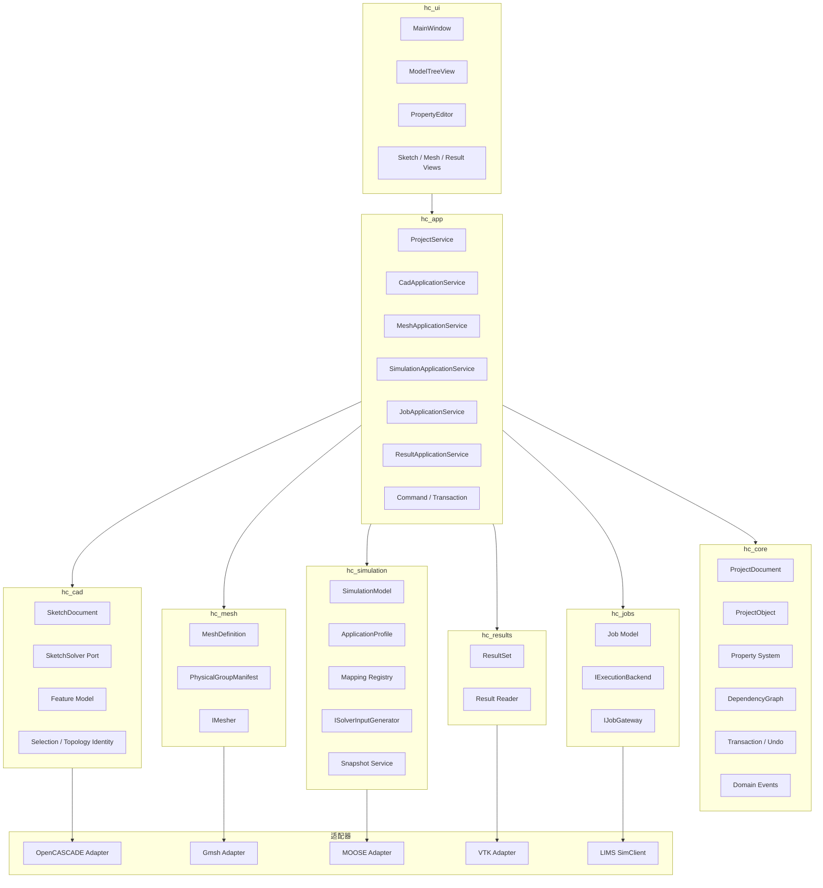

# HC-Gmsh 架构评审 v0.1 - v0.2 架构设计

> 评审模式: A - 架构评审, 只读.  
> 仓库: `RedCreationTech/hcGmsh`  
> 基线提交: `5210ba5b632bc529f63ff0ca49db8a5f0d4db275`  
> 本文是目标架构设计, 不代表已经修改代码.

## 证据标记

- **已验证**: 当前已有能力.
- **建议**: v0.2 目标设计.
- **兼容原则**: 不破坏现有 `.gmp.yaml`, Phase 4/5 验收和主要 UI 行为.

## 1. v0.2 架构目标

v0.2 的目标不是一次性重写 HC-Gmsh.

核心目标是:

> **建立一个独立于 Qt Widget 的工程模型核心, 并把现有 UI 逐步变成该核心的 View/Controller.**

### 1.1 v0.2 成功定义

v0.2 完成时应达到:

1. `ProjectDocument` 成为运行时工程真源.
2. `QTreeWidget` 不再承担业务数据存储职责.
3. 核心对象拥有稳定 ID.
4. 对象之间有显式依赖关系.
5. 下游 stale 由 `DependencyGraph` 传播.
6. 建立基础 Transaction/Undo/Redo.
7. Project 保存/加载通过独立 `ProjectStore`.
8. MOOSE 输入生成从 MainWindow 抽出.
9. Gmsh Assembly/Mesh 操作从 GmshPanel 抽出.
10. Qt UI 可以继续保持现有工作流和视觉行为.
11. 现有 `.gmp.yaml schema_version=2` 继续兼容.
12. Phase 5 G1 流程继续通过.

## 2. 明确非目标

v0.2 不建议同时做:

- 完整 FreeCAD 级 Topological Naming.
- 完整 SolidWorks 级 Feature Tree.
- 大型 Plugin Marketplace.
- 多求解器全部实现.
- Assembly 高级约束求解.
- 云原生服务化.
- AI Agent 产品化.
- UI 全面重写.
- 新的渲染引擎.

这些属于后续阶段.

## 3. 目标逻辑架构



核心依赖方向:

```text
UI
 -> Application
    -> Domain
       -> Port

Adapter
 -> Port
```

不允许:

```text
Domain -> QWidget
Domain -> QTreeWidgetItem
Domain -> VTK Widget
```

## 4. 建议的源码和 CMake 模块

建议逐步形成:

```text
src/
  app/
  core/
  cad/
  mesh/
  simulation/
  jobs/
  results/
  ui/
  adapters/

include/hc/
  app/
  core/
  cad/
  mesh/
  simulation/
  jobs/
  results/
```

对应 CMake:

```text
hc_core
hc_cad
hc_mesh
hc_simulation
hc_jobs
hc_results
hc_app
hc_ui
gmp_ise
```

注意:

> v0.2 不应第一天就物理搬目录.

推荐顺序:

1. 先新建 Library 和接口.
2. 从现有类抽逻辑.
3. 保留原文件 wrapper.
4. 测试稳定后再移动文件.

## 5. Core 领域模型

### 5.1 ProjectDocument

建议职责:

- 对象生命周期.
- 稳定 Object ID.
- 父子层级.
- 依赖关系.
- dirty/stale.
- 事务.
- 事件.
- 重算入口.

示意接口:

```cpp
class ProjectDocument {
public:
    ProjectId id() const;
    ProjectObject* object(ObjectId id);
    const ProjectObject* object(ObjectId id) const;
    std::vector<ObjectId> children(ObjectId parent) const;
    ObjectId addObject(std::unique_ptr<ProjectObject> object);
    bool removeObject(ObjectId id);
    DependencyGraph& dependencies();
    TransactionManager& transactions();
    RecomputeResult recompute(ObjectId from);
};
```

不负责:

- Qt Tree.
- VTK Actor.
- 网络.
- 文件对话框.
- MOOSE 文本编辑框.

### 5.2 ProjectObject

建议最小对象:

```cpp
class ProjectObject {
public:
    ObjectId id;
    QString name;
    ObjectKind kind;
    ObjectStatus status;
    PropertyBag properties;
};
```

`ObjectStatus` 至少保留现有语义:

```text
ready
incomplete
invalid
stale
disabled
```

### 5.3 初始强类型对象集合

第一批建议:

```text
ProjectObject
  |- SketchObject
  |- PartObject
  |- FeatureObject
  |- AssemblyInstanceObject
  |- MeshObject
  |- SimulationObject
  |- JobObject
  |- ResultObject
```

Material/Section/BC/Load 等可以先通过 `Typed Kind + Property Schema` 逐步迁移.

## 6. Property System

### 6.1 为什么需要 Property System

当前 `QVariantMap params` 灵活, 但缺少:

- 类型定义.
- 单位.
- 默认值.
- Required.
- Enum.
- Reference.
- Validation.
- Change Event.
- Serialization Metadata.

建议引入:

```text
PropertyDefinition
  - key
  - displayName
  - type
  - unit
  - required
  - defaultValue
  - enumValues
  - referenceKind
  - validator
```

运行时:

```text
PropertyBag
  -> get<T>()
  -> set<T>()
  -> changed event
```

### 6.2 兼容方式

项目文件继续写:

```yaml
params:
  type: PartInstance
  part: part_concrete
  translate_x: 0
```

内部读取后转换为 Typed Property, 因此不需要立刻升级 Schema 版本.

## 7. DependencyGraph 和 Recompute

### 7.1 当前典型依赖

```text
Sketch
 -> Feature
 -> Part
 -> Assembly Instance
 -> Assembly Geometry
 -> Mesh
 -> PhysicalGroupManifest
 -> Simulation Input
 -> Snapshot
 -> Job
 -> Result
```

以及:

```text
Material
 -> Section
 -> Simulation Input

Selection
 -> BC / Load / Contact
 -> Simulation Input

Step
 -> Executioner
 -> Simulation Input
```

### 7.2 建议 DependencyGraph

```cpp
class DependencyGraph {
public:
    void addDependency(ObjectId upstream, ObjectId downstream);
    void removeDependency(ObjectId upstream, ObjectId downstream);
    std::vector<ObjectId> downstream(ObjectId id) const;
    std::vector<ObjectId> topologicalOrder(ObjectId root) const;
    void markStaleFrom(ObjectId id);
};
```

### 7.3 Recompute 策略

v0.2 第一阶段:

```text
修改对象
 -> Graph 标记下游 stale
 -> UI 显示 stale
 -> 用户显式 Build/Recompute
```

之后再演进自动重算策略.

## 8. Feature Model 演进

### 8.1 保留当前语义

必须兼容:

```text
Feature 历史记录继续存在
Part.feature 继续指向当前 Feature
Part.brep 继续可以恢复
```

### 8.2 新增 Feature Dependency Contract

建议逐步增加:

```yaml
feature:
  id: feature-003
  type: Extrude
  inputs:
    sketch: sketch-002
  parameters:
    distance: 20
  output:
    brep: ...
  order: 3
  active: true
  status: ready
```

### 8.3 Recompute 阶段

```text
Sketch changed
 -> Feature stale
 -> Part stale
 -> Assembly stale
 -> Mesh stale

Recompute Part
 -> 按 Feature order 执行
 -> 生成新 BREP
 -> 更新 Part
```

完整参数化链可以放到 v0.3.

## 9. CAD Kernel 和 Meshing Port

### 9.1 ICadKernel

建议把当前 `OccBridge` 演进为:

```text
OpenCascadeCadKernel : ICadKernel
```

接口负责:

```text
Extrude
Revolve
Loft
Sweep
Boolean Fuse
Boolean Cut
Boolean Common
Fillet
Chamfer
```

### 9.2 IMesher

建议:

```text
IMesher
  -> GmshMesher
```

当前 Gmsh 能力拆为:

```text
GmshGeometryAdapter
GmshAssemblyService
GmshPhysicalGroupService
GmshMesher
```

UI `GmshPanel` 只负责参数输入和显示.

## 10. Selection 和拓扑身份

建议引入稳定 Selection 对象:

```text
Selection
  - id
  - semanticName
  - ownerObjectId
  - dimension
  - strategy
  - signature
  - resolvedEntities
```

第一阶段继续兼容:

```text
owner + bbox
```

之后逐步增加:

```text
surface normal
area
centroid
adjacency
feature provenance
```

## 11. Simulation 架构

### 11.1 引入 Solver-neutral SimulationModel

建议:

```text
SimulationModel
  |- Variables
  |- Materials
  |- Sections
  |- Physics
  |- Steps
  |- BoundaryConditions
  |- Loads
  |- Interactions
  |- Constraints
  |- Functions
  |- Outputs
```

这些对象不直接等于 MOOSE block.

### 11.2 MOOSE Adapter

```text
SimulationModel
   -> MooseModelTranslator
       -> MooseInputDocument
           -> .i
```

`ApplicationProfile` 和 `MooseMappingRegistry` 保留.

MainWindow 中现有 block builder 逐步迁移到:

```text
MooseInputGenerator
```

### 11.3 Snapshot Service

`MooseSnapshot` 应抽成:

```text
SnapshotService
```

输入:

```text
ProjectDocument
SimulationModel
MeshArtifact
ApplicationProfile
```

输出:

```text
Immutable Job Snapshot
```

## 12. Job 架构

### 12.1 Solver 和执行环境分离

建议:

```text
SolverAdapter
    负责输入/命令

ExecutionBackend
    负责在哪里执行
```

例如:

```text
MooseAdapter + LocalProcessBackend
MooseAdapter + LimsRemoteBackend
```

未来可以增加:

```text
CalculiXAdapter
OpenFOAMAdapter
```

而复用同一个 Job Service.

`SimClient` 可包装为:

```text
LimsExecutionBackend
```

## 13. Results 架构

### 13.1 拆分 VtkViewer 职责

目标:

```text
SketchViewport
MeshViewport
ResultViewport
```

共享:

```text
VtkScene
CameraController
SelectionOverlay
```

### 13.2 Result Model

建议:

```text
ResultSet
  - sourceJob
  - snapshotId
  - files
  - timeSteps
  - fields
  - provenance
```

UI 再决定显示:

```text
Contour
Vector
Deformation
Slice
Plot
Table
```

## 14. Transaction 和 Undo/Redo

建议所有模型修改通过 Command:

```text
AddObjectCommand
RemoveObjectCommand
RenameObjectCommand
SetPropertyCommand
CreateSketchEntityCommand
MoveSketchEntityCommand
CreateFeatureCommand
AssignMaterialCommand
CreateAssemblyInstanceCommand
```

支持:

```text
Begin
  -> 多个 Command
Commit
```

收益:

- Ctrl+Z.
- Ctrl+Y.
- 批量操作.
- AI Agent 操作回滚.
- Audit Log.

## 15. UI 适配层

### 15.1 Model Tree

目标:

```text
ProjectDocument
    -> ModelTreeAdapter
        -> QTreeWidget
```

### 15.2 PropertyEditor

目标:

```text
ProjectObject
  -> PropertySchema
      -> PropertyEditor Form
```

减少大量 `if (kind == "...")`.

## 16. 模块依赖规则

建议限制:

```text
hc_core
  不依赖 Qt Widgets
  不依赖 Gmsh
  不依赖 VTK
  不依赖 MOOSE
  不依赖网络

hc_cad
  依赖 hc_core
  通过 Port 调 CAD Kernel

hc_mesh
  依赖 hc_core
  通过 Port 调 Mesher

hc_simulation
  依赖 hc_core

hc_jobs
  依赖 hc_core

hc_results
  依赖 hc_core

hc_ui
  可以依赖 Application API
```

v0.2 可以暂时允许 Qt Core 的 `QString/QVariant`, 不需要为了 "纯标准 C++" 做大重写.

## 17. 迁移计划

### Stage 0 - 冻结当前行为

建立回归基线:

- Phase 5 G1.
- Project save/reopen.
- Save As mesh migration.
- Two Part / Assembly.
- Contact.
- Pressure.
- MOOSE generation.
- Snapshot.
- Job.
- Results.

### Stage 1 - 引入 `hc_core`, 不改变 UI

新增:

```text
ProjectDocument
ProjectObject
ObjectId
ObjectStatus
PropertyBag
DependencyGraph
TransactionManager
```

先用 adapter 同步 QTreeWidget.

### Stage 2 - Project Persistence 迁移到 ProjectStore

MainWindow 只调用:

```text
ProjectStore.load()
ProjectStore.save()
```

### Stage 3 - 抽取 Simulation Generation

把 MOOSE builder 从 MainWindow 迁移到:

```text
MooseInputGenerator
```

### Stage 4 - 抽取 Gmsh/Assembly Service

从 `GmshPanel` 提取:

```text
AssemblyGeometryService
PhysicalGroupService
GmshMesher
```

### Stage 5 - 分离 Sketch 和 Result Viewport

避免 `VtkViewer` 继续膨胀.

### Stage 6 - 激活 Graph Recompute 和 Transaction

把现有程序化 stale 传播切换为图驱动.

### Stage 7 - CMake 模块化

最终让编译边界与架构边界一致.

## 18. 兼容规则

v0.2 必须:

1. 继续读写 Schema v2.
2. 不改变用户现有工程路径规则.
3. 不破坏 Phase 4/5 工程.
4. `Input Cases` 合同需补齐文档.
5. 现有 Profile/Mapping 文件保持兼容.
6. 现有 Snapshot v2 保持兼容.
7. 现有远程 LIMS API 不变.
8. 旧 Feature 历史继续可读.

## 19. v0.2 准出条件

- [ ] 工程真源已经切换到 `ProjectDocument`.
- [ ] Model Tree 只是 Projection.
- [ ] Core 测试无需构造 `QTreeWidget`.
- [ ] Project save/load 不在 MainWindow 实现.
- [ ] MOOSE 主要 block generation 不在 MainWindow.
- [ ] Assembly/Mesh 核心逻辑不依赖 GmshPanel Widget.
- [ ] 有统一 DependencyGraph.
- [ ] 有基础 Undo/Redo.
- [ ] Phase 5 G1 回归通过.
- [ ] `.gmp.yaml` v2 兼容.
- [ ] CMake 至少出现 `hc_core` 和 `hc_simulation` 等独立目标.

## 20. 本文源码依据

主要依据:

- 当前 `MainWindow.h` 和 `MainWindow.cpp` 规模及职责.
- `ProjectSchema`.
- `SketchDocument`.
- `OccBridge`.
- `GmshPanel`.
- `MoosePanel`.
- `Runner`.
- `SimClient`.
- `VtkViewer`.
- `PropertyEditor`.
- `manual/test05.md`.
- `tests/test_phase0.cpp`.
