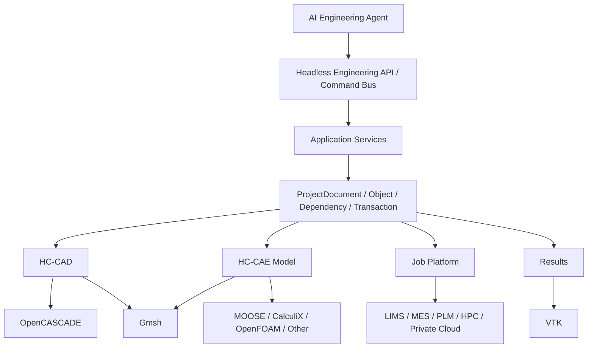
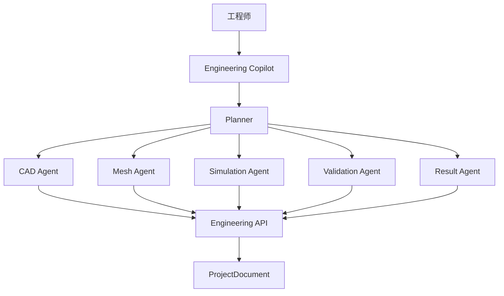

# HC-Gmsh 架构评审 v0.1 - HC-CAD 与工业仿真平台路线图

> 评审模式: A - 架构评审, 只读.  
> 仓库基线: `main@5210ba5b632bc529f63ff0ca49db8a5f0d4db275`  
> 本文描述产品和技术演进方向, 不代表当前全部已经实现.

## 证据标记

- **已验证**: 当前项目已经具备.
- **建议**: 后续路线.

## 1. 产品方向

从当前代码基础看, 最合理的长期产品方向不是继续强化 "Gmsh 前端", 而是逐步形成两个互相连接的能力层:

```text
HC-CAD
  参数化几何建模内核

+
HC-CAE / 工业仿真平台
  Mesh + Physics + Solver + Job + Result

+
AI Engineering Layer
  AI 辅助建模, 校验, 求解, 优化
```

当前 GMP-ISE 可以看作这个平台的第一代工程实现.

推荐长期定位:

> **面向工业场景的开放式 CAD/CAE 工程工作台, 以可编排模型对象为核心, 连接 OpenCASCADE, Gmsh, 多类求解器和企业计算环境.**

## 2. 战略原则

### 原则 1. 不重写成熟底层算法

保留:

```text
OpenCASCADE
PlaneGCS
Gmsh
MOOSE
VTK
```

自研重点放在:

```text
Document Model
Feature Graph
CAE Model
Workflow
Solver Adapter
Job Platform
AI Tool API
Industrial Templates
```

### 原则 2. CAD 和 CAE 共享同一个 Project Graph

不建议未来拆成两个互不相关的工程格式.

目标:

```text
ProjectDocument
  |- CAD
  |- Assembly
  |- Selections
  |- Mesh
  |- Simulation
  |- Jobs
  |- Results
```

### 原则 3. Solver 只是 Adapter

未来不把平台永久锁死在 MOOSE.

### 原则 4. AI 建立在 Headless Engineering API 之上

不建议 AI Agent 直接点击 GUI.

AI 应调用稳定工程命令:

```text
createSketch()
setConstraint()
createExtrude()
createMesh()
assignMaterial()
createLoad()
validate()
runJob()
inspectResult()
```

## 3. 目标平台层次



## 4. 路线概览

| 版本 | 核心主题 | 主要结果 |
|---|---|---|
| v0.2 | 架构地基 | Document/Object/Graph/Transaction |
| v0.3 | 参数化 CAD 基线 | Feature Graph + Recompute |
| v0.5 | 工业机械 CAE 闭环 | CAD -> Mesh -> Simulation -> Job -> Result |
| v0.7 | 平台化 | Multi-solver + Headless API + Plugin |
| v1.0 | 工业工程平台 | 行业模板, 自动化, 企业集成 |
| v1.x | AI-native | Agent 驱动建模, 仿真和优化 |

## 5. v0.2 - 架构地基

重点:

```text
ProjectDocument
ProjectObject
Property System
DependencyGraph
Transaction
ProjectStore
Application Services
```

v0.2 不强调用户可见的新功能.

但完成后会解决:

- MainWindow 持续膨胀.
- UI Tree 兼任数据模型.
- 无法 Headless.
- 无法可靠 Undo.
- stale 规则分散.
- 新求解器难接入.
- Agent 无稳定 API.

v0.2 是后续所有路线的前置条件.

## 6. v0.3 - HC-CAD 参数化基线

### 6.1 Sketcher

在已有 `SketchDocument + PlaneGCS` 基础上继续完善:

- 约束完整性.
- 自由度 DoF 显示.
- 过约束诊断.
- 尺寸编辑.
- Construction Geometry.
- External Geometry.
- Trim/Extend.
- Mirror.
- Pattern.
- 圆角/倒角.
- 多草图引用.

### 6.2 Feature Graph

将当前 "Feature 历史快照" 演进为:

```text
Sketch001
  -> Pad001
      -> Pocket001
          -> Fillet001
```

每个 Feature 有:

```text
Input
Parameters
Output
Dependencies
Status
Recompute
```

第一批 Feature 建议:

```text
Extrude / Pad
Revolve
Pocket / Cut
Boolean Fuse
Boolean Cut
Boolean Common
Fillet
Chamfer
Loft
Sweep
Hole
Pattern
Mirror
```

### 6.3 Topology Identity

逐步建立稳定引用:

```text
ObjectId
FeatureId
SelectionId
Semantic Name
Geometry Signature
Provenance
```

目标是让:

```text
BC
Load
Contact
Section
```

在 CAD 参数修改后尽可能自动重绑定.

### 6.4 Assembly

在当前 Part Instance 基础上增加:

```text
Instance hierarchy
Mate / Constraint
Reference coordinate system
Exploded view
Interference check
```

高级装配约束求解可后置.

## 7. v0.5 - 工业机械 CAE 闭环

目标用户应该可以完成:

```text
新建工程
 -> Sketch
 -> Part
 -> Assembly
 -> Material
 -> Section
 -> Mesh
 -> BC / Load / Contact
 -> Solve
 -> Result
```

而且整个工程可以保存, 重开, 修改参数并重算.

### 7.1 SimulationModel

建立 solver-neutral 模型:

```text
Materials
Sections
Physics
Steps
BC
Loads
Interactions
Constraints
Outputs
```

### 7.2 Mesh Workflow

增加:

- 全局 Mesh Control.
- 局部尺寸.
- Boundary Layer.
- Element Order.
- Quality Check.
- Mesh Diagnostics.
- Mesh Rebuild.
- Selection Preservation.

### 7.3 Validation

形成正式 Validation Engine:

```text
Geometry Validation
Mesh Validation
Physics Validation
Reference Validation
Solver Capability Validation
Unit Validation
Workflow Validation
```

Validation 结果统一:

```text
severity
objectId
property
message
fixHint
```

### 7.4 Result Traceability

结果可追溯到:

```text
Project
Model Revision
Mesh Hash
Simulation Snapshot
Solver Profile
Job ID
Result File Hash
```

当前 Snapshot v2 已经是很好的基础.

## 8. v0.7 - 可扩展和多求解器平台

### 8.1 不绑定 "求解器" 和 "执行环境"

目标组合:

```text
MOOSE Adapter
  x
Local / WSL / SSH / LIMS / HPC

CalculiX Adapter
  x
Local / LIMS / HPC

OpenFOAM Adapter
  x
Docker / Remote Linux / HPC
```

分成:

```text
ISolverAdapter
IExecutionBackend
```

### 8.2 Headless Engineering API

这是平台化和 AI 的关键.

示例:

```cpp
auto project = api.openProject("case.gmp.yaml");
auto sketch = project.createSketch("base");
sketch.addRectangle(...);
sketch.constrain(...);

auto part = project.createPart("body");
part.extrude(sketch, 20.0);

auto mesh = project.mesh(part);
mesh.setGlobalSize(5.0);
mesh.build();

auto study = project.createSimulation("static");
study.assignMaterial(...);
study.addFixedBC(...);
study.addPressure(...);

auto job = study.run();
```

同时提供:

```text
C++ API
Python binding
JSON-RPC / MCP Tool API
```

### 8.3 Command Registry

所有用户操作统一注册为 Command:

```text
CreateSketch
AddConstraint
CreateFeature
CreateAssemblyInstance
AssignMaterial
GenerateMesh
CreateLoad
RunJob
```

收益:

```text
Menu
Toolbar
Shortcut
Macro
CLI
AI Agent
```

都调用同一个 Command.

## 9. v1.0 - 工业工程平台

### 9.1 行业模板包

工业产品不应只有 "通用 CAE".

可以提供:

```text
压力容器
管道
阀门
试验机结构
工程机械
水工结构
混凝土大坝
热分析
接触分析
疲劳分析
```

模板包可以包含:

```text
Geometry Template
Material Library
Mesh Policy
Simulation Template
Validation Rules
Report Template
AI Prompt/Agent Policy
```

### 9.2 企业能力

加入:

- 私有化部署.
- 企业材料库.
- 标准件库.
- 求解器许可证管理.
- HPC 调度.
- 用户和权限.
- Project Revision.
- 审计日志.
- PLM/PDM 对接.
- LIMS 对接.
- MES/数据平台对接.
- 计算任务队列.

### 9.3 工程自动化

典型:

```text
参数扫描
DOE
Optimization
Batch Solve
Regression
Sensitivity
Auto Meshing
Auto Report
```

## 10. AI-native CAD/CAE

### 10.1 Agent 架构



### 10.2 第一批 AI 应用

建议从低风险, 高价值场景开始:

1. 工程模型解释.
2. 缺失配置检查.
3. Material/Section 推荐.
4. Mesh 参数建议.
5. BC/Load 检查.
6. MOOSE 输入解释.
7. 求解失败日志诊断.
8. Result 自动摘要.
9. 参数扫描生成.
10. 批量变体工程创建.

之后再进入:

```text
Natural Language -> CAD Feature
```

### 10.3 AI 安全和追溯

Agent 的每个操作必须产生:

```text
Command
Transaction
Before State
After State
Reason
Validation Result
```

高风险动作:

```text
删除 Feature
修改 Material
改变 BC
运行大规模 Job
覆盖工程
```

需要明确确认或策略授权.

## 11. 平台差异化

HC-CAD/CAE 不需要正面复制商业 CAD 所有能力.

更适合形成差异化的方向:

### 方向 A. 开放式工业 CAE

```text
OpenCASCADE
Gmsh
Open-source Solver
Enterprise Compute
```

### 方向 B. AI Native

传统软件:

```text
人操作 GUI
```

目标:

```text
人 + Agent
 -> 同一 Engineering API
```

### 方向 C. 工业连接能力

连接:

```text
LIMS
MES
PLM
SCADA
Test Data
HPC
```

### 方向 D. Solver-neutral

不是 "MOOSE IDE", 而是:

```text
Engineering Model Platform
```

## 12. 商业化之前的架构闸门

进入 v1.0 商业化之前建议必须具备:

- 稳定 Project Schema.
- Stable Object ID.
- Project Migration.
- Undo/Redo.
- Crash Recovery.
- Dependency Recompute.
- Deterministic Input Generation.
- Job Snapshot.
- Result Traceability.
- Plugin Isolation.
- Headless API.
- Regression Tests.
- Windows Packaging.
- Large Model Performance Baseline.

## 13. 建议里程碑准出标准

### v0.2

```text
UI 与 Domain 初步分离
ProjectDocument 成为真源
DependencyGraph + Transaction
```

### v0.3

```text
参数化 Feature Graph 可以重算基础 Part
```

### v0.5

```text
典型机械结构可以完成 CAD -> CAE 全闭环
```

### v0.7

```text
至少两个 Solver Adapter 或两个执行后端可替换
Headless API 可用
```

### v1.0

```text
行业模板 + 企业 Job + 稳定工程模型
```

## 14. 命名建议

短期可以继续保留:

```text
GMP-ISE
```

作为当前应用名.

架构模块逐步使用中性命名:

```text
hc_core
hc_cad
hc_mesh
hc_simulation
hc_jobs
hc_results
```

长期产品可以形成:

```text
HC-CAD
HC-CAE
HC Engineering Platform
```

是否最终使用一个品牌名可以在产品成熟后决定, 不需要在 v0.2 强行重命名整个仓库.

## 15. 本文源码依据

路线图主要基于当前已经存在的:

- SketchDocument.
- PlaneGCS.
- OccBridge/OpenCASCADE.
- Gmsh/Physical Group.
- Assembly.
- Schema v2.
- Application Profile.
- MOOSE Mapping.
- Snapshot v2.
- Runner.
- LIMS SimClient.
- VTK Results.
- Phase 5 G1 工作流.
