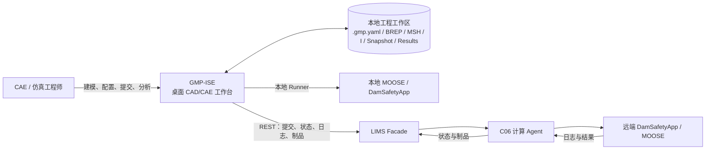
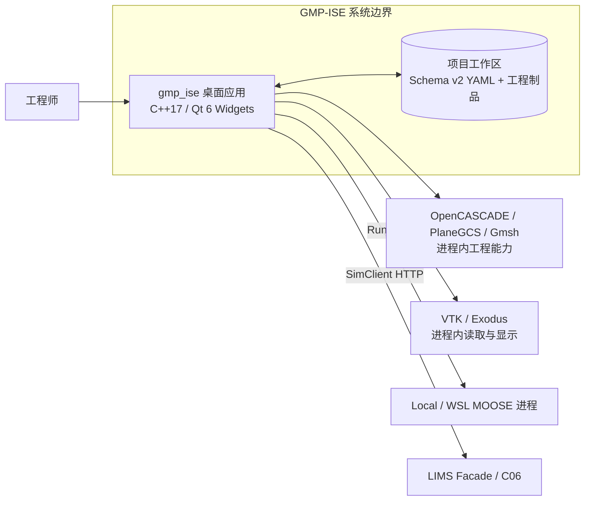
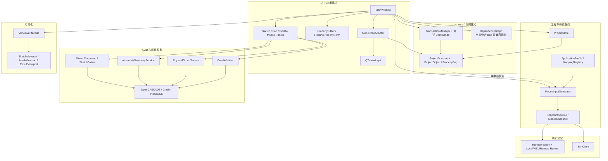

# GMP-ISE 当前系统架构 C4 模型与重构总结

> 编制日期：2026-09-20
> 当前基线：`main@3a42114be7361a9e7c5deece075ce364bd009a5a`
> 远端状态：编制前已执行 `git fetch origin main`，`HEAD == origin/main`
> 范围：总结从初始架构评审到 `HARD-010～050` 完成后的实际架构；不把规划项描述成既成事实

## 1. 结论

本轮架构改造成功完成了近期最关键的目标：GMP-ISE 已从“Widget/模型树承载领域状态”切换为“`ProjectDocument` 承载领域状态，Qt Tree 只做投影”。当前正常写入链路是：

```text
用户操作
  -> 可逆领域 Command / TransactionManager
  -> ProjectDocument（唯一领域真源）
  -> ModelTreeAdapter
  -> QTreeWidget（显示与导航投影）
```

同时，项目持久化、MOOSE 输入生成、快照、网格服务和视口均已从原来的大 Widget 中形成独立边界，CMake 也已有 `hc_core`、`hc_simulation`、`hc_mesh` 三个内部库。

但“原始目标全部完成”并不准确。以下两项按批准后的产品顺序后置：

- `HARD-060`：`DependencyGraph` 从 kind 级规则升级为 `ObjectId -> ObjectId` 对象级图，在 G4 多 Step 前完成。
- `HARD-070`：在现有可逆命令上增加内部 Undo/Redo 栈，在 v0.3 Feature Graph 前完成。

因此当前准确口径是：

> **v0.2 架构地基和 v0.2.1 核心硬化切片已经完成；系统已具备继续 G2/G3 的可靠领域内核，但尚未进入完整参数化 CAD 架构。**

## 2. 基线与追溯范围

最早一组重构目标来自 2026-09-18 的架构评审基线 `5210ba5`：

- [01-current-architecture.md](01-current-architecture.md)：改造前架构与 C4 模型。
- [02-gap-analysis.md](02-gap-analysis.md)：Tree 真源、God Object、依赖图、事务等差距。
- [03-v0.2-architecture-design.md](03-v0.2-architecture-design.md)：v0.2 目标架构和迁移阶段。
- [04-hc-cad-roadmap.md](04-hc-cad-roadmap.md)：长期 HC-CAD/CAE 路线。
- [05-architecture-findings.md](05-architecture-findings.md)：源码证据与问题登记。

随后两份文档完成了复核和范围裁剪：

- [HC-Gmsh-v0.2-重构成果复核与进一步优化计划.md](HC-Gmsh-v0.2-重构成果复核与进一步优化计划.md)：识别出 Tree/Document 方向、稳定 ID、对象级依赖和 Undo/Redo 等剩余问题。
- [v0.2.1架构硬化任务清单.md](../v0.2.1架构硬化任务清单.md)：批准并完成 `HARD-010～050`，将 `HARD-060/070` 放到实际需要出现前。

本文以当前源码、CMake 和上述任务执行记录为准；旧文档中的“当前”仅代表其各自编制时点。

## 3. C4 Level 1：系统上下文

**DES-C4-001**：GMP-ISE 是工程师使用的桌面 CAD/CAE 集成工作台，负责项目建模、网格、求解输入、作业编排和结果查看；求解器与远端调度系统是外部系统。



关键边界：

- GMP-ISE 不在领域层实现 CAD、网格和求解算法，而是编排 OpenCASCADE、PlaneGCS、Gmsh、MOOSE 和 VTK。
- 远端客户端只访问 LIMS Facade；`SimClient` 不直连 C06，也不保存 C06 凭据。
- 工程文件与运行环境分离；同一项目可生成本地或远端可执行快照。

## 4. C4 Level 2：容器视图

**DES-C4-002**：当前产品只有一个主要桌面进程。`hc_core`、`hc_simulation`、`hc_mesh` 是进程内编译边界，不是独立部署容器。



| 容器/边界 | 主要职责 | 当前实现 |
|---|---|---|
| `gmp_ise` 桌面应用 | UI、应用编排、领域模型、生成、执行和结果查看 | 单一 Qt 可执行文件 |
| 项目工作区 | 持久工程、网格、输入、快照、日志和结果 | `.gmp.yaml` schema v2 与 `.work/case/...` |
| 本地求解进程 | 执行生成后的输入 | `RunnerFactory` + Local/Process/WSL Runner |
| 远端求解平台 | 排队、执行、日志和制品 | `SimClient -> LIMS Facade -> C06` |

## 5. C4 Level 3：桌面应用组件

**DES-C4-003**：组件依赖以 `ProjectDocument` 为中心，UI 不再反向生成领域模型。下图实线表示主要调用/代码依赖，虚线表示纯数据流。



### 5.1 编译边界

| CMake 目标 | 包含 | 明确不依赖 |
|---|---|---|
| `hc_core` | Document、PropertyBag、DependencyGraph、Transaction、视口共享纯逻辑 | Qt Widgets、Gmsh、VTK、网络 |
| `hc_simulation` | ProjectStore、MOOSE 生成、Snapshot、Profile/Mapping、SimClient | Qt Widgets、Gmsh、VTK |
| `hc_mesh` | SketchDocument、Physical Group、Mesh、Assembly 服务 | Qt Widgets、VTK；Gmsh 为可选依赖 |
| `gmp_ise` | UI、应用编排、Runner、Viewport facade 与具体适配 | 组合上述内部库 |

源码事实见 [CMakeLists.txt](../../CMakeLists.txt)、[ProjectDocument.h](../../include/gmp/ProjectDocument.h)、[ProjectStore.h](../../include/gmp/ProjectStore.h) 和 [ModelTreeAdapter.h](../../include/gmp/ModelTreeAdapter.h)。

## 6. 关键运行链路

### 6.1 对象修改与 UI 投影

```text
UI 意图
  -> Create/Delete/Rename/SetProperties/SetStatus Command
  -> TransactionManager 执行并记录审计
  -> ProjectDocument 更新
  -> ModelTreeAdapter 按 ObjectId 定向或递归投影
  -> Tree 刷新
```

对象身份由持久 UUID 表示；rename 不改变 ID，duplicate 和 delete+recreate 产生新 ID。固定根节点使用 `root:<kind>`。

### 6.2 保存与加载

```text
加载：schema v2 YAML -> ProjectStore -> 临时 ProjectDocument 校验 -> 原子替换 -> Tree 投影
保存：ProjectDocument -> ProjectStore -> schema v2 YAML
```

加载支持 child-before-parent、任意深度、顺序保持，并拒绝缺失父节点、重复 ID、自引用和环；失败不会破坏当前文档。

### 6.3 CAD/网格到求解

```text
Sketch / Part / Assembly
  -> OpenCASCADE / Gmsh 服务
  -> MSH + PhysicalGroupManifest
  -> ProjectDocument 纯数据快照
  -> MooseInputGenerator
  -> .i + generation report
  -> SnapshotService
  -> Local Runner 或 SimClient/LIMS
  -> Exodus/CSV/log
  -> ResultViewport
```

生成器输入仍使用 `ProjectModelEntry` DTO，但采集源已经是 `ProjectDocument`，不再遍历 Tree。

## 7. 原始重构目标达成情况

| ID | 2026-09-18 原始目标 | 当前结果 | 状态 |
|---|---|---|---|
| DES-ARCH-001 | `ProjectDocument` 成为运行时工程真源 | CRUD、属性、状态、生成、校验和持久化均从 Document/纯数据快照出发 | ✅ 完成 |
| DES-ARCH-002 | `QTreeWidget` 不承担业务数据存储 | `ModelTreeAdapter` 只做 ObjectId 投影与 UI 查找 | ✅ 完成 |
| DES-ARCH-003 | 核心对象拥有稳定 ID | schema v2 可选 `id`；旧项目首次保存固化 UUID | ✅ 完成 |
| DES-ARCH-004 | 显式依赖和图驱动 stale | 已有图算法和 kind 级兼容边；对象级引用图尚未实施 | 🟡 第一阶段完成 |
| DES-ARCH-005 | Transaction / Undo / Redo | 五类可逆领域命令和事务失败回滚已完成；Undo/Redo 栈后置 | 🟡 核心完成、交互回放待办 |
| DES-ARCH-006 | 独立 ProjectStore | Store 与 Document 直接互转，保存不经 Tree | ✅ 完成 |
| DES-ARCH-007 | MOOSE 生成离开 MainWindow | `MooseInputGenerator` 为无 Widget 的纯数据接口 | ✅ 完成 |
| DES-ARCH-008 | Gmsh/Assembly 核心逻辑离开 GmshPanel | 三个服务已抽离，Panel 保留 UI/会话编排 | ✅ 第一阶段完成 |
| DES-ARCH-009 | 视口职责拆分 | `VtkViewer` facade 委托三个 Viewport 和共享相机/选择逻辑 | ✅ 第一阶段完成 |
| DES-ARCH-010 | 编译边界对应架构边界 | 已形成三个内部库；尚未细拆 hc_app/jobs/results | ✅ 当前范围完成 |
| DES-ARCH-011 | schema v2 与现有工作流兼容 | 旧工程可读、稳定 ID 向后兼容、G1 行为保持 | ✅ 完成 |
| DES-ARCH-012 | 自动化回归保护 | CTest `1/1` 与 114 步真实点击巡览通过 | ✅ 完成 |

## 8. 改造前后对比

| 关注点 | 改造前 | 当前 |
|---|---|---|
| 领域真源 | Tree Data Role，Document 由 Tree 反向重建 | Document；Tree 是递归投影 |
| 对象身份 | `<根名>/<对象名>`，rename 会改变身份 | 持久 ObjectId，rename 不变 |
| 写入方式 | Widget 直接改 Tree/参数 | 可逆领域 Command 写 Document |
| 持久化 | MainWindow 遍历 Tree 组装模型 | ProjectStore 直接读写 Document |
| MOOSE 生成 | MainWindow 中拼装 block | 纯数据 `MooseInputGenerator` |
| 网格/装配 | GmshPanel 同时承担 UI 和 Engine | 独立 Service，Panel 负责编排 |
| 视口 | VtkViewer 混合草图、网格、结果职责 | facade + 三个 Viewport |
| stale | 程序化条件分支 | DependencyGraph 闭包；目前仍为 kind 级 |
| 构建 | 单体主目标为主 | core/simulation/mesh 内部库 + UI 可执行文件 |
| 回归 | 功能测试为主 | 服务合同 + CTest + 114 步真实点击巡览 |

## 9. 当前保留的架构债

这些是明确边界，不是本轮失败项：

1. **对象级依赖图**：当前同 kind 对象仍共享传播规则；`HARD-060` 必须在 G4 多 Step 前完成。
2. **Undo/Redo 栈**：命令已可逆，但 committed transaction 尚未形成全局 undo/redo stack；在 Feature Graph 前完成。
3. **引用迁移**：部分 Part、Material、Selection 等引用仍以 name 表达；按功能触达逐步增加 ObjectId，不做高风险机械替换。
4. **SimulationModel**：生成器仍使用 `ProjectModelEntry` DTO；只有在多求解器或稳定 Headless API 成为真实需求时再引入 solver-neutral 模型。
5. **Gmsh 会话**：预览已用临时模型隔离冲突，但系统仍以单项目、串行 Gmsh session 为主；出现后台并行网格需求时再治理。
6. **视口边界**：`VtkViewer` 仍是兼容 facade；当前没有必要为了目录纯度继续拆分。
7. **应用层体量**：`MainWindow` 仍承担较多工作流编排，但关键领域状态和服务已移出；后续只随真实变更热点继续收敛。

## 10. 后续顺序

当前应按已批准的产品顺序继续：

```text
已完成：v0.2 RG-D / v0.2-rc1
已完成：G1 9/9（08/09 按长期实际使用结论通过）
已完成：HARD-010～050
当前：G2 Reference Point / Coupling
下一步：G3 CDP 认可基准闭环
G4 前：HARD-060 对象级 DependencyGraph
然后：G4 多 Step
Feature Graph 前：HARD-070 内部 Undo/Redo
工业 CAE 闭环稳定后：v0.3 Feature Graph / 参数化 CAD
```

这条顺序保持两个约束：不继续无边界重构，也不在缺少对象级依赖保护时进入多 Step。

## 11. 验证与维护规则

当前硬化准出证据：

- Git 基线：`3a42114`，编制前与 `origin/main` 一致。
- `v0.2-rc1` tag：存在于 `153a6b5`。
- `HARD-010～050`：全部完成。
- CTest：`1/1` 通过。
- GUI 真实点击巡览：`114/114` 通过，无崩溃。

本文只在以下情况更新：系统边界、部署容器、领域真源、模块依赖方向或主数据流发生变化。普通功能增加不需要改写 C4；对应状态继续在 [GMP-ISE项目进度与后续总体规划.md](../GMP-ISE项目进度与后续总体规划.md) 维护。
