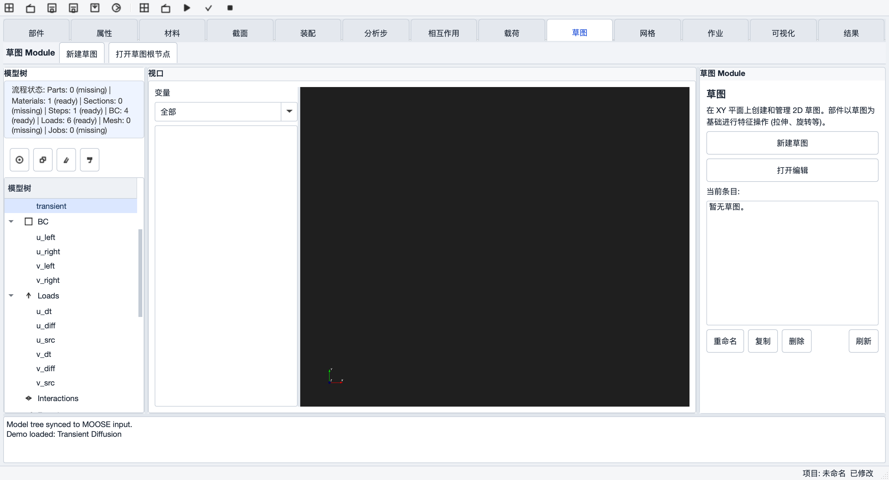
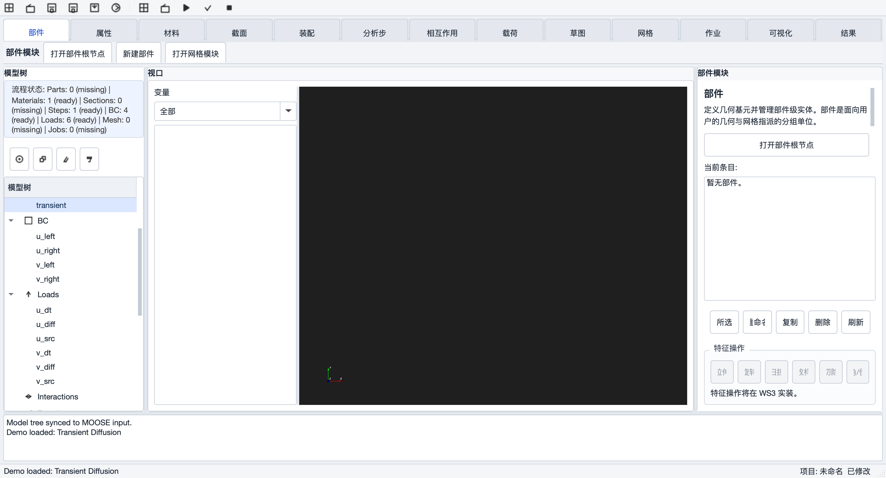
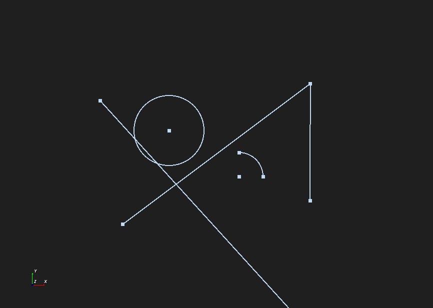
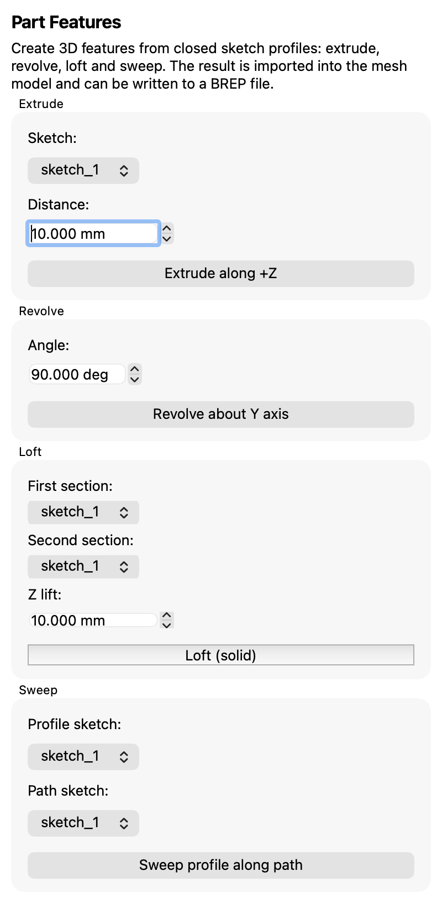
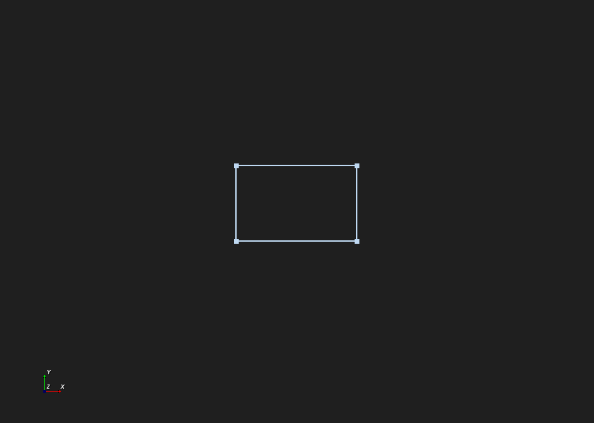
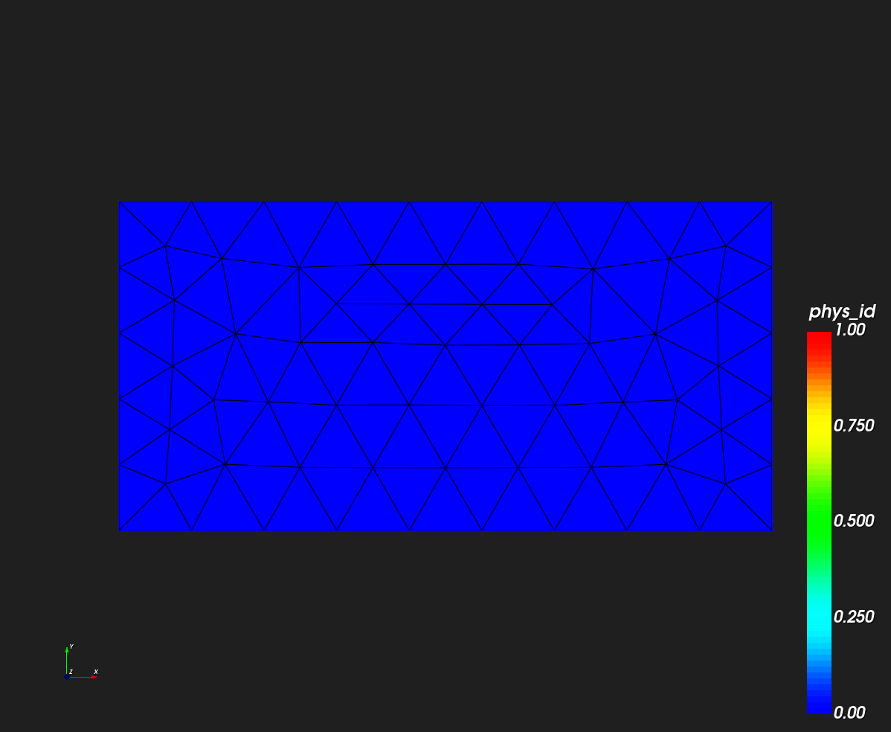

# Sketcher 草图与 Part 零件模块 — 功能实施方案

> 版本：2026-08-11（v3，两轮反馈已并入）｜ 状态：**已定稿，可启动 WS0**
> 依据文档：《草图和零部件部分文档.docx》（doc 同级 HTML 版：《草图和零部件部分文档.html》）
> 目标软件：GMP-ISE（Qt6 Widgets + Gmsh/OCC + VTK + MOOSE 调度）
>
> 第 7 章为已确认决策记录；第 8 章待确认问题（当前无）；第 9 章为本期缓办的 TODO。

---

## 1. 背景与目标

当前 GMP-ISE 已打通"网格 → MOOSE 输入 → 远程求解 → 结果可视化"链路，几何能力停留在 GmshPanel 的基元/变换/布尔层面（`src/GmshPanel.cpp`，全部走 `gmsh::model::occ::*`）。本方案补齐 CAD 前处理两大支柱：

- **草图（Sketcher）**：2D 参数化草图（图元绘制 + 几何约束 + 尺寸约束）；
- **部件（Part）**：基于草图的 3D 特征建模（拉伸/旋转/扫掠/放样/切除/圆角倒角 + 基准要素 + 特征管理）。

目标体验：`草图 → 特征 → 部件 → （现有）网格/物理组 → 求解`。

## 2. 需求映射与现有基础

| 需求项 | 现有基础 | 实现路径 |
|---|---|---|
| 草图图元（线/多段线/圆/弧/椭圆/样条/构造线） | 无 2D 绘制；OCC 曲线 API 可用 | 新增"草图"页签 + VTK 视口 2D 正交模式（已确认 Q3） |
| 修剪/延伸/偏移/镜像/阵列 | 无 | OCC `Geom_TrimmedCurve` / `Geom_OffsetCurve` / 变换矩阵 |
| 几何约束（重合/水平/垂直/平行/相切/同心/等长/对称） | 无 | 集成 planegcs（已确认 Q1） |
| 尺寸约束（长度/半径/角度驱动） | 无 | planegcs + 参数管理器 |
| 参数管理器 | PropertyEditor 参数表交互模式可复用 | 新增参数管理器面板（位于草图页签） |
| 拉伸/旋转/切除 | gmsh occ 有 `extrude/revolve` | gmsh API 直接可用 |
| 扫掠/放样/圆角/倒角 | gmsh 无直接 API | 直调 OCC（已确认 Q2）：`BRepOffsetAPI_MakePipe / ThruSections`、`BRepFilletAPI_MakeFillet / MakeChamfer` |
| 特征编辑/禁用/删除 | 模型树已有 CRUD/动作条 | 特征节点 + 参数化重放（见 3.3） |
| 拆分边/面/体 | 无 | OCC `BRepFeat_SplitShape` 等 |
| 基准面/轴/点/局部坐标系 | 无 | 参考几何节点存模型树（Datums） |
| 几何导入导出 | 已有（STEP/IGES/BREP 导入，BREP 导出） | 补充草图级互认格式（见 Q8） |
| 部件管理器 | 模型树 Parts 根节点已有雏形 | 并入重构后的"部件"页签（见 Q6 决策） |

## 3. 总体设计

### 3.1 模块划分（按 Q6 反馈调整）

- **新增"草图"页签**：管理已创建草图（列表/重命名/删除/复制），新建或打开草图进入 2D 编辑环境；
- **重构现有"部件"页签**（不新建 Part Design 页签）：
  - 新建部件 = 打开已有草图，或一键跳转"草图"页签新建草图；
  - 特征操作入口（拉伸/旋转/扫掠/放样/切除/圆角倒角/镜像/壳/拆分/基准）直接承载在部件页签，操作对象 = 当前选中草图或实体；
  - 部件清单管理（可见性/重命名/指派材料）保留在本页签；
- 页签栏顺序：`部件 ... [草图] ... 网格 作业 ...`（草图置于部件之后、网格之前）。

### 3.2 草图环境（2D 绘制，按 Q3 决策）

- 复用中央 VTK 视口，进入草图时切换为**2D 正交俯视模式**（锁定旋转/缩放为平移缩放），退出恢复 3D；
- 绘制交互基于现有 VTK picker + 橡胶筋预览；辅以坐标输入框精确录入；
- 草图平面：默认 XY，可选部件模块创建的基准面。

### 3.3 数据模型（模型树扩展）

新增节点类型（复用现有 `add_child_item` / YAML 持久化机制）：

```
Sketches/           # 草图: params = 平面、图元列表(序列化)、约束列表(planegcs 参数映射)
Features/           # 特征: params = 类型、输入引用(草图/实体名)、参数表
Datums/             # 基准面/轴/点/局部坐标系
```

- **参数化重放**：特征节点只存"操作 + 参数 + 输入引用"，几何按依赖顺序重建；编辑 = 改参数重放；禁用 = 重放跳过；删除 = 移除后重放；
- 引用一律用**命名引用**（草图名/物理组名），不用裸拓扑 tag（防 ID 漂移）；
- 持久化：项目 YAML 新增 `sketches/features/datums` 段；草图互认格式另见 3.4。

### 3.4 内核调用与外部格式（按 Q1/Q2/Q5 决策）

- 简单操作（拉伸/旋转/布尔/变换）继续走 `gmsh::model::occ`；
- 高级特征直调 OpenCASCADE（CMake 增加 `find_package(OpenCASCADE)`；brew/conda 的 gmsh 均已带 OCC，Windows conda 包同样自带——已在 CI 环境验证存在）；
- 直调 OCC 的结果经 `gmsh::model::occ::importShapes`（BREP 字符串）回注 gmsh，gmsh 保持唯一几何事实源；
- 约束求解：集成 `planegcs`（FreeCAD 同款，C++/MIT），草图约束图 → planegcs 参数系统 → 求解回写图元；
- 草图外部格式互认：第一期缓办，转 TODO（见第 9 章）。

## 4. 并行实施计划（按 Q7 反馈重组）

按 AI Agent 多子代理并行模式，拆为 4 条工作流（WS），共用一份接口契约（数据模型与内核通道），周期合并集成。

### WS0 — 先行基础（1 周，其他 WS 的依赖，必须先完成）

- CMake：`find_package(OpenCASCADE)` + planegcs 集成（子模块或 FetchContent）；
- 模型树新节点类型 + YAML 扩展；
- 草图页签与部件页签骨架；视口 2D/3D 模式切换；
- OCC 直调 → importShapes 回注验证。
- **验收**：空草图可存取；一个 OCC 直调放样 demo 可生成并可剖分。

### WS1 — 草图绘制与交互（2-3 周，依赖 WS0）

- 2D 正交模式（网格背景/坐标输入框/橡胶筋预览）；
- 图元：点/线段/多段线/矩形/圆/圆弧(三种)/椭圆/样条；
- 构造线、修剪/延伸、偏移、镜像、线性/圆周阵列、移动/复制、投影；
- 参数管理器 v1；草图 CRUD + 草图页签管理界面。
- **验收**：任意闭合轮廓可绘制、编辑、保存、加载。

### WS2 — 约束系统（2-4 周，依赖 WS0，与 WS1 并行）

- planegcs 封装层：草图图元 ↔ 求解器参数映射；
- 几何约束 8 种 + 尺寸约束（长度/距离/半径/直径/角度）；
- 约束标记可视化、过约束/欠约束提示、拖动求解。
- **验收**：约束草图拖动保持约束；改尺寸约束几何更新。

### WS3 — Part 特征与部件页签重构（3-4 周，依赖 WS0；特征输入依赖 WS1 草图序列化格式冻结）

- 部件页签重构（新建部件向导：选草图/跳转新建）；
- 拉伸（拔模/对称）、旋转、切除；扫掠、放样、镜像、壳；
- 圆角/倒角（批量）；特征树重放（编辑/禁用/删除）；
- 拆分边/面/体；基准面/轴/点/局部坐标系。
- **验收**：草图 → 多特征部件端到端；重放稳定；部件可直接进现有 Mesh 流程。

### WS4 — 集成与收尾（1-2 周，最后合并）

- 部件 → 物理组 → BC/Load 联动核对；
- 手册/截图/翻译字典更新；Windows CI 出包验证。
- （草图外部格式互认已缓办，不在本期范围，见第 9 章 TODO）

### 里程碑与合并节奏

- M1（第 1 周末）：WS0 完成，接口契约冻结（数据模型/序列化格式/内核通道）；
- M2（第 4 周末）：WS1 完成 + WS2 求解器封装可跑 demo；
- M3（第 7 周末）：WS2/WS3 主体完成，进入集成；
- M4（第 8-9 周末）：WS4 完成，全链路验收。

## 5. 工作量粗估（并行后）

| 工作流 | 工作量 | 并行后日历周期 |
|---|---|---|
| WS0 基础 | 1 周 | 第 1 周 |
| WS1 草图绘制 | 2-3 周 | 第 2-4 周 |
| WS2 约束系统 | 2-4 周 | 第 2-5 周 |
| WS3 Part 特征 | 3-4 周 | 第 2-6 周（部分依赖 WS1 格式冻结） |
| WS4 集成互认 | 1-2 周 | 第 7-9 周 |
| **合计** | 9-14 周人力 | **日历约 8-9 周**（多子代理并行） |

## 6. 风险与对策

| 风险 | 对策 |
|---|---|
| planegcs 集成成本（构建系统/参数映射复杂度） | WS0 先完成编译链路验证；映射层单独封装可替换 |
| 特征重放稳定性（拓扑 ID 漂移） | 一律命名引用；WS3 先做重放原型再铺开特征 |
| OCC 直调与 gmsh 状态不同步 | 直调结果统一 importShapes 回注，gmsh 唯一事实源 |
| 并行开发的接口漂移 | WS0 冻结接口契约；每次合并跑冒烟（构建 + 截图巡览） |
| 2D 草图交互工作量 | 先坐标输入 + 简单拾取，手势逐迭代增强 |

## 7. 已确认决策记录

**首轮反馈（2026-08-11）**

| 编号 | 问题 | 决策 |
|---|---|---|
| Q1 | 约束求解器选型 | **集成 planegcs**（FreeCAD 同款） |
| Q2 | OCC 直调依赖策略 | **接受**：直接 `find_package(OpenCASCADE)` 链接 |
| Q3 | 草图 2D 环境形态 | **方案 a**：复用 VTK 视口切 2D 正交模式 |
| Q4 | 需求优先级 | **按既定阶段实施**，不调整 |
| Q5 | 外部 CAD 格式互认草图 | **需要互认**（后经 Q8 调整为第一期缓办，见下表） |
| Q6 | 模块命名与归属 | **新增"草图"页签**（管理+编辑草图）；**不新建 Part Design**，特征能力通过**重构现有"部件"页签**承载（新建部件 = 选已有草图或跳转草图页签新建 → 拉伸/旋转/扫掠成 3D） |
| Q7 | 排期与人力 | **多子代理并行**开展（计划已按工作流重组，见第 4 章） |

**二轮反馈（2026-08-11）**

| 编号 | 问题 | 决策 |
|---|---|---|
| Q8 | 草图互认的目标格式与深度 | **第一期缓办，转入 TODO**（见第 9 章） |
| Q9 | 部件页签重构范围 | **确认符合预期**：部件页签 = 部件清单 + 新建部件向导 + 特征操作区 |
| Q10 | 草图平面 | **草图固定为 2D 平面绘制（XY）**，产出即 2D 轮廓；由"部件"页签引用草图完成 2D→3D。基准面作为草图平面本期不纳入 |

## 8. 待确认问题

**当前无待确认项。方案定稿，可按 WS0 启动。**

## 9. TODO（本期缓办，后续版本评估）

- **草图外部格式互认**（原 Q5/Q8）：与外部 CAD 软件互认草图。
  - 候选路径：DXF 导入导出（几何图元级，无约束参数，实现可控）；FreeCAD `.FCStd`（含约束，解析成本高、保真有限）；
  - 启动条件：客户明确提出互认对象与深度后立项。

---

*反馈方式：直接在对应问题下写意见，或逐条回复"Q8 选 a 深度几何即可 / ..."。*

## 10. 实施进展

### WS0 — 先行基础（2026-08-11 完成）

| 工作项 | 状态 | 说明 |
|---|---|---|
| OCC 直调通道 | ✅ | `find_package(OpenCASCADE)` + 链接（含放样所需 `TKOffset`），brew/conda 环境均验证可命中 |
| planegcs 集成 | ✅ | FetchContent 拉取 `marcuswu/libplanegcs`（FreeCAD/planegcs 已迁移，上游 404），固定 commit `e6e749d`；注意其 `solve()` 不写回调用内存，必须再调 `sys.applySolution()` |
| OccBridge 验证 | ✅ | `src/OccBridge.cpp` / `include/gmp/OccBridge.h`；`GMP_WS0_SMOKE=1 ./build/gmp_ise` 输出 `occ_direct_call_smoke: true`、`planegcs_smoke: true`（OCC 建模 → brep → Gmsh `importShapes` 全链路打通；brew gmsh 的 `importShapes` 只认文件路径，brep 字符串需先落临时文件） |
| 模型树扩展 | ✅ | 新增 Sketches / Features / Datums 三个根节点；YAML 持久化走现有 `save_project` 根节点遍历，自动覆盖（代码路径已核对） |
| 草图页签骨架 | ✅ | 新增 `SketchPanel`（`src/SketchPanel.cpp`），页签位置：最左（部件之前） |
| 部件页签重构骨架 | ✅ | 部件清单 + 新建部件向导入口 + 特征操作区（按钮组占位，禁用态，待 WS3 逐项点亮） |
| 视口 2D 模式 | ✅ | `VtkViewer::set_2d_mode`（锁旋转、俯视正交），编译验证通过 |

**自测截图**

- 草图页签（模块巡览第 8 位）：
- 部件页签含特征操作区（禁用占位）：

**已知未验项（如实记录）**

- 新根节点的"新建草图 → 保存 → 重开"持久化尚未做运行期验证（仅代码路径分析）；
- `set_2d_mode` 仅编译验证，未在运行期验证交互锁定效果。

**下一步**：WS1（草图绘制：图元创建/拾取/编辑）、WS2（planegcs 约束封装）、WS3（Part 特征：拉伸/旋转/扫掠/放样）可按文件边界划分后并行启动。

### WS1/WS2/WS3 — 并行开发（2026-08-11 完成）

三路并行：先由架构方冻结契约 `include/gmp/SketchDocument.h`（图元/约束/命中测试/闭环检测/YAML 序列化，完整实现），再按文件边界拆给三个子代理同步开发，最后统一集成。

| 工作流 | 内容 | 状态 |
|---|---|---|
| WS1 草图绘制 | VTK 视口 2D 草图层：线/圆/弧三工具（橡皮筋预览、端点吸附）、选择/多选高亮、删除、选中约束（H/V/平行/垂直/重合）与 driving 尺寸（距离/半径）写入；SketchPanel 编辑工具区（默认隐藏，打开编辑时出现） | ✅ |
| WS2 约束求解 | `SketchSolver`（`src/SketchSolver.cpp`）：SketchDocument → GCS::System 全量重建映射、diagnose 先行检测矛盾约束、`solve()`+`applySolution()` 回写几何、`set_driving_value` 尺寸驱动 | ✅ |
| WS3 Part 特征 | `OccBridge` 四特征函数：extrude/revolve/loft/sweep（闭环→OCC wire/face→Prism/Revol/ThruSections/MakePipe→importShapes 回注 gmsh+brep 落盘）；`PartFeaturePanel` 实装（四组参数表单） | ✅ |
| 集成 | MainWindow 接线：草图编辑会话（打开→载入 `params["data"]`→视口编辑→`sketch_modified` 实时序列化回模型树→完成编辑退出 2D）；特征信号→OccBridge→成功挂 Features 根节点（type/sketch/参数/gmsh_volume_tag/brep 路径）；L10n 字典补齐 WS1/WS3 文案；页签顺序调整为"草图"在最左（部件之前），部件页说明改为明确指引 2D→3D 路径，特征面板提到说明文字之后、打开部件页即可见 | ✅ |

**关键技术结论（踩坑记录，供后续参考）**
- planegcs 驱动尺寸的目标值参数**不能进 `declareUnknowns`**（否则尺寸约束形同虚设）：几何参数进 unknowns，尺寸值/Fixed 坐标用固定参数（WS2）。
- 矛盾约束不能依赖 `solve()` 返回码（DogLeg 可能假收敛）：先 `diagnose()` 用 `hasConflicting()` 判定，失败不回写（WS2）。
- 部件页外层布局无滚动余量，新面板必须插进 `make_module_page` 内嵌滚动区的末尾 stretch 之前，否则被挤出可视区；Qt6 spinbox 最小宽度是硬下限，`QFormLayout::WrapAllRows`（标签在字段上方）规避横向撑爆（集成阶段修复）。

**自测**
- WS1：QTest 向真实 QVTKOpenGLNativeWidget 注入鼠标/键盘事件，38 项断言全过（画线/吸附/画圆/三点弧/多选/约束与尺寸写入/删除/三角形闭环检出/退出恢复 3D）。
- WS2：独立 harness 四场景全过（两线约束链求解；矩形 40×20 → `set_driving_value` 改 80×10 正确缩放；矛盾约束正确报错；弧 Fixed 圆心 + Radius 驱动）。
- WS3：独立 harness 11 用例全过（矩形/圆/含弧跑道形拉伸、90° 旋转、跨轴报错、实体/壳放样、折线与含弧路径扫掠、空草图与断链路径报错）。
- 集成后：主构建全绿；`GMP_WS0_SMOKE=1` 仍双 true；13 模块截图巡览无回归，部件页无横向滚动条。

**自测截图**
- 草图 2D 编辑（线/圆/弧 + 端点标记，QTest 驱动真实视口）：
- 草图页签（含编辑工具区，默认隐藏）：
- 部件特征面板（拉伸/旋转/放样/扫掠四组）：

**未验证/限制（如实记录）**- 端到端点击链（建草图→绘制→完成→部件页拉伸→网格划分）各段均已单独验证，但完整 UI 连击未做运行期验证，建议人工过一遍。
- 特征结果导入 gmsh 后不自动显示，需到网格模块划分后可视化（控制台有提示）。
- v1 限制：多环草图只取第一个闭环（不支持内孔）；sweep 路径须单条连通线/弧链；约束无可视化标注/尺寸线；参考尺寸（driving=false）只存不测。
- 每次特征调用 `gmsh::model::add("gmp_feature")` 新建模型，旧模型未清理（后续接装配/网格流程时统一处理）。

### 增量迭代（2026-08-11）：矩形工具 + 撤销/重做 + 页签与入口调整

| 项 | 内容 | 状态 |
|---|---|---|
| 页签顺序 | "草图"页签移到最左（部件之前）；同步更新页签→面板映射表与截图巡览列表，巡览中硬编码的 Visualization 索引改为按名查找 | ✅ |
| 特征入口可见性 | 部件特征面板从滚动区底部提到说明文字之后（打开部件页即可见）；部件页说明改为明确的 2D→3D 指引 | ✅ |
| 矩形工具 | 新增 `SketchToolDrawRectangle`：两对角点轴对齐矩形，一次生成 4 条线 + 4 个角点重合约束（一步撤销）；面板加"矩形"按钮 | ✅ |
| 撤销/重做 | 草图编辑会话级 YAML 快照栈（粒度 = 一次修改）；SketchPanel 加撤销/重做按钮（随栈空自动禁用）+ Cmd/Ctrl+Z、Cmd/Ctrl+Shift+Z 快捷键；撤销/重做后同步回写模型树并刷新视口 | ✅ |

**自测**
- 矩形：QTest 驱动真实视口，两角点点击 → 4 线 + 4 重合约束 + 角点坐标范围正确 + `closed_loops` 检出 1 个四环（截图 `images/ws1_rectangle_tool.png`）。
- 撤销/重做：QTest 驱动真实 MainWindow 全流程（新建草图→打开编辑→画 2 线→撤销×2 到空→重做×2 恢复→新修改清空重做栈→完成编辑），按钮可用态同步验证，ALL PASS。



### 增量迭代 2（2026-08-11）：特征结果即时可视化

**问题**：拉伸成功后视口看不到 3D——实体只导入 gmsh 内核，视口只显示网格/结果文件，必须手动去网格模块划分才能看到。

**修复**：`OccBridge::mesh_current_model()`（优先 3D 体网格、失败回退 2D 面网格并写出 msh）+ MainWindow 特征成功钩子：挂 Features 节点后立即自动划分网格并 `set_mesh_file` 加载到视口；控制台提示同步更新；部件页说明改为"结果会自动划分网格并显示在视口"。

**自测**（QTest 驱动真实 MainWindow）：新建草图 → 矩形工具画 40×20 → 完成编辑 → 切部件页 → 点"沿 +Z 拉伸" → Features 树新增节点 + 自动生成的 msh（34KB）加载到视口 —— ALL PASS，视口截图确认网格模型显示。


