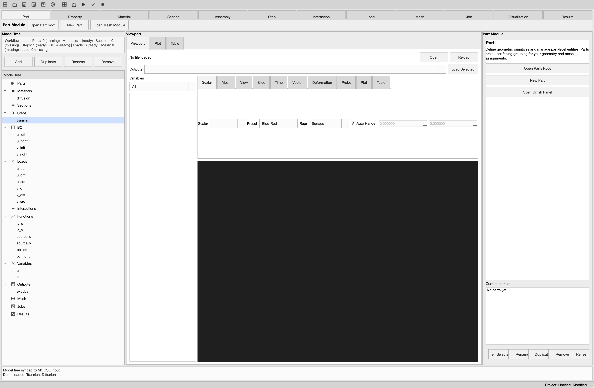
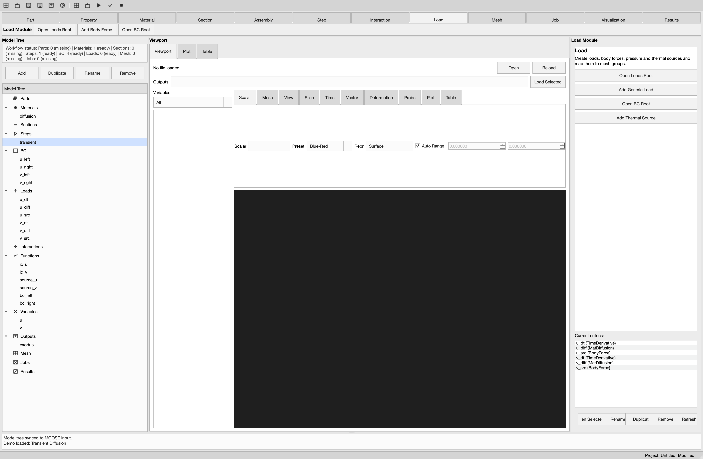
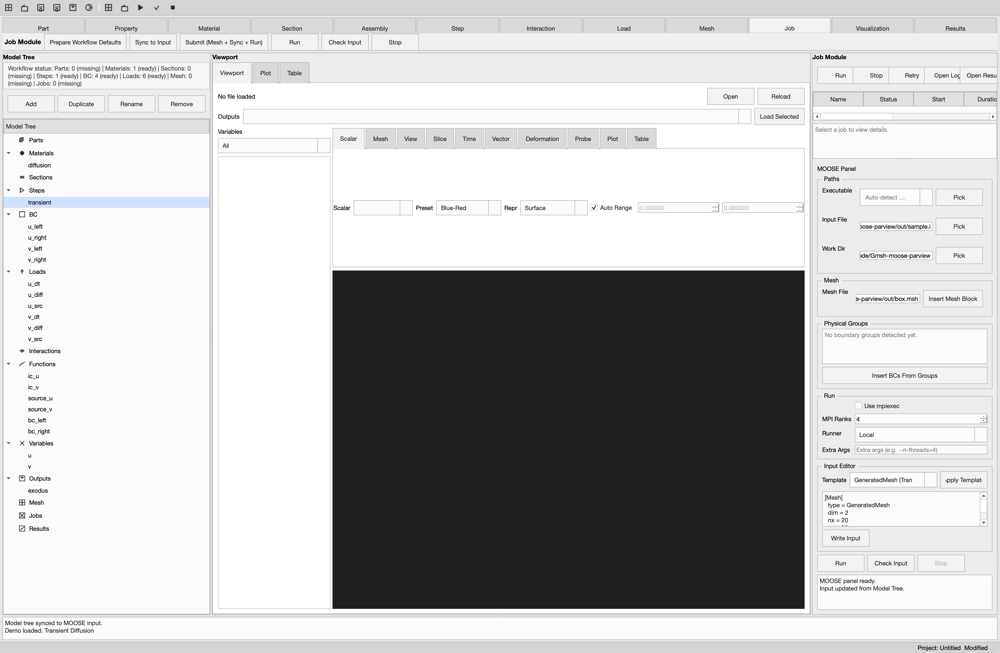
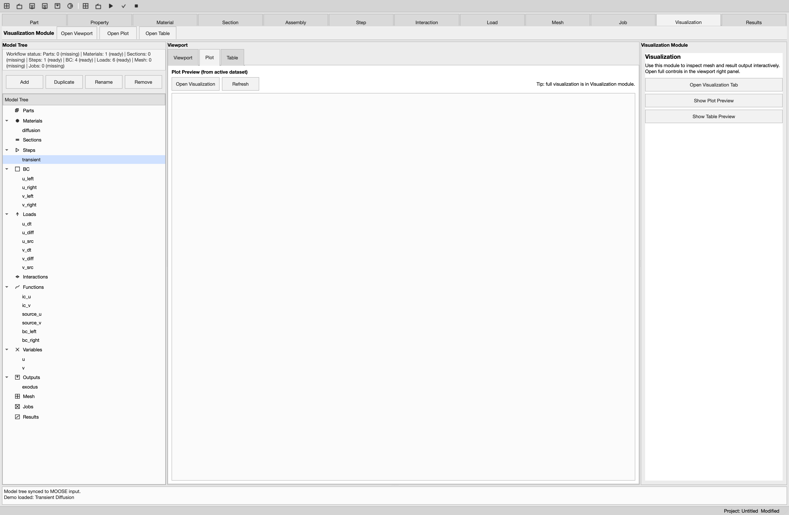
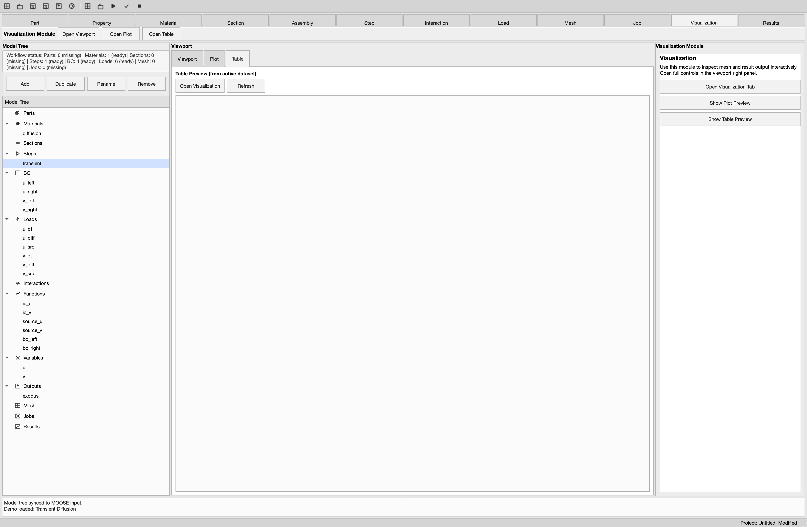

# GMP-ISE 用户使用手册

> 版本：2026-08-04 ｜ 适用版本：gmp_ise（main 分支，Qt 6.11 + VTK 9.6 + Gmsh 4.15 构建）
>
> 本手册截图均来自应用内"截图巡览"工具（设置 `GMP_SCREENSHOT_DIR` 环境变量启动即可自动翻页截图），
> 截图时载入了内置演示案例 *Transient Diffusion*，因此各页面带有示例数据。

## 目录

1. [软件简介](#1-软件简介)
2. [界面总览](#2-界面总览)
3. [菜单栏与工具栏](#3-菜单栏与工具栏)
4. [模型树（Model Tree）](#4-模型树model-tree)
5. [模块页详解](#5-模块页详解)
6. [Mesh 模块（GmshPanel）参数详解](#6-mesh-模块gmshpanel参数详解)
7. [Job 模块与 MOOSE Panel 参数详解](#7-job-模块与-moose-panel-参数详解)
8. [Visualization 可视化参数详解](#8-visualization-可视化参数详解)
9. [PropertyEditor 属性编辑器](#9-propertyeditor-属性编辑器)
10. [项目文件（*.gmp.yaml）](#10-项目文件gmpyaml)
11. [演示案例（Demos）](#11-演示案例demos)
12. [环境变量与自动探测](#12-环境变量与自动探测)
13. [已知限制](#13-已知限制)

---

## 1. 软件简介

GMP-ISE 是一个集成式仿真环境，把三个工具串成一条完整工作流：

- **前处理**：Gmsh C++ API（OCC 几何内核）——几何建模、物理组、网格生成；
- **求解**：MOOSE——自动生成输入文件（`.i`），以独立进程方式运行（支持 MPI）；
- **后处理**：内嵌 VTK 视图——加载 ExodusII（`.e`）结果做标量/向量/变形/切片/探针/图表分析。

使用体验对标 Abaqus 主线流程：

```
Part → Materials/Sections → Assembly → Step → BC/Load → Mesh → Job → Results
```

---

## 2. 界面总览



主窗口从上到下、从左到右分为：

| 区域 | 内容 |
|---|---|
| 顶部 | 菜单栏 + 主工具栏 |
| 模块页签条 | `Part / Property / Material / Section / Assembly / Step / Interaction / Load / Mesh / Job / Visualization / Results` 共 12 个模块 |
| 模块命令条 | 页签下方一行，标题为 `<模块名> Module`，内含当前模块的快捷按钮，随模块切换而变化 |
| 左栏 Model Tree | 工作流状态标签 + `Add/Duplicate/Rename/Remove` 动作条 + 模型树 |
| 中栏 Viewport | 三页页签：`Viewport`（3D 视图）、`Plot`（曲线预览）、`Table`（表格预览） |
| 右栏 Current Module | 随模块切换的功能页（属性编辑器 / 模块页 / Gmsh 面板 / 作业面板等） |
| 底部 | Job/Message Console 只读控制台 |
| 状态栏 | 右侧显示 `Project: <路径>` 与 `Saved/Modified` 状态 |

窗口标题为 `GMP-ISE - <项目名> [*]`，`*` 表示有未保存修改。

**Workflow status 标签**（模型树顶部）：实时显示 `Parts / Materials / Sections / Steps / BC / Loads / Mesh / Jobs` 各类节点的数量与 `ready/missing` 状态，用于快速发现流程缺口（例如还没建 Step 或没配 BC）。

---

## 3. 菜单栏与工具栏

### File 菜单

| 菜单项 | 快捷键 | 说明 |
|---|---|---|
| New Project | `Ctrl+N` | 清空模型树与作业表，新建未命名项目 |
| Open Project... | `Ctrl+O` | 打开 `*.gmp.yaml / *.yaml` 项目文件 |
| Save Project | `Ctrl+S` | 保存（无路径时弹另存对话框） |
| Save Project As... | `Ctrl+Shift+S` | 另存为 |
| Recent Projects ▸ | — | 最近项目（最多 10 条），底部 `Clear Recent` 清空 |
| Export Debug Bundle... | — | 导出调试包：项目文件 + 控制台日志 + MOOSE 输入 + 网格/结果副本 + `bundle_info.txt` |
| Save Screenshot... | `Ctrl+Shift+P` | 把当前视口保存为 PNG |

### Model 菜单

| 菜单项 | 快捷键 | 说明 |
|---|---|---|
| Sync Model -> MOOSE Input | `Ctrl+Shift+R` | 把模型树各节点生成为 MOOSE 输入块并写入输入编辑器 |

### Mesh 菜单

| 菜单项 | 快捷键 | 说明 |
|---|---|---|
| Generate Mesh | `Ctrl+M` | 生成网格（等价于 Mesh 模块的 Generate Mesh） |
| Preview Mesh... | `Ctrl+Shift+M` | 选择 `*.msh` 文件直接在视口预览 |

### Job 菜单

| 菜单项 | 快捷键 | 说明 |
|---|---|---|
| Run | `F5` | 启动作业 |
| Check Input | `Ctrl+K` | 以 `--check-input` 模式检查输入文件 |
| Stop | `Shift+F5` | 终止运行中的作业 |

### Demos 菜单

每个案例有 `Setup`（只载入模型树与 MOOSE 模板）和 `Run`（载入后立即运行）两个动作：

- `Setup/Run Transient Diffusion`：双变量 u/v 瞬态扩散；
- `Setup/Run Thermo-Mechanics`：热-力耦合（建议配合 combined-opt 可执行）；
- `Setup/Run Nonlinear Heat`：k(T) 非线性热传导。

### 主工具栏

菜单的图标版，依次为：New / Open / Save / Save As / Screenshot / Sync ｜ Generate Mesh / Preview Mesh / Run / Check / Stop。

---

## 4. 模型树（Model Tree）

模型树有 13 个固定根节点（根不可重命名/删除）：

```
Parts, Materials, Sections, Steps, BC, Loads, Interactions,
Functions, Variables, Outputs, Mesh, Jobs, Results
```

### 操作方式

- **动作条**：`Add`（在选中根下新增子节点，默认名 `<kind>_1`）、`Duplicate`（复制为 `<名>_copy`，含全部参数）、`Rename`（行内编辑）、`Remove`；
- **右键菜单**：根节点上为 `Add <根名>`；子节点上为 `Add / Duplicate / Rename / Remove`；
- **选中节点**：右侧 Property 模块自动显示该节点的属性编辑表单。

### 各类节点默认参数

| 节点类型 | 默认参数 |
|---|---|
| Functions | `type=ParsedFunction, expression=1.0` |
| Variables | `order=FIRST, family=LAGRANGE` |
| Materials | `type=GenericConstantMaterial, prop_names=prop, prop_values=1.0` |
| BC | `type=DirichletBC, variable=u, boundary=left, value=0` |
| Loads | `type=BodyForce, variable=u, value=0` |
| Outputs | `type=Exodus, exodus=true` |
| Steps | `type=Transient, dt=0.1, end_time=1.0` |
| Sections | `type=SolidSection, material=material_1` |

### 自动维护的节点

- 网格生成后 → `Mesh` 根下自动写入网格文件节点（`path, source=gmsh`）；
- 作业开始/结束 → `Jobs` 根下自动维护作业节点（状态、起止时间、结果路径）；
- 作业产出结果后 → `Results` 根下自动写入结果节点。

### 同步到 MOOSE 输入的映射规则

| 模型树根节点 | 生成的 MOOSE 块 |
|---|---|
| Functions | `[Functions]` |
| Variables | `[Variables]` |
| Materials | `[Materials]` |
| BC | `[BCs]` |
| Loads | `[Kernels]`（跳过 `section` 键） |
| Outputs | `[Outputs]` |
| Steps | `[Executioner]`（**仅使用第一个 Step**，多于一个时控制台告警） |

---

## 5. 模块页详解

### 5.1 Part 模块


- 按钮：`Open Parts Root`（模型树定位）、`New Part`（新建 `type=Part` 节点）、`Open Gmsh Panel`（跳 Mesh 模块）；
- 下方 `Current entries:` 列表显示现有 Part，双击跳转到模型树对应节点；行内按钮 `Open Selected / Rename / Duplicate / Remove / Refresh`。

### 5.2 Property 模块


右栏即 PropertyEditor（详见 [§9](#9-propertyeditor-属性编辑器)），编辑当前模型树选中节点的参数。
命令条按钮：`Sync Model to Input`、`Open Mesh Module`、`Open Job Module`。

### 5.3 Material 模块


- `Open Materials Root`、`New Material`（预置 `GenericConstantMaterial`）、`Open Property Editor`；
- 创建后自动跳到 Property 页编辑参数（密度、导热系数、弹性常数等，见 §9 的模板预设）。

### 5.4 Section 模块


- `Open Sections Root`、`New Solid Section`（预置 `type=SolidSection, material=material_1`）、`Open Property Editor`；
- Section 用于把材料赋给几何区域（对标 Abaqus 的 Section Assignment）。

### 5.5 Assembly 模块


- `Open Mesh Root`、`Create Assembly Alias`（在 Parts 下创建 `type=Assembly` 节点）；
- 当前为对象组合/别名管理，几何实例化变换在 Gmsh 面板的 Transform 组完成。

### 5.6 Step 模块


- `Open Steps Root`、`Add Static Step`（dt=0）、`Add Transient Step`（dt=0.1, end_time=1.0）、`Add Steady Step`；
- 页底 **Step sequence preview**：只读列出全部 Step 的 `type/dt/end_time`，并提示 MOOSE `[Executioner]` 只使用第一个 Step。

### 5.7 Interaction 模块


- `Open Interactions Root`、`Add Interaction`、`Add Tie Interaction`（预置 `type=Tie` 主/从面参数）；
- ⚠️ 当前 Interaction 仅为数据节点，**尚未接入求解流程**（规划中）。

### 5.8 Load 模块



- `Open Loads Root`、`Add Generic Load`、`Add Body Force`（BodyForce/u/0）、`Open BC Root`（直达 BC 分支）、`Add Thermal Source`（BodyForce/temperature/1.0）；
- Loads 同步到 MOOSE 时生成 `[Kernels]` 块。

### 5.9 Mesh 模块


右栏为 GmshPanel，功能与参数见 [§6](#6-mesh-模块gmshpanel参数详解)。
命令条按钮：`Generate Mesh`、`Generate 2D Mesh`、`Generate 3D Mesh`、`Open Mesh Root`、`Generate & Submit`（生成网格并一步提交作业）。

### 5.10 Job 模块



右栏上半为作业管理（详见 [§7.1](#71-作业管理)），下半为 MOOSE Panel（详见 [§7.2](#72-moose-panel-参数详解)）。
命令条按钮：

- `Prepare Workflow Defaults`：自动补齐缺失的最小流程节点（Part/Material/Section/Step/BC/Load）；
- `Sync to Input`：模型树 → 输入编辑器；
- `Submit (Mesh + Sync + Run)`：一键提交——自动取/生成网格 → GeneratedMesh 模板自动切换为对应 FileMesh 模板 → 同步 → 运行；
- `Run / Check Input / Stop`。

### 5.11 Visualization 模块


- 按钮：`Open Visualization Tab`、`Show Plot Preview`、`Show Table Preview`；
- 完整可视化控制在 Viewport 页签右侧（见 [§8](#8-visualization-可视化参数详解)）。

### 5.12 Results 模块


- **Type 筛选下拉**：`All / Solver (.e/.exo) / Mesh (.msh) / Text (.txt/.csv/.log/.yaml/.yml)`；
- 结果列表：**双击**条目——文本类文件在预览区打开，网格/求解结果自动载入视口；
- 按钮：`Open Results Root`、`Refresh List`、`Open in Viewer`（Exodus 或网格加载）、`Open as Text`（文本预览，超过 8KB 截断）；
- 预览区显示：路径、所属 job、文件大小/修改时间、类型与前 6 行内容；
- 列表选中项会自动在模型树中定位同名结果节点；命令条另有 `Open Job Log`。

---

## 6. Mesh 模块（GmshPanel）参数详解

GmshPanel 为滚动面板，底部有只读日志区。分组如下：

### 6.1 Model（几何导入）

| 控件 | 说明 |
|---|---|
| `Geometry` 路径框 | 只读，显示当前几何来源 |
| `Open Geometry` | 导入几何，支持 `.geo / .geo_unrolled / .step / .stp / .iges / .igs / .brep`（STEP/IGES/BREP 走 OCC 内核） |
| `Clear Model` | 清空当前模型（`gmsh::clear`） |
| `Auto mesh after import` | 导入后自动剖分（默认开） |
| `Auto reload geometry on project load` | 打开项目时自动重载几何（默认开） |
| `Summary` | 实体统计：`Entities: nP / nC / nS / nV`（点/线/面/体数量） |

### 6.2 Entities（实体浏览）

`Dim` 下拉（`All/0/1/2/3`）+ `Refresh` + 只读实体列表（ID + 名称）。

### 6.3 Geometry（示例盒）

| 参数 | 范围 | 默认 |
|---|---|---|
| `Use Sample Box` | 开关 | 开（空模型时自动生成带 `solid` 体物理组 + `boundary` 面物理组的示例盒） |
| `Size X / Y / Z` | 0.01–1000 | 各 1.0 |

### 6.4 Primitives（几何基元）

| 参数 | 说明 | 默认 |
|---|---|---|
| `Type` | `Box / Cylinder / Sphere` | Box |
| `Origin/Base x,y,z` | 基元原点（圆柱为底面圆心） | 0,0,0 |
| `Size/Axis dx,dy,dz` | 盒边长 / 圆柱轴向 | 1.0 |
| `Radius` | 圆柱/球半径 | 0.5 |

按钮 `Add Primitive` 创建基元。

### 6.5 Transform（变换）

- `Selection` 行：`Dim`（All/0/1/2/3）+ `IDs` 输入框（支持 `1,2` 或 `2:5`，空=全部；非法 ID 实时红色高亮）+ `Template` 实体模板下拉 + `Pick` 拾取按钮；
- `Translate`：`dx,dy,dz` + `Translate` 按钮；
- `Rotate`：`Rotate Origin x,y,z` + `Rotate Axis ax,ay,az`（默认 0,0,1）+ `deg`（-360~360）+ `Rotate`；
- `Scale`：`Scale Center x,y,z` + `Scale sx,sy,sz`（0.001–1000，默认 1.0）+ `Scale`。

> 变换仅作用于 OCC 实体；非 OCC 实体会被自动过滤并在日志提示。

### 6.6 Boolean（布尔运算）

- `Dim`（3/2/1/0）；`Obj` / `Tool` 两组 IDs 输入（各带模板下拉与 Pick）；
- 复选框 `Remove Object` / `Remove Tool`（默认均开）；
- 按钮 `Fuse / Cut / Intersect`。

### 6.7 Physical Groups（物理组）

- `Groups` 下拉 + `Refresh`；`Group` 行 = `Dim`（0/1/2/3）+ `Name`；
- `Entities` 输入框 + `Pick`；
- 按钮 `Add / Update Selected / Delete Selected`；
- 统计表 5 列：`Dim / Tag / Name / Entities / Elements`，选中行会在视口中高亮对应组。

> 物理组名称会同步为 MOOSE 的边界/块名称（BC 的 `boundary`、Loads 的 `block`）。

### 6.8 Mesh Fields（局部加密场）

| 参数 | 默认 | 说明 |
|---|---|---|
| `Targets` | Dim 1/2/3 + Entities | 场作用目标 |
| `DistMin / DistMax` | 0.1 / 1.0 | 距离范围（Distance 场） |
| `SizeMin / SizeMax` | 0.05 / 0.2 | 近处/远处网格尺寸（Threshold 场） |

按钮 `Apply Field / Clear Fields / Refresh`；Fields 列表显示已创建的场，自动设为背景场。

### 6.9 Mesh（网格控制）

| 参数 | 选项/范围 | 默认 |
|---|---|---|
| `Mesh Size` | 0.01–1000 | 0.2（全局尺寸，同时设 Min/Max） |
| `Generate Dim` | `Auto / 1D / 2D / 3D` | Auto（超几何维度自动回退） |
| `Entity Size` | Dim+IDs+Size | 仅 dim=0（点）生效 |
| `Element Order` | `Linear(1) / Quadratic(2) / Cubic(3) / Quartic(4)` | Linear |
| `High-Order` | `Off / Simple / Elastic / Fast Curving` | Off（阶数>1 时生效） |
| `MSH Version` | `MSH 2.2 / MSH 4.1` | 2.2 |
| `Algorithm 2D` | `Automatic(2) / MeshAdapt(1) / Delaunay(5) / Frontal(6) / BAMG(7) / DelQuad(8)` | Automatic |
| `Algorithm 3D` | `Delaunay(1) / Frontal(4) / HXT(10)` | Delaunay |
| `Recombine (quad/hex)` | 开关 | 关 |
| `Smoothing` | 0–100 | 10 |
| `Optimize Mesh` | 开关 | 开 |

### 6.10 输出与执行

- `Mesh Output` 路径（默认 `<工作目录>/out/box.msh`）+ `Pick Output`；
- `Export Geometry`：导出 `.brep / .geo_unrolled`；
- `Generate Mesh / Generate 2D Mesh / Generate 3D Mesh`。

### 6.11 网格报告

生成后日志输出：节点/单元数、单元质量 `Quality (minSICN) min/mean/max`、各物理组单元计数。

---

## 7. Job 模块与 MOOSE Panel 参数详解

### 7.1 作业管理

- **作业表** 7 列：`Name / Status / Start / Duration / Mesh / Exec / Result`；
- **控制按钮**：`Run`、`Stop`、`Retry`（重跑）、`Open Log`（弹窗显示完整日志）、`Open Result`（把该行结果载入视口）；
- **作业详情**：选中行显示 Name/Status/Start/Duration/Mesh/Exec/Args/Workdir/Result/Exit + 最近 30 行日志；
- 状态流转：`Running` → `Completed / Failed`（按退出码），自动记录起止时间与时长。

### 7.2 MOOSE Panel 参数详解

**Paths 组**

| 参数 | 说明 |
|---|---|
| `Executable` | MOOSE 可执行文件（可编辑下拉带历史；留空时自动探测，见 §12） |
| `Input File` | 输入文件路径（默认 `<工作目录>/out/sample.i`） |
| `Work Dir` | 工作目录（默认当前目录） |

**Mesh 组**

| 参数 | 说明 |
|---|---|
| `Mesh File` | `.msh` 网格路径 |
| `Insert Mesh Block` | 把输入文件中的 `[Mesh]` 块替换为 `type = FileMesh, file = <路径>` |

**Physical Groups 组**

- 只读边界组列表（来自网格的物理组）；
- `Insert BCs From Groups`：按边界组批量生成 DirichletBC 的 `[BCs]` 块（组名中的非字母数字字符自动转为 `_`）。

**Run 组**

| 参数 | 范围/选项 | 默认 |
|---|---|---|
| `Use mpiexec` | 开关 | 关 |
| `MPI Ranks` | 1–4096 | 4 |
| `Runner` | `Local / WSL / Remote` | Local |
| `Extra Args` | 空格分词的额外参数（如 `--n-threads=4`） | 空 |

**Input Editor 组**

- `Template` 下拉 5 项：
  1. `GeneratedMesh (Transient Diffusion)` — 内置网格 + 瞬态扩散；
  2. `FileMesh (Transient Diffusion)` — 外部网格 + 瞬态扩散；
  3. `GeneratedMesh (Nonlinear Heat)` — 非线性热传导；
  4. `GeneratedMesh (Thermo-Mechanics)` — 热-力耦合；
  5. `FileMesh (Thermo-Mechanics)` — 外部网格 + 热-力耦合；
- `Apply Template` 应用模板（选热-力耦合模板时自动尝试定位 `combined-opt`）；
- 输入文本编辑器可直接修改；`Write Input` 写盘；
- 动作行 `Run / Check Input / Stop`；下方为运行日志（自动识别产出的 `.e` 文件并通知视口）。

**运行命令**（供参考）：

```bash
# 不勾选 mpiexec
<exec> -i <input> [Extra Args]
# 勾选 mpiexec
mpiexec -n <ranks> <exec> -i <input> [Extra Args]
# Check Input 模式追加 --check-input
```

以上路径/参数均通过 QSettings 持久化（下次启动自动恢复）。

---

## 8. Visualization 可视化参数详解


顶部：文件标签 + `Open`（支持 `*.e / *.msh`）+ `Reload`；`Outputs` 下拉（历史作业产出）+ `Load Selected`。
左列 `Variables`：过滤器 `All/Point/Cell` + 变量列表（选中即切换着色变量）。右侧控制区页签：

### Scalar（标量着色）

| 参数 | 选项 | 默认 |
|---|---|---|
| `Scalar` | 当前数据的标量数组 | — |
| `Preset` | `Blue-Red / Grayscale / Rainbow` | Blue-Red |
| `Repr` | `Surface / Wireframe / Surface + Edges` | Surface |
| `Auto Range` + min/max | 色标范围（手动精度 6 位小数） | Auto 开 |

### Mesh（网格显示）

- 显示开关：`Faces`（开）/ `Edges`（开）/ `Shell`（开）/ `Nodes`（关）/ `Quality`（关，勾选后按 `C:Quality` 着色）；
- 过滤：`Dim`（All/0/1/2/3）、`Group`（物理组）、`Entity`（实体）、`Type`（单元类型）；
- `Opacity` 0.05–1.0（默认 1.0）、`Shrink` 0–1.0（默认 1.0，单元收缩便于看内部）；
- `Scalar Bar`（开）；`Pick` 拾取复选 + 模式 `Group / Entity / Cell` + `Clear`。

### View（视图）

视角 `Reset / Front / Right / Top / Iso` + `Apply View`；`Axes`、`Outline` 开关；`Reset Filters` 一键复位过滤器；`Pick:` 拾取状态与 `Groups:` 图例标签。

### Slice（切片）

`Slice` 复选 + 轴 `X/Y/Z` + 位置滑块 0–100（默认 50）。

### Time（时间序列）

`Auto Refresh` + 间隔 ms（250–10000，默认 1000；另有文件监视自动重载）；时间步滑块 + 当前 `t=` 标签。

### Vector / Deformation（向量与变形）

- Vector：向量数组下拉 + `Auto-sync deformation vector`（默认开）+ `Apply to Deform`；
- Deformation：`Enable Deformation` + 向量下拉 + `Scale` 0–1000（默认 1.0，vtkWarpVector 变形放大）。

### Probe（探针）

`Enable Probe` + 模式 `Point / Cell` + `Clear`；信息标签显示拾取的节点/单元与数值。

### Plot / Table（图表与表格）





- Plot：`Refresh` + 统计标签 + 文本曲线视图；
- Table：`Rows` 10–5000（默认 100）+ `Refresh` + 只读表格；
- 中栏的 `Plot` / `Table` 预览页与之联动：结果产出后自动刷新快照。

---

## 9. PropertyEditor 属性编辑器

选中模型树任意节点后，右栏 Property 页显示 `«Kind» — «名称»`，含三个页签：

### General

`Kind`（只读）、`Status`（只读）、`Name`（可编辑，即节点重命名）。

### Parameters

- **Quick Parameters 表单**：按节点类型动态生成（Materials/Sections/Steps/BC/Loads），字段随 `type` 联动显隐，与下方高级参数表双向同步；
- **Template 预设**：表单首行 `Template` 下拉 + `Apply Template`，首项 `Type Defaults`（按当前 type 生成默认值），其后为类型预设——
  - Materials：`Generic Constant (k=1.0)`、`Parsed Conductivity k(T)`、`Linear Elastic (isotropic)`、`Thermal Expansion`；
  - BC：`Fixed (Dirichlet 0)`、`Prescribed Function`、`Neumann (traction)`；
  - Loads：`Body Force`、`Body Force (Function)`、`MatDiffusion`、`TensorMechanics`；
  - Sections：`Solid Section`；
  下方 `Template Info` 预览区显示所选预设的说明；
- **Groups 框**（仅 BC/Loads）：BC 显示 Boundary Groups、Loads 显示 Volume Groups，多选 + `Apply Groups` 写入 `boundary`/`block`（空格连接）；
- **Advanced Parameters**：复选展开 Key/Value 参数表（`Add Param / Remove Param`），`Sync` 下拉选择同步策略 `Bidirectional (Recommended) / Quick Form Wins`；
- **校验**：缺失必填字段时显示红色 `Missing required fields: …`；**Validation Summary** 汇总全树校验结果（`Node / Issues` 表，过滤器 `Current Type Only` / `Only With Issues`，`Go To Node` 跳转）。典型规则：Transient 步要求 `dt>0, end_time>0`；FunctionDirichletBC 要求 `function`；BodyForce 要求 `value` 或 `function`。

### Preview

显示节点摘要（名称/类型/状态）、按 key 排序的参数输出，以及对应的 MOOSE 输入块预览与校验结论。

---

## 10. 项目文件（*.gmp.yaml）

保存/打开过滤器为 `GMP Project (*.gmp.yaml *.yaml)`，内容为 YAML：

```yaml
version: 1
saved_at: <UTC ISO 时间>
model:    # 模型树全部节点（name/kind/params）
gmsh:     # GmshPanel 全部设置（输出路径、几何路径、算法、场参数等）
moose:    # MOOSE 面板设置（可执行、输入路径、MPI、模板、输入文本等）
viewer:   # VTK 视图状态（约 30 个键：着色、过滤、视角、时间步等）
```

加载项目时：恢复模型树与三个面板设置；若记录了几何路径且开启 `Auto reload geometry`，自动重新导入几何（必要时自动剖分）。

---

## 11. 演示案例（Demos）

Demos 菜单提供 3 个内置案例，每个都有两个动作：

- **Setup**：清空模型树 → 按案例重建全部节点 → 应用对应 MOOSE 模板 → 自动执行一次 `Sync Model to Input`。适合浏览、学习节点组织方式；
- **Run**：在 Setup 的基础上立即提交作业（需要可用的 MOOSE 可执行文件，见 §12）。

### 11.1 Transient Diffusion（双变量瞬态扩散）

最简单的入门案例：两个独立的扩散方程共用一块 2D 网格，演示"变量 + 材料 + 函数 + BC + Kernel"的完整链路。

| 模型树节点 | 内容 |
|---|---|
| Variables | `u`、`v`（均为一阶 LAGRANGE） |
| Functions | `ic_u / ic_v`（初始场）、`source_u / source_v`（ParsedFunction 源项）、`bc_left / bc_right`（边界函数） |
| Materials | `diff_u / diff_v`（GenericConstantMaterial，扩散系数） |
| BC | `u_left / u_right`（FunctionDirichletBC）；`v_left / v_right`（DirichletBC，value=0） |
| Loads（→`[Kernels]`） | 每个变量 3 个核：`TimeDerivative`（时间项）+ `MatDiffusion`（扩散项）+ `BodyForce`（源项） |
| Steps | Transient，`solve_type=NEWTON, scheme=bdf2, dt=0.01, end_time=0.2` |
| Outputs | Exodus + CSV |

- MOOSE 模板：`GeneratedMesh (Transient Diffusion)`（2D 内置网格，无需外部 `.msh`）；
- 观察点：结果载入后，Visualization 的 Scalar 下拉可切换 `u` / `v`，Time 页签拖动时间步看扩散过程。

### 11.2 Thermo-Mechanics（热-力耦合）

演示单向热-力耦合：温度场先求解，热膨胀产生应变，再驱动位移场。

| 模型树节点 | 内容 |
|---|---|
| Variables | `T`（温度，initial_condition=300）、`disp_x`、`disp_y`（2D 位移） |
| Functions | `heat_src`（`50*exp(-t)*sin(πx)*sin(πy)` 衰减热源） |
| Materials | `thcond`（导热系数 1.0）、`elastic`（ComputeElasticityTensor，symmetric_isotropic）、`strain`（ComputeSmallStrain，含热膨胀本征应变）、`stress`（ComputeLinearElasticStress）、`thermal_strain`（ComputeThermalExpansionEigenstrain，α=1e-5，参考温度 300） |
| BC | 温度：`left=400 / right=300`；位移：`fix_x`（left 边 disp_x=0）、`fix_y`（bottom 边 disp_y=0） |
| Loads | `htcond`（HeatConduction）、`TensorMechanics`（力学作用）、`Q_function`（热源 BodyForce） |
| Steps | Transient，`PJFNK, bdf2, dt=0.05, end_time=0.5`，含非线性/线性迭代与容差设置 |
| Outputs | Exodus + CSV；模板另带 `sigma_xx/yy/xy` 应力 AuxVariables + RankTwoAux |

- MOOSE 模板：`GeneratedMesh (Thermo-Mechanics)`；选择该模板时会自动尝试定位 `external/moose/modules/combined/combined-opt` 作为可执行文件（TensorMechanics 模块需要 combined 应用）；
- 观察点：Visualization 中 `Deformation` 页签勾选 Enable 后用 `disp_*` 向量做变形放大，配合 `sigma_xx` 看热应力分布。

> 注意：模型树中的 `TensorMechanics` 是 MOOSE 的 **Action** 语法。当前版本同步到输入时会多写一行 `type = TensorMechanics`，若 `--check-input` 报未注册类型错误，在 Input Editor 中删除该行即可（保留 `[./TensorMechanics]` 块与 `displacements` 参数）。

### 11.3 Nonlinear Heat（非线性热传导）

演示材料参数随温度变化（k = k(T)）的非线性稳态/瞬态传热，对应 `ParsedMaterial` 的用法。

| 模型树节点 | 内容 |
|---|---|
| Variables | `T`（温度，initial_condition=300） |
| Materials | `k_T`（ParsedMaterial：`property_name=thermal_conductivity, coupled_variables=T, expression=1 + 0.01*T`） |
| BC | `temp_left=500 / temp_right=300`（DirichletBC） |
| Loads | `T_dt`（TimeDerivative）、`T_cond`（HeatConduction，自动引用 k(T)） |
| Steps | Transient，`NEWTON, bdf2, dt=0.02, end_time=0.5` |
| Outputs | Exodus + CSV |

- MOOSE 模板：`GeneratedMesh (Nonlinear Heat)`；
- 观察点：与线性案例对比温度场分布的弯曲程度；非线性残差收敛情况见作业日志。

### 11.4 案例选择建议

- 第一次跑通流程 → **Transient Diffusion**（无外部依赖，网格内置）；
- 要学力学/耦合建模 → **Thermo-Mechanics**（最接近结构分析场景，需要 combined-opt）；
- 要学非线性材料 → **Nonlinear Heat**（ParsedMaterial 表达式模板可直接改成你的 k(T)/σ(T) 关系）。

---

## 12. 环境变量与自动探测

| 环境变量 | 作用 |
|---|---|
| `GMP_MOOSE_EXEC` | 指定 MOOSE 可执行文件路径，优先级最高 |
| `GMP_SCREENSHOT_DIR` | 启动后自动逐页截图到指定目录并退出（文档工具） |

`Executable` 留空时的自动探测顺序：

1. 环境变量 `GMP_MOOSE_EXEC`；
2. PATH 中的 `moose_test-opt` / `moose_test-dbg`；
3. 自当前目录向上最多 6 级查找 `external/moose/test/moose_test-opt(-dbg)`；
4. 选择热-力耦合模板时，同法探测 `external/moose/modules/combined/combined-opt`。

---

## 13. 已知限制

- **Runner 模式**：`Local` 直接本机运行；`WSL` 通过 `wsl.exe` 调度（仅 Windows）；`Remote`（SSH）当前为占位实现，回退为本地执行（规划中）；
- **Interaction**（Tie 等约束）仅为数据节点，尚未接入求解输入生成；
- **Steps** 只同步第一个 Step 到 `[Executioner]`；
- 未启用编译宏 `GMP_ENABLE_GMSH_GUI` / `GMP_ENABLE_VTK_VIEWER` 时，对应面板显示禁用提示；
- 启动日志中的 `Gmsh has not been initialized` 为面板初始化顺序导致的无害噪音，不影响功能。
