# GMP-ISE 用户手册（终端客户版）

> 版本：2026-09-17（重构版）
> 适用软件：GMP-ISE（Gmsh + MOOSE + VTK 集成仿真环境）
> 编写依据：操作步骤取自人工验证通过的实际项目配置流程（验收记录见
> `manual/test04.md`、`manual/test05.md`）；界面与参数说明以 2026-09 当前构建为准
> （参考 `doc/UI功能手册.md`、`doc/用户使用手册.md`）。
>
> 截图说明：本手册中 GMP-ISE 界面截图均为 **2026-09-17 当前构建**的实际界面，
> 通过软件内置「真实点击 UI 巡览」自动截取（复现方法见附录 D）；Abaqus 截图
> （文件名以 `abaqus-` 开头）为对标参考流程的 Abaqus/CAE 侧画面。

---

## 阅读指南：两类读者，两条路径

| 读者 | 推荐路径 |
|---|---|
| **零基础用户**（从未用过有限元软件） | 第一部分（认识软件）→ 第二部分（手把手完成第一个仿真）→ 第八、九部分（提交计算、看结果）→ 第十部分（FAQ） |
| **Abaqus 专家**（熟悉 Abaqus/CAE） | 第一部分 → 第三部分（Abaqus 概念对照 + M-01 装配接触算例）→ 第四～七部分（参考手册：菜单、参数、引用关系、`.i` 映射） |

手册结构总览：

| 部分 | 内容 | 性质 |
|---|---|---|
| 一 | 认识 GMP-ISE：界面、模型树、工作流 | 入门 |
| 二 | 零基础快速上手：混凝土试块受压完整流程 | 教程（已验证） |
| 三 | Abaqus 专家篇：概念对照 + M-01 装配接触算例 | 教程（已验证） |
| 四 | 功能菜单逐条参考（含输入依赖与输出） | 参考 |
| 五 | 全模块参数设置详解 | 参考 |
| 六 | 模块间引用关系与固定建模顺序 | 参考 |
| 七 | 预处理操作 → `.i` 输入文件映射详解 | 参考 |
| 八 | 计算任务：本地与远程两种场景的配置 | 参考 |
| 九 | 后处理与舞台操作详解 | 参考 |
| 十 | 常见问题 FAQ | 参考 |
| 附录 | 映射速查 / 快捷键 / 参考文档 / 截图复现 | 参考 |

> 名词约定：「模型树」指软件左侧的对象树；「物理组（Physical Group）」是网格中
> 带名字的区域集合，相当于 Abaqus 的 Set / Surface；「同步」指把模型树转换成
> 求解器输入文件（`.i`）。

---

# 第一部分 认识 GMP-ISE

## 1.1 这是什么软件

GMP-ISE 把三个开源工具整合成一条完整的仿真工作流：

- **前处理（建模与网格）**：内置 Gmsh（OCC 几何内核）——画草图、建部件、装配、
  划分网格、定义物理组；
- **求解**：自动把你在界面里配置的内容生成为 MOOSE 输入文件（`.i`），支持本地运行
  或通过网络提交到远程计算节点（LIMS Facade）；
- **后处理**：内置 VTK 视图——加载 Exodus（`.e`）结果，查看云图、变形、切片、
  时间序列曲线。

整体使用体验对标 Abaqus 的主线流程：

```text
草图 → 部件(Part) → 材料/Section → 装配(Assembly) → 分析步(Step)
     → 相互作用(Interaction) → 边界/载荷(BC/Load) → 网格(Mesh) → 作业(Job) → 结果(Results)
```

## 1.2 主界面总览

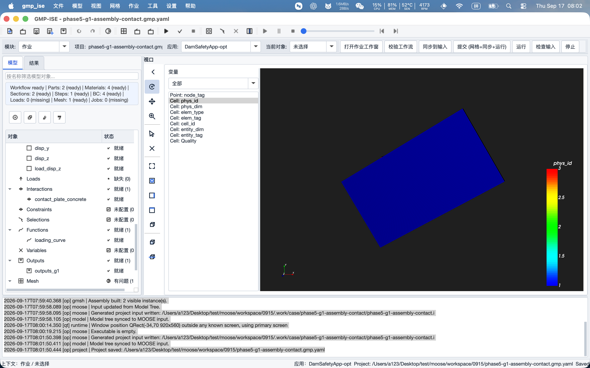

上图是打开一个已完成装配接触项目（`phase5-g1-assembly-contact.gmp.yaml`）后的主界面。
从上到下、从左到右：

| 区域 | 内容 |
|---|---|
| 菜单栏 | 文件 / 模型 / 视图 / 网格 / 作业 / 工具 / 设置 / 帮助（逐条说明见第四部分） |
| 图标工具栏 | 项目 / 编辑 / 模型 / 网格 / 作业 / 回放六个工具组（可拖拽、可浮动） |
| 工作上下文条 | **模块**下拉（13 个模块）、**项目**名、**应用**选择器（如 `DamSafetyApp-opt`）、**当前对象**下拉；右侧为随模块变化的快捷按钮 |
| 左侧导航区 | **模型** / **结果**两个页签。模型页顶部有工作流摘要（如 `Workflow ready \| Parts: 2 (ready) \| …`），实时提示还缺哪些环节 |
| 中央舞台 | 3D/2D 视口，左侧有竖排工具条；视口左边是变量列表 |
| 底部 | 作业/消息控制台，所有操作日志带时间戳输出在这里 |
| 状态栏 | 当前上下文、活动应用、项目路径、保存状态（Saved / Modified） |

## 1.3 模型树：所有对象的「总目录」

模型树包含 21 个固定根节点（根节点不可重命名/删除）：

```text
Parts（部件）、Sketches（草图）、Features（特征历史）、Datums（基准）、
Materials（材料）、Sections（截面）、Assembly（装配）、Physics（力学场）、
Steps（分析步）、BC（边界条件）、Loads（载荷）、Interactions（相互作用）、
Constraints（约束）、Selections（选择集）、Functions（函数）、Variables（变量）、
Outputs（输出）、Mesh（网格）、Input Cases（输入案例）、Jobs（作业）、Results（结果）
```

通用操作约定（全软件统一）：

- **双击**节点（或右键 →「编辑属性」、或按 `Enter`）打开浮动属性表单；
  **右键**根节点出现「添加 …」菜单；
- 属性表单中修改后要点**「确定」**才校验并一次性写回；「取消」/ Esc / 关闭窗口
  丢弃全部修改，不改变项目脏状态；
- 很多表单顶部有「可选物理体 / 可选边界分组」列表：**在列表里点中一行 ≠ 完成指派**，
  必须再点击**「应用所选物理体」/「应用所选边界」/「应用所选分组」**按钮，
  并确认只读的「已指派 …」字段变成目标名称，才算真正指派成功；
- 每个对象都有「校验」页，点「刷新」可查看当前对象缺什么、错在哪；
- 模型树节点状态图标：就绪 ✓ / 失效（含引用丢失）/ 未配置 / 已生成 / 运行中 ▶；
  根节点聚合显示如「缺失 (n) / 有问题 (n)」。

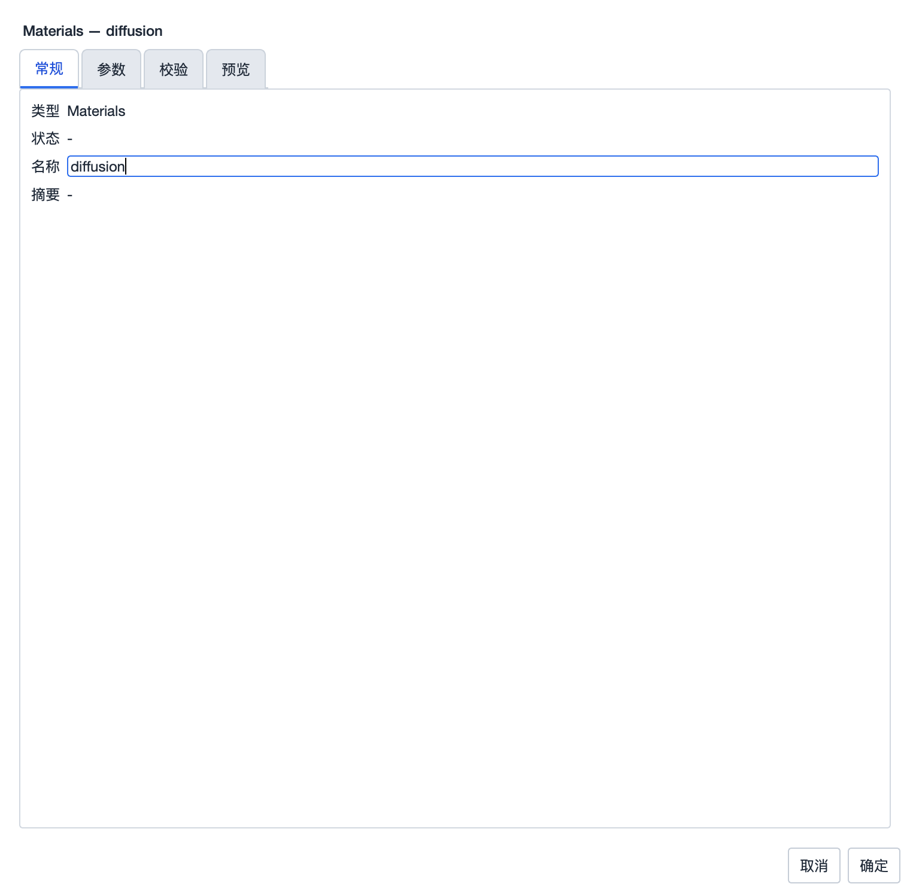

## 1.4 工作流状态与「校验工作流」

左侧模型树顶部的摘要条实时统计各类节点的数量和就绪状态。任何时候都可以点击
**「校验工作流」**（作业模块快捷按钮，或菜单「作业 → 校验工作流」）做一次全面体检：

- 校验是**只读**操作，不会自动替你补建任何对象；
- 报告中的错误行可以双击**定位**到出问题的模型树节点并打开其属性表单；
- 全部通过时摘要显示 `Workflow ready`；存在阻断问题时显示 `Workflow blocked`，
  此时快照导出和远程提交会被阻止；
- 分步建模过程中暂时 blocked 是正常的，配齐所有环节后再看总结果。

---

# 第二部分 零基础快速上手：混凝土试块受压仿真

> 本章带你从零完成一个完整仿真：**一个混凝土方块，底面固定，顶面缓慢下压**。
> 流程中的每一步都已在 2026-09 的人工验收中实际执行通过（对应 `manual/test04.md`
> 的第一至十二部分）。跟着做即可，不理解的名词可以先跳过，第五～九部分有完整解释。

## 2.1 新建项目并保存

1. 菜单「文件 → 新建项目」（快捷键 `Ctrl/Cmd+N`）。
2. 立即「文件 → 项目另存为」，存为例如 `my-first-case.gmp.yaml`。
   保存后窗口标题变为 `GMP-ISE - my-first-case.gmp.yaml`，右上角会短暂出现
   「项目另存为成功」提示（约 3.5 秒自动消失）。
3. 确认工作上下文条的**应用**选择器为生产档案 `DamSafetyApp-opt`。

> 提示：新项目不会继承上一个项目的输入文件、网格路径等设置，各项目完全隔离。

## 2.2 画草图

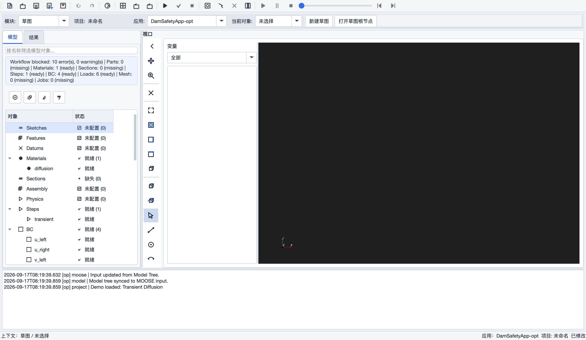

1. 顶部「模块」切换到**草图**。
2. 点击「新建草图」，进入草图编辑器（Sketch Editor）。
3. 选择「矩形」工具，在 XY 平面拖出一个闭合矩形（本例尺寸随意，例如 100 × 100）。
4. 画错了可以用「工具 → 撤销」（`Ctrl/Cmd+Z`）回退。
5. 点击「完成编辑」退出编辑器。
6. 在模型树中右键新草图节点 →「重命名」，改为 `sketch_block`。

## 2.3 拉伸成三维部件

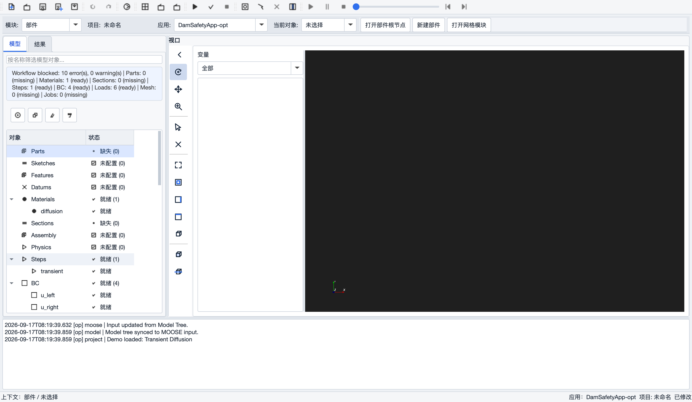

1. 顶部「模块」切换到**部件**。
2. 点击「新建部件」，草图选择 `sketch_block`，并把部件重命名为 `part_block`。
3. 在「部件特征」中选择「拉伸」，草图选 `sketch_block`，填写正的拉伸距离
   （例如 `100`），点击「沿 +Z 拉伸」。
4. 中央舞台应出现一个三维实体。部件参数中会出现一个 BREP 几何文件路径，
   该文件由软件自动管理，不需要手工处理。

## 2.4 装配（放入一个实例）

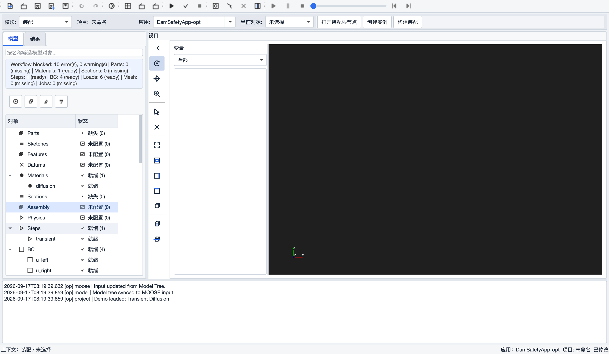

1. 顶部「模块」切换到**装配**，点击「打开装配根节点」。
2. 点击「创建实例」，把新节点重命名为 `instance_block`。
3. 双击该实例，在「参数」页设置：
   - 部件：`part_block`
   - 平移 X/Y/Z：`0 / 0 / 0`
   - 旋转 X/Y/Z：`0 / 0 / 0`（角度制，按 X → Y → Z 顺序应用）
   - 缩放 X/Y/Z：`1 / 1 / 1`（缩放必须大于 0，否则表单会拒绝提交）
   - 可见：`true`；顺序：`1`
4. 点击「确定」，再点击**「构建装配」**。
5. 网格工作窗会自动来到前面，「模型来源」显示 `assembly: active`，
   舞台中出现装配后的实体。

> 装配的意义：同一个部件可以被实例化多次并各自摆放位置（第三部分的双部件算例会用到）。
> 单个部件也要经过装配，后续的网格和物理组才有一个统一的「当前模型」来源。

## 2.5 划分网格并建立物理组

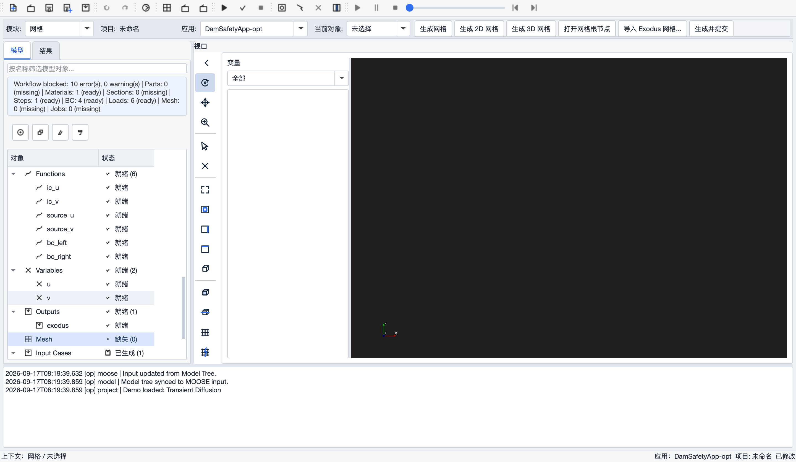

物理组（Physical Group）是给网格中的区域起名字——**后面固定、加载、赋材料全部靠这些名字**，
相当于 Abaqus 里的 Set 和 Surface。

1. 模型树展开 `Mesh`，右键根节点新建一个 Mesh 子节点，重命名为 `mesh_block`。
2. 双击 `mesh_block` 打开网格工作窗（Mesh Workspace）。
3. 在「模型」页确认几何来源为 `assembly: active`。

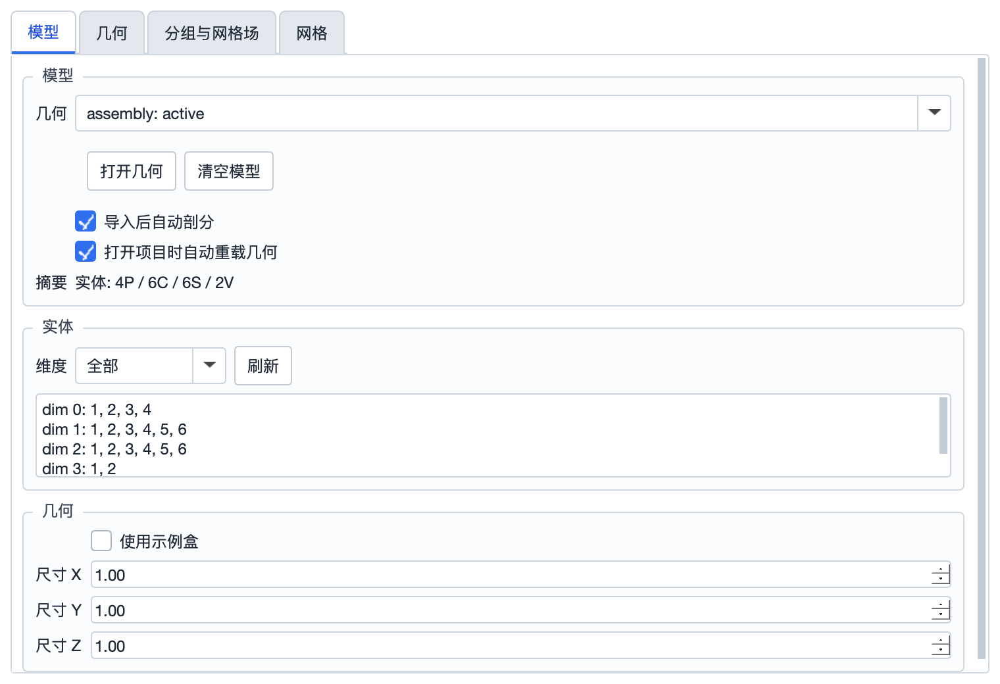

4. 在「网格」页选择合适的全局网格尺寸（例如 `10`），点击**「生成 3D 网格」**，
   等待完成。控制台会输出节点数、单元数和单元质量（`minSICN`，越接近 1 越好）。
5. 进入「分组与网格场 → 物理组」页。装配已经自动生成了：
   - `instance_block`（维度 3，整个体）——后面**赋材料**用它；
   - `instance_block_surface`（维度 2，全部边界面）——这只是总边界，**不能直接当固定面/加载面用**。
6. 新建固定面组：
   - 维度设为 `2`，名称填 `fixed`；
   - 点击实体旁的**「拾取」**，弹出选择器。单击候选面时，主舞台会把整个装配降为灰色线框、
     把该面以亮黄色高亮，并自动转到从该面外侧观察的视角——用这个方法确认你选的是
     **底面**（Z 坐标最小的面）；选择器打开期间舞台仍可旋转/缩放；
   - 选中底面后确认，点击「添加」。
7. 同样方法新建加载面组 `load`，这次选**顶面**（Z 坐标最大的面）。
8. 检查物理组表格：`fixed`、`load` 维度均为 2，且两者不是同一个面。
9. **重新生成一次 3D 网格**，把新建的面组写进 `.msh` 文件。
10. 保存项目。

## 2.6 定义混凝土 CDP 材料

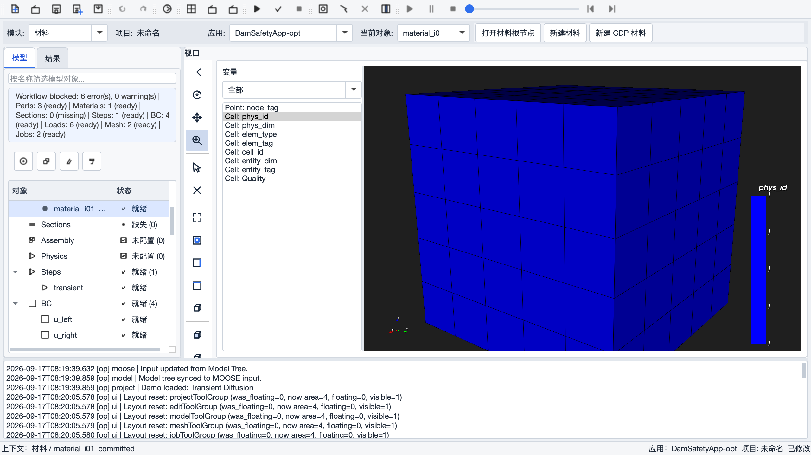

混凝土在受压/受拉时会开裂、压碎，这种行为用 **CDP（混凝土损伤塑性）**模型描述。
软件通过四个 CSV 数据表定义 CDP 的非线性曲线：

| CSV 文件 | 描述 |
|---|---|
| `compression_hardening.csv` | 压应力 — 非弹性应变 |
| `compression_damage.csv` | 压缩损伤 — 非弹性应变 |
| `tension_stiffening.csv` | 拉应力 — 开裂应变 |
| `tension_damage.csv` | 拉伸损伤 — 开裂应变 |

操作步骤：

1. 顶部「模块」切换到**材料**，点击「新建 CDP 材料」。
2. 模型树展开 `Materials`，记下新材料名称（通常是 `cdp_material_1`）。
3. 双击该材料打开属性表单，确认类型为 `AbaqusCDP`。
4. 在参数中补齐四个 CSV 文件的路径。软件仓库的 `tests/fixtures/cdp-v01/` 下有一组
   演示数据可用于练手。

> ⚠️ **重要**：`cdp-v01` 这组数据是为软件验证准备的演示数据（mock/prototype），
> **不能作为正式工程的材料参数**。正式项目应由材料专家根据目标混凝土标号、试验数据
> 或适用规范（如 GB50010）重新生成并确认这四张曲线。

## 2.7 创建截面（Section）并指派给体


Section 的作用是把材料「贴」到几何区域上（对标 Abaqus 的 Section Assignment）：

1. 顶部「模块」切换到**截面**，点击「新建实体截面」，模型树出现 `section_1`。
2. 双击 `section_1`，打开「参数」页：
   - 类型保持 `SolidSection`；
   - 「材料」下拉选择 `cdp_material_1`；
3. 在页面上方「可选物理体」列表中单击 `instance_block`，
   然后点击**「应用所选物理体」**；
4. 确认只读的「已指派物理体」显示为 `instance_block`，再点「确定」。
5. 模型树中 `section_1` 应显示「就绪」。

> 如果「可选物理体」列表是空的：回到网格工作窗点「刷新」，确认体物理组存在，
> 必要时重新生成网格。

## 2.8 添加力学场（Physics）

Physics 告诉求解器「这是一个固体力学问题」，并自动建立位移变量 `disp_x / disp_y / disp_z`
（所以模型树 `Variables` 根节点为空是**正常的**，不需要手工建变量）。

1. 模型树 `Physics` 根节点右键 →「添加 Physics」。
2. 双击新节点，打开「参数」页，确认或填写：
   - Action：`QuasiStatic`（准静态）
   - 在「可选体组」列表选中 `instance_block`，点击**「应用所选分组」**
   - Volumetric Locking Correction：`true`
   - Add Variables：`true`
   - Incremental：`true`
   - Strain：`SMALL`
   - Save In Resid：`true`
   - Generate Output：保留默认值（含应力/应变分量）
3. 点击「确定」，Physics 节点应显示「就绪」。

## 2.9 创建分析步（Step）

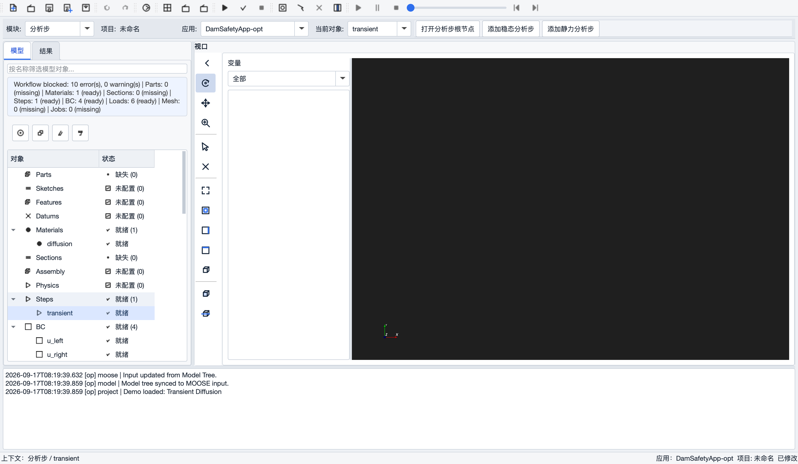

分析步定义求解的时间范围和非线性求解控制。本例用 `0 → 1` 的「伪时间」表示加载进程
（准静态加载，不是动力学）：

1. 模型树 `Steps` 根节点右键 →「添加 Steps」。
2. 双击新节点，「参数」页核对默认值（入门直接用默认值即可）：

   | 分组 | 关键参数 |
   |---|---|
   | 基本 | Type=`Transient`，Start Time=`0`，End Time=`1` |
   | 求解控制 | Solve Type=`NEWTON`，Line Search=`bt`，Automatic Scaling=`true` |
   | 非线性容差 | Relative=`1e-9`，Absolute=`1e-8`，Max Iterations=`50` |
   | 时间步 | IterationAdaptiveDT，初始 dt=`0.01`，范围 `1e-15 ~ 1` |
   | 预条件 | Type=`SMP`，Full=`true` |

3. 点击「确定」。

> 当前版本只把**第一个** Step 同步进求解输入；建多个 Step 时日志会明确提示
> 「仅取第一个 Step」。多步分析是规划中的功能。

## 2.10 创建加载函数与边界条件

### 加载函数（位移随时间怎么变化）

1. 模型树 `Functions` 根节点右键 →「添加 Functions」，重命名为 `load_curve`。
2. 双击打开，「参数」页类型选 `PiecewiseLinear`（分段线性）：
   - X Values：`0 1`（时间从 0 到 1）
   - Y Values：`0 -0.001`（位移从 0 变化到 -0.001，负号表示向下压）
3. 打开「校验」页点「刷新」——X 和 Y 的数字个数必须一一对应，
   确认没有 `x/y count mismatch` 提示后点「确定」。

### 固定端（底面三个方向全部钉死）

在模型树 `BC` 根节点右键 →「添加 BC」，依次创建三个对象 `fix_x`、`fix_y`、`fix_z`。
每个的设置相同，只有「变量」不同：

| BC 对象 | 类型 | 变量 | 已指派边界 | 值 |
|---|---|---|---|---|
| `fix_x` | `DirichletBC` | `disp_x` | `fixed` | `0` |
| `fix_y` | `DirichletBC` | `disp_y` | `fixed` | `0` |
| `fix_z` | `DirichletBC` | `disp_z` | `fixed` | `0` |

每个 BC 的操作：双击打开 → 设置类型/变量/值 → 在顶部「可选边界分组」单击 `fixed`
→ 点**「应用所选边界」** → 确认只读「已指派边界」从默认值变成 `fixed` →
「校验」页无问题 →「确定」。

> ⚠️ 新建 BC 的默认占位值是 `variable = u`、`boundary = left`——这是内置模板的演示值，
> 在你的网格里并不存在，**必须改成真实变量和真实面组**。

### 加载端（顶面按函数下压）

1. 再添加一个 BC，命名 `load_z`：
   - 类型：`FunctionDirichletBC`（函数位移边界）
   - 变量：`disp_z`
   - 函数：`load_curve`
   - 边界：选中 `load` →「应用所选边界」
2. 选中 `FunctionDirichletBC` 后，常量「值」字段会自动隐藏——位移时程完全由函数给出，
   两者不能同时存在。

完成后模型树应显示 `BC · 就绪 (4)`。

## 2.11 配置输出（Outputs）

告诉求解器「算完后我要看哪些结果」：

1. 模型树 `Outputs` 根节点右键 →「添加 Outputs」。
2. 双击打开「参数」页：
   - **场输出**（整个模型的空间分布云图）：勾选需要观察的 CDP 变量，
     例如 `DamageC`（压缩损伤）、`DamageT`（拉伸损伤）、`kappa_c`；
   - **历史输出**（随时间变化的曲线）：在顶部「可选边界分组」选中 `load`，
     点击**「应用所选边界」**，然后：
     - Reaction Force：`true`（加载面的反力——画力-位移曲线用）
     - Displacement Average：`true`，Displacement Variable：`disp_z`
   - **输出时间控制**：Times Enabled=`true`，Start=`0`，End=`1`，Interval=`0.01`；
   - **输出文件**：Exodus=`true`（云图文件）、CSV=`true`（数据表格）。
3. 点击「确定」。

## 2.12 校验 → 同步 → 检查输入

1. 点击工具栏**「校验工作流」**。首次完整配置应达到 `0 errors`
   （可能有一条「当前阶段仅生成第一个 Step」的警告，属正常）。若有错误，
   双击报告行可直接定位到问题对象修复。
2. 菜单「模型 → 同步模型到 MOOSE 输入」（`Ctrl+Shift+R`）。
   软件会把模型树生成为求解器输入，写入项目目录下
   `.work/case/my-first-case/my-first-case.i`。
3. 打开「作业工作窗 → MOOSE 设置 → **输入文件**」页签（注意是第二排页签最右侧，
   不是「算例设置」里的路径框），在文本区域中滚动检查：
   - `[Mesh/file]` 指向项目自己的 `.msh`；
   - `[Materials]` 下有三个 CDP 子块（elasticity / stress / cdp_stress_update），
     且 `block = 'instance_block'`；
   - `[BCs]` 有 `fix_x/fix_y/fix_z/load_z` 四个子块，boundary 分别是 `fixed` 和 `load`；
   - `[Functions]` 有 `load_curve`；
   - `[Physics/SolidMechanics/QuasiStatic/…]`、`[Executioner]`、`[Outputs]` 均存在。
4. 输入有两种模式：
   - **结构化（只读）**：默认模式，输入完全由模型树生成，不能手改——推荐始终使用；
   - **专家（自定义块）**：高级用户可在独立扩展区追加额外 MOOSE 块（如 Checkpoint），
     与模型树受管块冲突的内容会被明确拒绝。

## 2.13 导出快照并提交远程计算

> 本地直接运行需要本机安装 MOOSE 求解器；标准用法是提交到远程计算节点（LIMS Facade）。

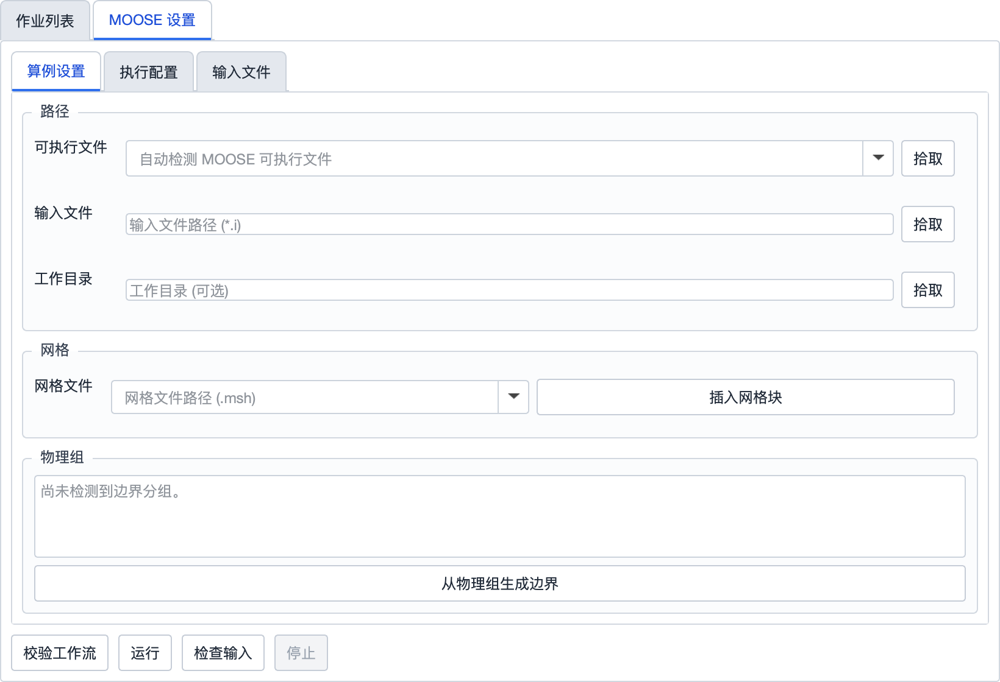

1. 在「输入文件」页点击**「导出任务快照」**，选择一个父目录。软件会创建
   `case-<时间戳>` 目录，内含：
   - 当前 `.i` 输入文件（文件名使用项目名，支持中文）；
   - 网格 `.msh`；
   - 四个 CDP CSV（输入中引用的是包内文件名，不是本机绝对路径）；
   - `manifest.json`（清单：应用档案、mapping 版本、所有文件的 SHA-256 等）。
2. 切换到「MOOSE 设置 → 执行配置」，在「远程作业（经 LIMS Facade 提交）」中设置：
   - 服务器：如 `http://127.0.0.1:8200`（按实际部署地址填写）；
   - 项目 ID：`gmp-ise`。
3. 点击**「提交作业」**。成功后界面显示 `job_<时间戳>_<随机串> : queued`。
4. 点击「刷新状态」或在「作业列表」页观察状态流转：
   `queued → preparing → running → succeeded`。进入 `running` 后可以看到远端 PID、
   MPI 进程数、CPU/内存和物理时间推进。

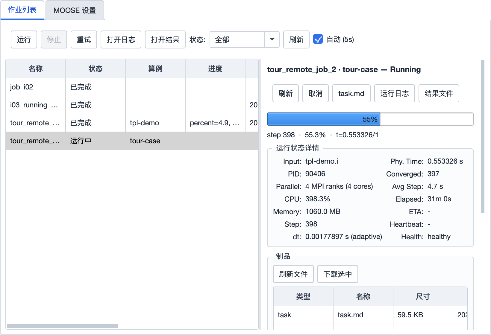

5. 若状态变为 `check_input_failed`，查看作业日志中的输入错误提示，修正模型后
   重新同步并导出新快照再提交。

## 2.14 查看结果

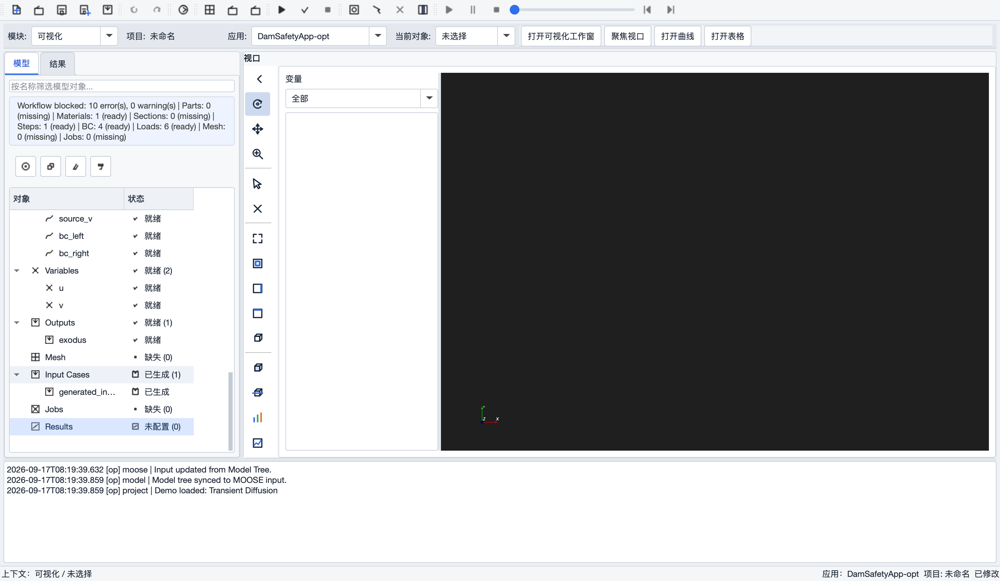

1. 作业完成后，在「作业列表」选中该作业，刷新并下载制品（Exodus、CSV、日志）。
   结果会自动登记到模型树 `Results` 节点。
2. 顶部「模块」切换到**可视化**，打开 Exodus 结果：
   - 左侧变量列表切换着色变量（位移、应力、`DamageC/DamageT` 损伤场等）；
   - 顶部时间滑块**播放加载过程**；
   - 「Deformation」可勾选变形放大，直观看到试块被压扁的过程。
3. 打开 CSV，读取加载面反力和平均位移随时间的数据，画出**力-位移曲线**。

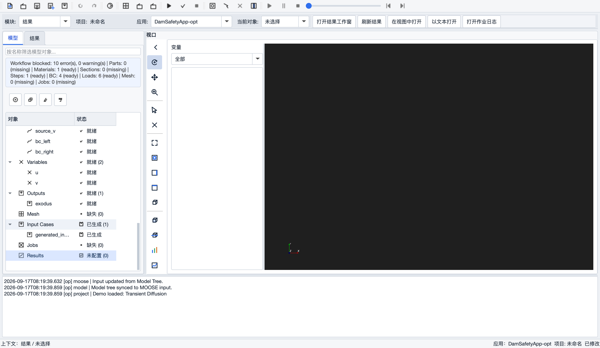

🎉 至此你已完成一个「建模 → 网格 → 材料 → 边界载荷 → 求解 → 后处理」的完整闭环。
舞台和后处理的全部操作详见第九部分。

---

# 第三部分 Abaqus 专家篇

> 本章面向熟悉 Abaqus/CAE 的工程师：先给概念对照，再用一个已通过人工验证的
> 真实项目（钢板-混凝土装配接触算例 M-01，项目文件 `phase5-g1-assembly-contact.gmp.yaml`）
> 完整走一遍流程。每个对象的完整参数定义见第五部分，`.i` 生成规则见第七部分。

## 3.1 Abaqus ↔ GMP-ISE ↔ MOOSE 概念对照

| Abaqus 概念 | GMP-ISE 对应 | 生成的 MOOSE 块 |
|---|---|---|
| Part（部件） | 模型树 `Parts` + 草图/拉伸等 Feature | —（几何来源） |
| Assembly / Instance | `Assembly` 根节点下的实例（平移/旋转/缩放/可见性/顺序） | — |
| Set / Surface | 网格**物理组（Physical Group）**，体组 dim=3、面组 dim=2 | `block = '…'` / `boundary = '…'` |
| Material | `Materials` 节点（线弹性、CDP 等） | `[Materials]` |
| Section + Assignment | `Sections` 节点：选材料 + 应用所选物理体 | 影响材料子块的 `block` |
| Step | `Steps` 节点（Transient 等） | `[Executioner]` + `[Preconditioning]` |
| Interaction（接触） | `Interactions` 节点（面-面 Contact） | `[Contact]` |
| BC（Encastre/位移） | `BC` 节点：`DirichletBC` / `FunctionDirichletBC` | `[BCs]` |
| Load（Pressure） | `Loads` 节点：`Pressure`（面压力） | `[BCs]` 中的 Pressure 子块 |
| Amplitude（幅值曲线） | `Functions` 节点：`PiecewiseLinear` | `[Functions]` |
| Field/History Output | `Outputs` 节点（场变量 + 边界反力/平均位移 + 时间控制） | `[AuxVariables]`/`[AuxKernels]`/`[Postprocessors]`/`[Times]`/`[Outputs]` |
| Mesh 模块 | 网格工作窗（GmshPanel） | `[Mesh/file]` |
| Job 模块 | 作业工作窗（本地运行 / LIMS 远程提交） | — |
| Visualization | 可视化模块（Exodus 云图、时间播放、CSV 曲线） | — |

与 Abaqus 的**关键差异**，务必先建立心智模型：

1. **先网格后指派**：物理组在划分网格时写入 `.msh` 文件；新建/修改面组后必须
   **重新生成网格**，下游（Section、BC、Contact）才看得到。
2. **列表高亮 ≠ 已指派**：所有「选集合」操作都必须点「应用所选…」按钮，
   并以只读的「已指派…」字段为准。
3. **位移变量自动建立**：`Variables` 根节点为空是正常的；`disp_x/y/z` 由 Physics 的
   `add_variables = true` 自动生成。
4. **输入文件是产物，不是源头**：`.i` 由模型树同步生成（结构化只读）。不要手改 `.i`
   来实现建模意图——修改模型树后重新同步即可，重复同步是幂等的，不会产生重复块。
5. **单位**：`DamSafetyApp-opt` 的应力单位是 **Pa**。材料的「Young's Modulus (MPa)」
   快捷字段按 MPa 输入、系统存储为 Pa；但**几何坐标没有自动 mm→m 换算**，
   建模时必须保证几何、位移、材料使用一致的长度单位。
6. **一个项目 = 一个 `.gmp.yaml` 文件**，派生文件（网格、输入、快照）都在项目目录的
   `.work/` 下，项目之间完全隔离。

## 3.2 算例 M-01：钢板压混凝土块（装配 + 接触）

> 本算例复刻经典 Abaqus 接触教学案例：一块钢板压在混凝土块顶面，钢板顶面施加
> 向下的位移载荷，钢板与混凝土之间为库仑摩擦接触。Abaqus 侧的对应操作截图见
> `doc/Abaqus建模流程简介.docx` 与 `doc/images/abaqus-workflow/`。

### 3.2.1 建模目标与命名约定

| 对象 | 名称 |
|---|---|
| 混凝土草图 / Part / 实例 | `sketch_concrete` / `part_concrete` / `instance_concrete` |
| 钢板草图 / Part / 实例 | `sketch_plate` / `part_plate` / `instance_plate` |
| 体组（自动） | `instance_concrete`、`instance_plate`（dim 3） |
| 面组（自建） | `contact_concrete`、`contact_plate`、`fixed_bottom`、`load_top`（dim 2） |
| 接触对象 | `contact_plate_concrete` |
| 位移函数 | `loading_curve` |

几何关系（验证项目的实际尺寸）：混凝土块高 `H_concrete = 20`，钢板厚 `H_plate = 5`；
装配后钢板底面与混凝土顶面同处 `Z = 20`，钢板顶面在 `Z = 25`。

### 3.2.2 两个独立 Part

按 §2.2–2.3 的方法分别创建：

- `part_concrete`：XY 平面较小的矩形，沿 +Z 拉伸 `20`；
- `part_plate`：XY 平面明显更大的矩形，沿 +Z 拉伸 `5`。

检查点：两个 Part 的 BREP 路径不同且文件存在；在 Part 列表往返选择时形状不会互相覆盖。
（每次成功拉伸都会在 `Features` 下追加一条历史，「2 个 Part、3 个 Feature」是正常设计，
装配永远使用各 Part **当前生效**的 BREP。）

### 3.2.3 装配：实例定位


1. 「装配」模块 →「创建实例」两次，得到 `instance_concrete`、`instance_plate`。
2. `instance_concrete`：部件 `part_concrete`，平移 `0/0/0`，其余默认，顺序 `1`。
3. `instance_plate`：部件 `part_plate`，平移 Z = `20`（即 `H_concrete`，落到混凝土顶面），
   顺序 `2`；如 XY 中心未对齐，调整 X/Y 平移。
4. 点击「构建装配」，确认日志输出 `Assembly built: 2 visible instance(s)`，
   舞台显示钢板位于混凝土顶部。

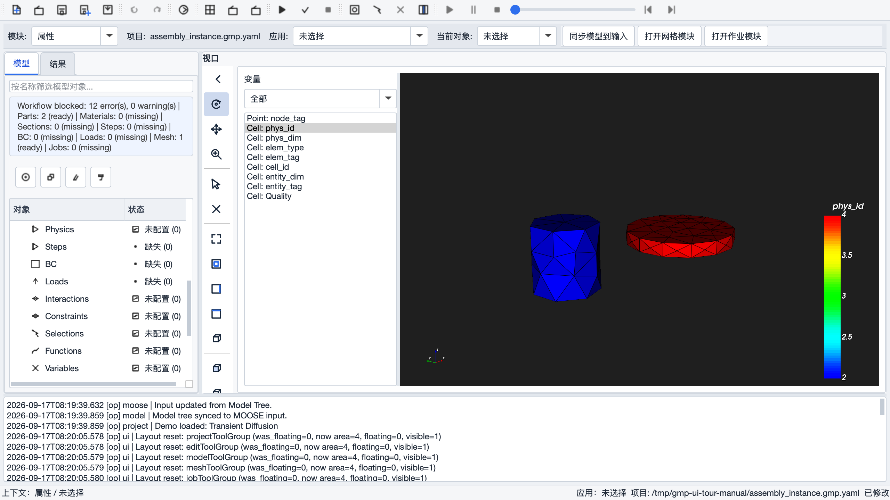

已验证的细节行为：隐藏实例（可见=`false`）不参与装配且不复制实体；缩放为 0/负数
会被表单拒绝；Part 引用为空会标记失效；保存重开后实例参数完整恢复；修改上游 Part
会让 Assembly 及下游网格/输入标记为「过期」，重建后使用新几何。

### 3.2.4 装配网格与四个专用面组

1. 新建 Mesh 节点 `mesh_assembly_g1`，双击打开网格工作窗，确认来源 `assembly: active`。
2. 选择合适的全局尺寸与单元策略，「生成 3D 网格」。
   （验证项目实测：175086 节点、152950 个顶维 Hexahedron 8 单元，质量 minSICN ≈ 1。）
3. 在「分组与网格场 → 物理组」（维度 `2`）用「拾取」依次建立四个面组
   （拾取器列表有「实体 / 所属 Assembly 实例 / 几何范围」三列，按所属实例 + Z 范围辨认）：

   | 面组 | 所属实例 | 位置（验证项目实测） |
   |---|---|---|
   | `contact_concrete` | `instance_concrete` | 混凝土顶面，`Z[20,20]` |
   | `contact_plate` | `instance_plate` | 钢板底面，`Z[20,20]` |
   | `fixed_bottom` | `instance_concrete` | 混凝土底面，`Z[0,0]` |
   | `load_top` | `instance_plate` | 钢板顶面，`Z[25,25]` |

4. 确认四个组均非空、两个接触面**不是同一个 Gmsh 实体**；重新生成 3D 网格。
5. 保存重开项目后，自定义面组按「所属实例 + 几何签名」自动重绑定恢复。

> ⚠️ 不要用裸 tag，也不要用实例的整个 `_surface` 组代替单个作用面——接触、固定、
> 加载都必须是具体命名面组。

### 3.2.5 线弹性材料（注意单位）

Abaqus 参考模型中混凝土 `E = 29791.45978 MPa, ν = 0.2`，钢板 `E = 206000 MPa, ν = 0.3`：


GMP-ISE 中每种线弹性材料由**两个节点配对**组成（弹性张量 + 应力计算），
在 `Materials` 根节点右键添加四个节点：

| 节点 | 类型 | Young's Modulus (MPa) | Poisson's Ratio | 作用体组 |
|---|---|---:|---:|---|
| `concrete_elasticity` | `ComputeIsotropicElasticityTensor` | `29791.45978` | `0.2` | `instance_concrete` |
| `steel_elasticity` | `ComputeIsotropicElasticityTensor` | `206000` | `0.3` | `instance_plate` |
| `concrete_stress` | `ComputeLinearElasticStress` | — | — | `instance_concrete` |
| `steel_stress` | `ComputeLinearElasticStress` | — | — | `instance_plate` |

要点：

- 快捷字段按 **MPa** 输入，系统存储为 Pa（高级参数中分别为 `29791459780` 和
  `206000000000`）——不要把 Pa 数值填进 MPa 字段；
- 「作用体组」通过「可选物理体」列表 + 「应用所选物理体」指派，只读字段回显；
- 从默认类型切换后若高级参数表残留 `prop_names/prop_values`，逐行删除。

然后创建两个 Section：`section_concrete`（材料 `concrete_elasticity`，体组
`instance_concrete`）和 `section_plate`（材料 `steel_elasticity`，体组 `instance_plate`），
各自点「应用所选物理体」后确定。

### 3.2.6 接触（Interaction）


当前应用档案（DamSafetyApp-opt / mapping 1.0.0）冻结的接触支持矩阵：

| 参数 | 候选 |
|---|---|
| 接触模型 `model` | `frictionless / coulomb / glued` |
| 算法 `formulation` | `kinematic / penalty / augmented_lagrange / tangential_penalty / mortar` |
| 摩擦系数 | Coulomb 时使用，`>= 0` |

M-01 基线：`model = coulomb`、`formulation = kinematic`、`friction_coefficient = 0.15`。

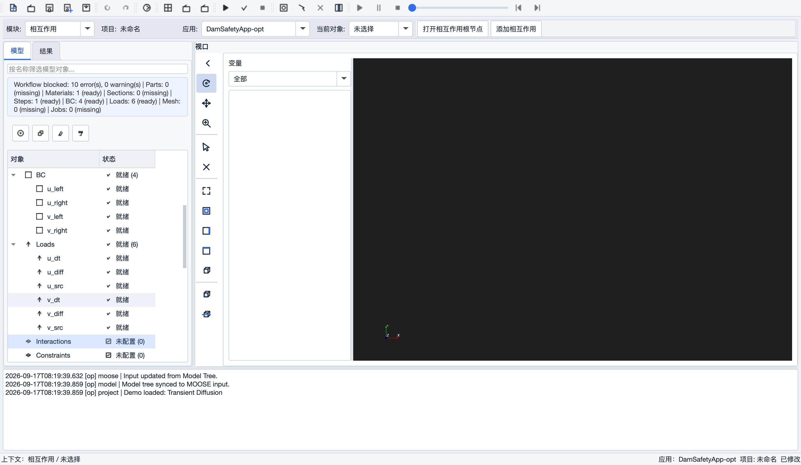

操作：「相互作用」模块 →「添加相互作用」，重命名 `contact_plate_concrete`，
类型选 Contact，**主面 `contact_plate`、从面 `contact_concrete`**，摩擦系数 `0.15`。
校验页会检查：两个面组存在、维度为 2、主从面不同——把主面改成三维体组或主从面相同
都会被阻断并定位。

### 3.2.7 边界条件与加载


1. **固定端**：`fixed_bottom` 上三个零位移约束 `disp_x / disp_y / disp_z`
   （DirichletBC，值 0），操作同 §2.10。
2. **加载函数** `loading_curve`：PiecewiseLinear，`X = 0 1`，`Y = 0 -2.5e-5`
   （钢板在上方，负 Z 压向接触面；如重建后局部 Z 反向，改符号使位移「朝向接触面」）。
3. **加载端**：`load_disp_z`：FunctionDirichletBC + `disp_z` + `load_top` + `loading_curve`。

**Pressure（面压力）映射**：如需用压力而非位移加载，`Loads` 节点类型选 `Pressure`
（或应用「面压力」模板），参数示例：变量 `disp_z`、压力系数 `-250000`（Pa）、
函数 `pressure_curve`（0→1 无量纲幅值）、分量 `2`（Z）。Pressure 真实映射到
MOOSE `[BCs]` 的 `Pressure` 子块。注意：**同一面同一自由度不能同时施加 Pressure 和
位移 BC**，校验工作流会报冲突——二选一。

### 3.2.8 Physics / Step / Outputs

- **Physics** `physics_g1`：QuasiStatic，`Strain=SMALL`、`add_variables=true`、
  `incremental=true`；「可选体组」**同时选中** `instance_concrete` 和 `instance_plate`
  （macOS 按住 Command 多选）后「应用所选分组」，Block 显示两个名称（空格分隔）。
- **Step** `step_g1`（只保留一个）：Transient，`start=0 / end=1 / num_steps=100000`；
  NEWTON + `line_search=bt` + `automatic_scaling=true`；PETSc 选项
  `-pc_type lu` + `-pc_factor_mat_solver_type mumps`；IterationAdaptiveDT
  （dt=0.01，1e-15~1）；SMP 预条件。
- **Outputs** `outputs_g1`：历史输出面组选 `load_top`，Reaction Force + Displacement
  Average（`disp_z`）开启；Times 0→1 步长 0.01；Exodus + CSV 开启。
  （CDP 专用的 DamageC/DamageT 复选框在线弹性算例中不要勾选。）

### 3.2.9 验证状态与已知边界（截至 2026-09-17）

- 模型树全链路（Assembly/网格/材料/Section/Physics/BC/Contact/Step/Outputs）已可按
  上述步骤配置完成，「校验工作流」通过，生成报告可逐项追溯到模型树对象；
- 同步生成的 `.i` 确定性可复现（两次同步逐字一致），结构化输入只读；
- **待补证据**：远端 `succeeded` 终态、Exodus/CSV 制品回放和接触量（`contact_pressure`
  等）数值验证，因当前远端计算环境不可用而延期，见 `manual/test05.md` §6.5。
  提交前请在可用环境完成「检查输入」（`--check-input`）并跟踪作业到 `succeeded`。

## 3.3 CDP 混凝土算例要点

把 §3.2 中的混凝土线弹性材料替换为 CDP（流程同 §2.6–2.7，验证记录见
`manual/test04.md`）：

1. 「新建 CDP 材料」生成 `AbaqusCDP` 类型节点，补齐四个 CSV（压硬化/压损伤/拉 stiffening/拉损伤）；
2. 同步后 `[Materials]` 生成三件套，且 `block` 与 Section 指派的体组一致：

   ```text
   [Materials]
     [cdp_material_1_elasticity]        type = ComputeIsotropicElasticityTensor
     [cdp_material_1_stress]            type = ComputeMultipleInelasticStress
     [cdp_material_1_cdp_stress_update] type = AbaqusCDPStressUpdate
   []
   ```

3. **引用完整性是自校验的**：删除材料后，引用它的 Section 立即变「失效」并在校验页
   报 `material reference`；重建同名材料后**无需重新指派即自动恢复**；
4. 四个 CSV 会随快照打包，`manifest.json` 记录其 SHA-256——正式工程请用材料专家
   确认的曲线并保留哈希基线（演示数据 `cdp-v01` 不适用于正式工程）；
5. 场输出勾选 `DamageC/DamageT/kappa_c` 即可获得损伤云图。

---

# 第四部分 功能菜单逐条参考

> 本部分逐条列出主窗口全部菜单项与工具组按钮。每项说明：**功能**、
> **依赖的输入**（执行前需要满足的条件/读取的数据）、**产生的输出**（执行后
> 改变的状态/生成的文件）。

## 4.1 「文件」菜单

| 菜单项 | 快捷键 | 功能 | 依赖输入 | 产生输出 |
|---|---|---|---|---|
| 新建项目 | `Ctrl/Cmd+N` | 清空模型树与作业表，建立空项目 | 无（若有未保存修改会先提示） | 空的未命名项目；输入文件/工作目录/网格路径全部清空，不继承上一项目 |
| 打开项目… | `Ctrl/Cmd+O` | 打开 `.gmp.yaml` 项目文件 | 磁盘上的项目文件 | 恢复模型树、各面板设置、视图状态；若记录了几何路径且开启自动重载，自动重新导入几何；生成输入恢复为 `.work/case/<项目名>/<项目名>.i` |
| 保存项目 | `Ctrl/Cmd+S` | 保存当前项目（无路径时转另存为） | 当前模型树与全部面板状态 | 写入 `.gmp.yaml`；保存前先执行一次模型树→输入同步；右上角短暂提示「项目保存成功」 |
| 项目另存为… | `Ctrl+Shift+S` | 保存到新路径（图标带蓝色加号徽标） | 同上 | 新路径的 `.gmp.yaml`；提示「项目另存为成功」 |
| 最近项目 ▶ | — | 最近打开的项目列表（最多 10 条），含「清空最近记录」 | 历史记录 | 打开所选项目 |
| 导出调试包… | — | 打包问题反馈材料 | 当前项目、控制台日志 | 调试包：项目文件 + console.log + MOOSE 输入 + 网格/结果副本 + `bundle_info.txt` |
| 保存截图… | `Ctrl+Shift+P` | 把当前视口保存为 PNG | 视口当前画面 | PNG 图片文件 |
| 打开操作日志目录 | — | 在系统文件管理器中打开日志目录 | 操作日志文件 | 系统文件管理器窗口 |

## 4.2 「模型」菜单

| 菜单项 | 快捷键 | 功能 | 依赖输入 | 产生输出 |
|---|---|---|---|---|
| 编辑属性… | `Enter` | 打开当前所选对象的浮动属性表单 | 模型树中有选中节点 | 表单「确定」后参数写回节点并标脏项目 |
| 同步模型到 MOOSE 输入 | `Ctrl+Shift+R` | 把模型树对象装配为 `.i` 输入 | 模型树各对象 + 当前网格物理组清单 + 活动应用档案的映射表 | 更新「输入文件」页文本；写入 `.work/case/<项目名>/<项目名>.i`；材料 CSV 复制到工作目录；日志输出 `Input updated from Model Tree`（详见第七部分） |

## 4.3 「视图」菜单

| 菜单项 | 功能 | 依赖输入 | 产生输出 |
|---|---|---|---|
| 工具栏 ▶ | 勾选显示/隐藏各工具组（项目/编辑/模型/网格/作业/回放/显示组） | 无 | 工具栏布局（自动持久化） |
| 浮动 ▶ | 切换各工具组的浮动/停靠状态 | 无 | 同上 |
| Module / Mesh / Job / Visualization / Results Workspace | 显示/隐藏对应浮动工作窗 | 无 | 工作窗显隐；关闭工作窗不停止作业、不卸载结果 |
| 恢复默认工具布局 | 全部工具组回到预置位置 | 无 | 重置布局 |

## 4.4 「网格」菜单

| 菜单项 | 快捷键 | 功能 | 依赖输入 | 产生输出 |
|---|---|---|---|---|
| 生成网格 | `Ctrl+M` | 按网格工作窗当前参数执行 Gmsh 剖分 | 当前几何来源（装配/几何文件/示例盒）+ 网格参数 | `.msh` 文件；模型树 Mesh 节点更新；控制台输出节点/单元数与质量报告；舞台载入网格 |
| 预览网格… | `Ctrl+Shift+M` | 选择 `.msh` 文件载入视口预览 | 磁盘上的 `.msh` | 视口显示该网格（不写模型树） |

## 4.5 「作业」菜单

| 菜单项 | 快捷键 | 功能 | 依赖输入 | 产生输出 |
|---|---|---|---|---|
| 校验工作流 | — | 全模型只读预检 | 模型树 + 网格清单 + 应用档案 | 校验报告弹窗（错误可定位）；不修改任何对象 |
| 运行 | `F5` | 运行当前作业（本地 Runner） | 可执行文件 + 输入文件已配置；工作流校验通过 | 本地作业进程；作业列表新增记录；日志输出到控制台 |
| 检查输入 | `Ctrl+K` | 以 `--check-input` 预检 `.i` | 本机已配置 MOOSE 可执行文件 | 预检日志；不启动正式求解 |
| 停止 | `Shift+F5` | 终止运行中的本地作业 | 有运行中作业 | 作业状态变为已停止/失败 |

## 4.6 「工具」菜单

| 菜单项 | 快捷键 | 功能 | 依赖输入 | 产生输出 |
|---|---|---|---|---|
| 撤销 | `Ctrl/Cmd+Z` | 撤销一步草图修改 | 处于草图编辑会话 | 草图回退一步 |
| 重做 | `Ctrl+Shift+Z` | 重做 | 同上 | 草图前进一步 |
| 演示案例 ▶ | — | 载入/运行内置演示（瞬态扩散、热-力耦合、非线性热传导） | 运行动作需要本机 MOOSE 可执行文件 | 重建模型树节点 + 应用对应输入模板 |

## 4.7 「设置」菜单

| 菜单项 | 功能 | 输出 |
|---|---|---|
| 语言 ▶ | English / 中文互斥切换 | 界面运行时翻译，立即生效 |

## 4.8 「帮助」菜单

| 菜单项 | 功能 |
|---|---|
| 关于 GMP-ISE | 版本与说明对话框 |

## 4.9 顶部工具组（菜单的图标版）

| 工具组 | 按钮 | 对应菜单 |
|---|---|---|
| 项目 | 新建 / 打开 / 保存 / 另存 / 截图 | 文件 |
| 编辑 | 撤销 / 重做 | 工具 |
| 模型 | 同步模型到 MOOSE 输入 | 模型 |
| 网格 | 生成网格 / 预览网格 | 网格 |
| 作业 | 运行 / 检查输入 / 停止 | 作业 |
| 回放 | 播放 ▶ / 暂停 ⏸ / 终止 ⏹ / 进度条 / 后退 ⏮ / 前进 ⏭ | 多时间步 Exodus 动画（详见第九部分 §9.6） |
| 显示组（默认浮动于舞台右上） | 切换显示方式 / 拾取 / 清除选择 / 切片 | 视口显示控制（详见第九部分） |

## 4.10 工作上下文条

| 控件 | 功能 |
|---|---|
| 模块 [▼] | 13 个工作模块：草图/部件/属性/材料/截面/装配/分析步/相互作用/载荷/网格/作业/可视化/结果；切换后工具组、舞台工具、对象选择器同步刷新 |
| 项目 | 当前项目名（只读） |
| 应用 [▼] | 活动应用档案（如 `DamSafetyApp-opt`），决定各模块可选类型与支持矩阵 |
| 当前对象 [▼] | 当前模块的可操作对象，与模型树选择双向同步；无对象时显示「未选择」 |
| 模块快捷按钮 | 随模块动态生成（见第五部分各模块） |

## 4.11 左侧导航区

**模型页签**：名称过滤框（只过滤显示，不改数据）；工作流状态行；添加/复制/重命名/
删除工具按钮（作用于选中节点）；21 根节点模型树（对象 | 状态双列）。
右键根节点 =「添加 …」；右键子节点 =「编辑属性… / 复制 / 重命名 / 删除」；
Mesh/Jobs/Results 根节点多一项「打开对应工作窗」。

**结果页签**：镜像 Jobs、Results 两个分支的导航树；双击 Results 子项载入视口，
双击 Jobs 子项打开作业工作窗。

## 4.12 状态栏与底部控制台

- 状态栏左侧：当前上下文（模块 / 对象）；右侧：应用档案、项目路径、保存状态；
  临时操作提示显示 2~3 秒。
- 底部控制台：只读，镜像全部操作日志；Gmsh/MOOSE 日志以 `[op] gmsh |`、
  `[op] moose |` 等前缀转发；分隔条可拖高。

---

# 第五部分 全模块参数设置详解

> 本部分逐个模块列出**全部参数**：参数名、取值范围/候选、默认值、含义，
> 以及该参数最终对 `.i` 输入的影响（更完整的映射示例见第七部分）。
> 对象间的引用顺序见第六部分。

## 5.1 属性表单通用结构（所有节点共用）

双击任何模型树子节点打开的浮动表单统一包含四个页签：

| 页签 | 内容 |
|---|---|
| 常规 | 类型（只读）、状态（只读）、名称（可编辑，即重命名）、摘要 |
| 参数 | 快捷参数表单（随类型联动显隐）+ 分组应用区（可选物理体/边界 + 应用按钮）+ 高级参数表（任意 Key/Value，可添加/删除行） |
| 校验 | 全模型校验结果表；可按「仅当前类型 / 仅有问题」过滤；「刷新」「跳转到节点」 |
| 预览 | 节点参数的只读文本预览与对应 MOOSE 块预览 |

事务语义：修改先进入编辑缓冲，「确定」先校验再一次性写回；校验失败会阻止提交并
定位到第一个错误字段；「取消」/ Esc / 关窗丢弃全部改动。

高级参数表的「同步」下拉决定快捷表单与参数表的冲突仲裁：
`Bidirectional (Recommended)`（双向同步，默认）/ `Quick Form Wins`（以快捷表单为准）。

## 5.2 草图模块（Sketch）

**快捷按钮**：新建草图（创建后立即进入编辑会话）、打开草图根节点。

**草图编辑器**（浮动非模态窗口，与舞台 2D 会话联动）：

| 区域 | 工具/参数 | 说明 |
|---|---|---|
| 工具（互斥） | 选择 / 移动 / 直线 / 圆 / 圆弧 / 矩形 / 删除 | 当前工具蓝底白字高亮；完成一次绘制后工具保持生效 |
| 约束 | 水平 / 竖直 / 平行 / 垂直 / 重合 | 作用于选中图元的几何约束 |
| 尺寸 | 数值输入 + 添加距离 / 添加半径 | 驱动尺寸标注 |
| 反馈行 | 光标坐标、选中数 | 只读 |
| 底部 | 撤销 / 重做 / 完成编辑 | 关闭时自动保存并退出 2D 会话 |

交互细节：移动工具默认拖动整个图形，按住 `Option/Alt` 下钻到子图元（如矩形单边）；
`Shift+单击`多选；舞台平移用鼠标中键；编辑会话期间禁止切换模块；删除被引用的草图
会立即清除依赖它的 3D 预览。

**输出**：草图闭合轮廓作为部件特征（拉伸/旋转/放样/扫掠）的输入；同一草图中的
嵌套闭合轮廓（如矩形内圆）拉伸后自动生成中空体。

## 5.3 部件模块（Part / Feature）

**快捷按钮**：打开部件根节点 / 新建部件（选择来源草图）/ 打开网格模块。

**部件特征面板**（页签化，每次成功操作在 `Features` 下追加一条历史）：

| 特征 | 参数 | 说明 |
|---|---|---|
| 拉伸 | 草图下拉 + 距离(mm) +「沿 +Z 拉伸」 | 闭合轮廓沿 Z 拉伸成体 |
| 旋转 | 草图下拉 + 角度(deg) +「绕 Y 轴旋转」 | 草图绕 Y 轴旋转成回转体 |
| 放样 | 第一/第二截面下拉 + Z 向抬升 +「实体放样」 | 两截面之间放样 |
| 扫掠 | 轮廓草图 + 路径草图 +「沿路径扫掠」 | 轮廓沿路径扫掠 |

Part 参数（只读回显为主）：当前生效 Feature、来源草图、BREP 路径、网格路径、
Gmsh 体标签。**删除规则**：删除 Part 会一并删除其全部 Feature 并使引用它的装配实例
失效；删除当前生效 Feature 会清除 Part 的 BREP/网格派生引用。

## 5.4 材料模块（Materials）

**快捷按钮**：打开材料根节点 / 新建材料 / 新建 CDP 材料。

材料节点的 `type` 决定快捷参数表。当前已验证的类型：

### 5.4.1 `GenericConstantMaterial`（新建材料的默认类型）

| 参数 | 默认 | 说明 |
|---|---|---|
| `prop_names` | `prop` | 材料属性名列表（空格分隔） |
| `prop_values` | `1.0` | 对应的常数值 |
| `block` | — | 作用体组（经「可选物理体 + 应用所选物理体」指派） |

### 5.4.2 线弹性两件套（固体力学必须成对创建）

| 类型 | 快捷参数 | 说明 |
|---|---|---|
| `ComputeIsotropicElasticityTensor` | Young's Modulus (**MPa**) / Poisson's Ratio / Block | 弹性张量；模量按 MPa 输入、存储为 Pa（高级参数中为精确 Pa 值） |
| `ComputeLinearElasticStress` | Block | 线弹性应力计算；无量纲参数 |

两者 `block` 必须一致，且与 Section 指派的体组对应。MOOSE 官方线弹性入门输入
也采用这两个对象配对。

### 5.4.3 `AbaqusCDP`（混凝土损伤塑性）

| 参数 | 说明 |
|---|---|
| 弹性参数 | 弹性模量（MPa 输入存 Pa）、泊松比 |
| CDP 标量参数 | 膨胀角（dilation angle）、偏心率（eccentricity）、双轴/单轴抗压强度比等 |
| `compression_hardening.csv` | 压应力 — 非弹性应变曲线 |
| `compression_damage.csv` | 压缩损伤 — 非弹性应变曲线 |
| `tension_stiffening.csv` | 拉应力 — 开裂应变曲线 |
| `tension_damage.csv` | 拉伸损伤 — 开裂应变曲线 |

四个 CSV 缺一即被校验阻断；快照导出时随包携带并记录 SHA-256。
同步后生成三件套子块（`ComputeIsotropicElasticityTensor` +
`ComputeMultipleInelasticStress` + `AbaqusCDPStressUpdate`），见 §7.4。

### 5.4.4 `ParsedMaterial`（表达式材料，热传导等演示用）

| 参数 | 说明 |
|---|---|
| `property_name` | 属性名（如 `thermal_conductivity`） |
| `coupled_variables` | 耦合变量（如 `T`） |
| `expression` | 表达式（如 `1 + 0.01*T`） |

## 5.5 截面模块（Sections）

**快捷按钮**：打开截面根节点 / 新建实体截面。

| 参数 | 取值 | 说明 |
|---|---|---|
| 类型 | `SolidSection`（只读） | 当前仅实体截面 |
| 材料 | Materials 下拉 | 引用材料节点名；删除被引用材料后 Section 变「失效」，重建同名材料自动恢复 |
| 已指派物理体 | 只读回显 | 由「可选物理体」列表 +「应用所选物理体」产生；支持多选（空格分隔） |

## 5.6 装配模块（Assembly）

**快捷按钮**：打开装配根节点 / 创建实例 / 构建装配。

实例参数：

| 参数 | 取值 | 默认 | 说明 |
|---|---|---|---|
| 部件 | Parts 下拉 | 优先填入尚未被引用的 Part | 实例的几何来源；空/不存在 → 失效 |
| 平移 X/Y/Z | 实数 | 0 | 实例平移量 |
| 旋转 X/Y/Z | 角度制实数 | 0 | 按 X → Y → Z 顺序应用 |
| 缩放 X/Y/Z | > 0 | 1 | 0 或负数被表单拒绝 |
| 可见 | true/false | true | 隐藏实例不参与装配 |
| 顺序 | 整数 | 递增 | 装配构建顺序，保存重开保持 |

「构建装配」把可见实例的变换落实到 Gmsh，为每个实例自动生成 `<实例名>`（dim 3）
体组和 `<实例名>_surface`（dim 2）总边界组，并生成轻量预览 `assembly_preview.msh`
切换到轴测视图。修改上游 Part 后，Assembly 及下游 Mesh/输入/Job 标记「过期」。

## 5.7 Physics（力学场）

当前仅一套 QuasiStatic 参数（新建自动填充）：

| 参数 | 取值 | 默认 | 说明 |
|---|---|---|---|
| Action | `QuasiStatic` | — | 准静态固体力学 action |
| Block | 体组多选 | — | 「可选体组」+「应用所选分组」，空格分隔 |
| Volumetric Locking Correction | true/false | true | 体积锁死校正 |
| Add Variables | true/false | true | 自动建立 `disp_x/y/z` 位移变量 |
| Incremental | true/false | true | 增量形式 |
| Strain | `SMALL` | SMALL | 小应变 |
| Generate Output | 列表 | 应力/应变分量（16 项） | 自动输出的场量 |
| Save In Resid | true/false | true | 保存残差（`save_in = 'resid_x resid_y resid_z'` + 三个残差 AuxVariable） |

生成：`[GlobalParams] displacements` + `[Physics/SolidMechanics/QuasiStatic/<名称>]`。

## 5.8 分析步模块（Steps）

**快捷按钮**：打开分析步根节点 / 添加稳态分析步 / 添加静力分析步。
模块页底部有只读的 Step sequence preview（提示仅第一个 Step 进入输入）。

Step 全参数（Transient）：

| 分组 | 参数 | 默认/验证基线 |
|---|---|---|
| 基本 | Type | `Transient` |
| 基本 | Start Time / End Time | `0` / `1` |
| 基本 | num_steps | `100000` |
| 求解控制 | Solve Type | `NEWTON` |
| 求解控制 | Line Search | `bt` |
| 求解控制 | Automatic Scaling | `true` |
| 非线性 | Relative / Absolute Tolerance | `1e-9` / `1e-8` |
| 非线性 | Max Iterations | `50` |
| PETSc | petsc_options_iname / value | `-pc_type -pc_factor_mat_solver_type` / `lu mumps` |
| 时间步 | Time Stepper | `IterationAdaptiveDT` |
| 时间步 | Initial dt / dt min / dt max | `0.01` / `1e-15` / `1` |
| 自适应 | Optimal Iterations / Iteration Window | `8` / `3` |
| 自适应 | Growth / Cutback Factor | `1.15` / `0.5` |
| 预条件 | Type / Full | `SMP` / `true` |

生成：`[Executioner]` + `[Preconditioning/smp]` + TimeStepper 参数块。
**只取第一个 Step**；删除全部 Step 后再次同步，这些受管块自动删除。

## 5.9 边界条件模块（BC）

**入口**：BC 根节点右键「添加 BC」。支持模板：`Fixed (Dirichlet 0)`、
`Prescribed Function`（先应用模板再指派边界，模板会恢复默认参数）。

| 类型 | 关键参数 | 校验规则 | 生成 |
|---|---|---|---|
| `DirichletBC` | 变量、值（默认 0）、边界 | 边界必须是网格中存在的 2D 物理组 | `[BCs/<名称>]` |
| `FunctionDirichletBC` | 变量、函数（Functions 下拉）、边界 | 必须选函数；函数引用悬空会被工作流校验定位；**不允许同时残留 `value`** | `[BCs/<名称>]` 含 `function = …` |

通用参数区：「可选边界分组」列表（仅列网格中的 2D 物理组）+「应用所选边界」+
只读「已指派边界」。默认占位 `variable = u`、`boundary = left` 必须替换。

## 5.10 载荷模块（Loads）

**快捷按钮**：打开载荷根节点 / 添加体力 / 打开边界条件根节点。

| 类型 | 关键参数 | 说明 | 生成位置 |
|---|---|---|---|
| `BodyForce` | 变量、值 或 函数、block（体组） | 体积力/热源 | `[Kernels]`（热/扩散场景） |
| `Pressure` | 变量、压力系数 `factor`（Pa）、函数（无量纲幅值）、分量 `component`（0/1/2 = X/Y/Z）、`use_displaced_mesh`、边界 | 面压力；模板「面压力」可一键填入基线 | `[BCs]` 的 Pressure 子块 |

规则：Pressure 的边界必须是 2D 物理组（三维体组会被参数页与校验双重阻断）；
同一 `边界 + 变量` 不得同时存在 Pressure 和位移 BC（冲突报错）。

## 5.11 相互作用模块（Interactions / Contact）

**快捷按钮**：打开相互作用根节点 / 添加相互作用。类型下拉只列活动应用档案
声明支持的类型；档案不支持时对象标记「不支持生成」并阻断同步与提交。

面-面 Contact 参数（DamSafetyApp-opt / mapping 1.0.0）：

| 参数 | 候选/取值 | 说明 |
|---|---|---|
| `primary` / `secondary` | 2D 物理组下拉 | 主面 / 从面；必须不同；维度错误被阻断 |
| `model` | `frictionless / coulomb / glued` | 接触模型 |
| `formulation` | `kinematic / penalty / augmented_lagrange / tangential_penalty / mortar` | 算法 |
| `friction_coefficient` | ≥ 0 | Coulomb 时使用 |

生成：`[Contact]` 块。生成报告可追溯到 Interaction 节点。

## 5.12 函数模块（Functions）

| 类型 | 参数 | 说明 |
|---|---|---|
| `ParsedFunction` | `expression` | 解析表达式（默认 `1.0`），支持变量 `x/y/z/t` |
| `PiecewiseLinear` | X Values / Y Values（空格分隔） | 分段线性时程；X/Y 个数必须相等（校验页检查 `x/y count mismatch`） |

生成：`[Functions/<名称>]`；PiecewiseLinear 不会残留 `expression`，
FunctionDirichletBC 引用的函数被删除时工作流校验会定位到引用字段。

## 5.13 变量模块（Variables）

| 参数 | 默认 | 说明 |
|---|---|---|
| `order` | `FIRST` | 单元阶次 |
| `family` | `LAGRANGE` | 形函数族 |
| `initial_condition` | — | 初始场值 |

固体力学位移变量通常由 Physics（`add_variables=true`）自动建立，**不需要**在
Variables 根下手工创建 `disp_x/y/z`；手工 Variables 主要用于热传导等自定义场。

## 5.14 选择集与约束（Selections / Constraints）

- **Selections**：从既有物理组创建命名选择集，供下游引用并随项目持久化
  （W-01c 已验证保存/重开恢复）。
- **Constraints（参考点 / Coupling）**：属于 Phase 5 / G2 规划能力，当前版本**未交付**；
  不支持的档案下对象会标记「不支持生成」并阻断。不要用普通 DirichletBC 冒充耦合。

## 5.15 输出模块（Outputs）

| 分组 | 参数 | 说明 |
|---|---|---|
| 场输出 | CDP 变量复选框（`DamageC` / `DamageT` / `kappa_c` 等） | 生成 `[AuxVariables]` + `[AuxKernels]`；线弹性算例不要勾选 |
| 历史输出 | 「可选边界分组」+「应用所选边界」（只读「历史输出面组」） | 仅服务于反力/平均位移；只配场输出时不需要 |
| 历史输出 | Reaction Force | 边界反力（`[Postprocessors]`） |
| 历史输出 | Displacement Average + Displacement Variable | 边界平均位移（如 `disp_z`） |
| 历史输出 | Extremum（+ 类型/变量） | 场量极值（不需要边界） |
| 时间控制 | Times Enabled / Times Name / Start / End / Interval | 生成 `[Times/<名称>] type = TimeIntervalTimes` |
| 输出文件 | Exodus / CSV / file_base | 两种文件引用同一个 times object，含 `sync_only = true` |

## 5.16 网格模块 — 网格工作窗（GmshPanel）

非模态浮动窗，四个页签。**模型**页：

| 控件 | 说明 |
|---|---|
| 几何（只读 + 下拉） | 当前几何来源（`assembly: active` / 文件路径 / 示例盒） |
| 打开几何 | 导入 `.geo / .geo_unrolled / .step / .stp / .iges / .igs / .brep`（STEP/IGES/BREP 走 OCC 内核） |
| 清空模型 | `gmsh::clear` |
| 导入后自动剖分 / 打开项目时自动重载几何 | 默认均开 |
| 摘要 | `实体: nP / nC / nS / nV` 点/线/面/体统计 |
| 实体浏览 | 维度下拉（全部/0/1/2/3）+ 刷新 + 只读实体列表 |
| 示例盒 | 无几何时可用「使用示例盒 + 尺寸 X/Y/Z」（自动生成 `solid` 体组 + `boundary` 面组） |

**几何**页：

| 分组 | 参数 |
|---|---|
| 基元 | 类型（Box/Cylinder/Sphere）+ 原点/尺寸/半径 +「添加」 |
| 变换 | 维度 + IDs（支持 `1,2`、`2:5`，非法 ID 红色高亮）+ 拾取；平移 dx/dy/dz；旋转（原点/轴/角度 -360~360）；缩放（中心 + 三轴 0.001~1000）。仅作用于 OCC 实体 |
| 布尔 | 对象/工具 IDs + 拾取；保留选项（Remove Object/Tool 默认开）；Fuse / Cut / Intersect |

**分组与网格场**页：

| 分组 | 参数 |
|---|---|
| 物理组 | 组下拉（`New` 或已有组）+ 刷新；维度（0/1/2/3）+ 名称；实体 IDs + 拾取；添加 / 更新所选 / 删除所选；5 列统计表（Dim / Tag / Name / Entities / Elements），选行高亮 |
| 网格场 | 目标维度 + 实体；DistMin/DistMax（默认 0.1/1.0）；SizeMin/SizeMax（0.05/0.2）；应用 / 清除 / 刷新；场列表自动设为背景场 |

物理组操作细节：单击统计表行即可编辑该组（顶部从 `New` 自动切换并回显）；
「组标识」（如 `2:9 contact_plate`）与「成员实体」（如 `2:5`）属不同命名空间，
不要求编号相等；单元数在重新生成网格后才刷新；保存后才写入项目文件。

**网格**页：

| 参数 | 取值 | 默认 |
|---|---|---|
| 网格尺寸 | 0.01–1000 | 0.2（同时设 Min/Max） |
| 生成维度 | Auto / 1D / 2D / 3D | Auto（超几何维度自动回退） |
| 按实体尺寸 | 维度 + IDs + 尺寸 | 仅 dim=0（点）生效 |
| 单元阶次 | Linear(1) / Quadratic(2) / Cubic(3) / Quartic(4) | Linear |
| 高阶 | Off / Simple / Elastic / Fast Curving | Off（阶数>1 时生效） |
| MSH 版本 | MSH 2.2 / MSH 4.1 | 2.2 |
| 2D 算法 | Automatic(2) / MeshAdapt(1) / Delaunay(5) / Frontal(6) / BAMG(7) / DelQuad(8) | Automatic |
| 3D 算法 | Delaunay(1) / Frontal(4) / HXT(10) | Delaunay |
| 重组合（四边形/六面体） | 开关 | 关 |
| 光顺 | 0–100 | 10 |
| 优化网格 | 开关 | 开 |
| 网格输出 | 输出路径 + 选择 | 项目 `.work/` 目录下 |

生成后控制台输出：节点/单元数、质量 `Quality (minSICN) min/mean/max`、
各物理组单元计数；大网格有三阶段进度、可取消、保护旧文件。网格摘要（维度、
节点数、单元数、物理组、SHA-256）在「属性 → 常规」页查看。

## 5.17 作业模块 — 作业工作窗

两个一级页签。**作业列表**页：

| 区域 | 功能 |
|---|---|
| 作业控制行 | 运行 / 停止 / 重试 / 打开日志 / 打开结果 |
| 监控行 | 状态过滤（全部/排队/运行中/已完成/失败/已取消）+ 刷新 + 自动刷新（5s，仅远程运行中生效） |
| 作业表 | 9 列：名称/状态/案例/进度/开始/耗时/类型/可执行/结果 |
| 远程详情 | 刷新 / 取消（二次确认）/ task.md / 运行日志 / 结果文件；进度条 |
| 执行详情 | 输入/PID/并行/CPU/内存/步数/dt/物理时间/收敛/平均步长/已耗时/ETA/心跳/健康 |
| 制品 | 刷新文件 / 下载选中（SHA-256 命中缓存跳过） |

**MOOSE 设置**页（三个二级页签）：

| 页签 | 参数 |
|---|---|
| 算例设置 | 可执行文件（可编辑下拉带历史；留空自动探测）/ 输入文件 / 工作目录（各带浏览）；网格文件 + 插入网格块；物理组边界列表 + 从物理组生成边界 |
| 执行配置 | 运行器（Local/WSL/Remote）/ 使用 mpiexec / MPI 进程数（1–4096，默认 4）/ 附加参数；**远程作业组**：服务器 / 项目 ID / 提交作业 / 刷新状态 / 打开远程制品 / 状态 |
| 输入文件 | 模板下拉 + 应用模板；输入模式（结构化只读 / 专家自定义块）；`.i` 编辑器；写出输入 / **导出任务快照**；生成报告 |

底部固定操作栏：校验工作流 / 运行 / 检查输入 / 停止。
注意：「运行器 / mpiexec / MPI 进程数」属于**本地直接运行**链路，不会传给远程提交；
远程作业的求解器命令取自快照 `manifest.json` 中的应用档案。

---

# 第六部分 模块间引用关系与固定建模顺序

## 6.1 固定建模顺序（为什么必须按这个顺序）

```text
① 草图 Sketch ──► ② 部件特征 Feature ──► ③ 部件 Part
      │                                      │
      └────────── ④ 装配实例 Instance ◄──────┘
                         │
                         ▼
              ⑤ 网格 Mesh（物理组写入 .msh）
                         │
        ┌────────────────┼─────────────────┐
        ▼                ▼                 ▼
  ⑥ 材料+Section    ⑦ Physics          ⑧ BC/Loads/Contact
  （引用 3D 体组）   （引用 3D 体组）     （引用 2D 面组 + 函数）
                         │
                         ▼
              ⑨ 分析步 Step + ⑩ 输出 Outputs
                         │
                         ▼
              ⑪ 校验工作流 → 同步 → ⑫ 作业（快照/提交）
```

硬约束顺序：

1. **物理组先于一切指派**：Section/Physics/BC/Loads/Contact/Outputs 的候选列表全部
   来自当前网格的物理组清单；新建/修改组后必须**重新生成网格**才会出现在候选中。
2. **材料先于 Section**：Section 的材料下拉只列已有 Materials 节点。
3. **函数先于函数边界**：`FunctionDirichletBC` / Pressure 的函数下拉只列已有
   Functions 节点。
4. **面组先于 Contact/历史输出**：主从面、历史输出面组必须是 2D 物理组。
5. **全部就绪后才可提交**：快照导出与远程提交被工作流校验门禁控制。

## 6.2 引用关系全表（谁引用谁）

| 对象 | 引用字段 | 被引用对象 | 引用断裂时的行为 |
|---|---|---|---|
| Feature | `part` / 来源草图 | Part / Sketch | 删除 Part 连带删除其 Feature 历史 |
| Part | `feature` | 当前生效 Feature | 删除生效 Feature 清除 Part 的 BREP/网格派生引用 |
| Assembly 实例 | `part` | Part | 空/不存在 → 实例失效，校验报 `part reference` |
| Section | `material` | Materials 节点 | 材料被删 → Section 失效，校验报 `material reference`；重建同名材料自动恢复 |
| Section / 材料 / Physics | `block` | 3D 物理组 | 组不存在 → 校验报缺失并阻断提交 |
| BC / Loads(Pressure) | `boundary` | 2D 物理组 | 组不存在或维度错误 → 参数页+校验页双重报错，「确定」被阻断 |
| BC / Loads | `variable` | 位移/自定义变量 | 保留占位 `u` 会生成无效输入，须改为 `disp_x/y/z` |
| FunctionDirichletBC / Pressure | `function` | Functions 节点 | 函数被删 → 校验定位到引用字段；重建同名恢复 |
| Contact | `primary` / `secondary` | 2D 物理组 | 主从面相同/维度错误 → 阻断 |
| Outputs | 历史输出面组 | 2D 物理组 | 组缺失 → 校验报错 |
| Mesh 节点 | 几何来源 | Assembly / 几何文件 | 上游 Part 修改 → Mesh 标记「过期」，重建后恢复 |
| Job / Input Case | 网格 + 输入 | Mesh 节点、`.i` | 上游变更 → 旧预检/快照/Job 不再显示为当前有效产物 |

## 6.3 失效与恢复语义（已验证行为）

- **过期传播**：修改上游 Part/Assembly/Mesh → 下游派生物（装配、网格、输入、Job）
  标记过期；重新产出后自动恢复，不会继续使用旧产物。
- **同名自愈**：删除被引用对象（材料/函数）→ 引用方失效；重建**同名**对象后引用
  自动恢复，无需重新指派。
- **重命名联动**：被引用对象重命名后，输入与生成报告同步更新（验证案例：BC 重命名
  后 `.i` 与报告同时变化，恢复名称后两者同时恢复）。
- **几何签名重绑定**：装配自定义面组随项目保存「所属实例 + 几何包围盒签名」，
  重开后重建装配自动重绑定；无法唯一匹配时拒绝恢复并写日志，不会静默绑错面。

---

# 第七部分 预处理操作 → `.i` 输入文件映射详解

> 所有预处理操作的最终产物是项目目录下 `.work/case/<项目名>/<项目名>.i`。
> 本章逐节说明每类操作在 `.i` 中生成什么。以下片段均取自人工验证的实际生成结果。

## 7.1 同步的总体语义

- 入口：「模型 → 同步模型到 MOOSE 输入」（`Ctrl+Shift+R`）、属性模块「同步模型到输入」、
  保存项目（保存前先同步）。
- **确定性**：不修改任何对象连续同步两次，文本逐字一致（已验证）。
- **幂等清理**：同步会先清除模型树已不存在的受管块——删除对象后再次同步，对应块
  自动消失；不会残留旧模板内容（如内置 diffusion 示例的 `u`/`v`/`left`/`right`）。
- **副作用**：同步同时把「算例设置 → 输入文件」更新为上述 `.i` 路径、工作目录更新为
  `.work/case/<项目名>`，并把材料 CSV 复制到该目录。
- **输入模式**：结构化（只读，默认）下 `.i` 完全由模型树生成；专家（自定义块）模式下
  可在独立扩展区追加无冲突块（如 `[Outputs/checkpoint]`），与受管路径冲突的块被拒绝，
  快照 manifest 记录 `input_mode: expert`。
- **生成报告**：输入页「生成报告」逐项记录每个块来自哪个模型树对象、哪个物理组、
  活动应用档案与 mapping 版本，随项目保存。

## 7.2 网格 → `[Mesh/file]`

```text
[Mesh]
  [file]
    type = FileMesh
    file = <项目网格>.msh
  []
[]
```

物理组名直接成为 `block`/`boundary` 的合法取值。快照内使用包内相对文件名。

## 7.3 Physics → `[GlobalParams]` + `[Physics/…]`

```text
[GlobalParams]
  displacements = 'disp_x disp_y disp_z'
[]

[Physics/SolidMechanics/QuasiStatic/physics_g1]
  block = 'instance_concrete instance_plate'
  strain = SMALL
  incremental = true
  add_variables = true
  volumetric_locking_correction = true
  generate_output = 'stress_xx … strain_zz'   # 16 项
  save_in = 'resid_x resid_y resid_z'
[]
```

同时自动建立三个残差 AuxVariable。重复同步不会产生第二个 `[GlobalParams]`。

## 7.4 材料 → `[Materials]`

线弹性两件套（每种材料两个子块）：

```text
[Materials]
  [concrete_elasticity]
    type = ComputeIsotropicElasticityTensor
    youngs_modulus = 29791459780      # MPa 输入 29791.45978，存储为 Pa
    poissons_ratio = 0.2
    block = 'instance_concrete'
  []
  [concrete_stress]
    type = ComputeLinearElasticStress
    block = 'instance_concrete'
  []
[]
```

CDP 三件套：

```text
[Materials]
  [cdp_material_1_elasticity]
    type = ComputeIsotropicElasticityTensor
    block = 'solid'
    ...
  []
  [cdp_material_1_stress]
    type = ComputeMultipleInelasticStress
    block = 'solid'
    ...
  []
  [cdp_material_1_cdp_stress_update]
    type = AbaqusCDPStressUpdate
    block = 'solid'
    ...                                # 四个 CSV 以包内文件名引用
  []
[]
```

要点：三个子块的 `block` 都必须等于 Section 指派的体组；不得出现 `block = ''`。

## 7.5 函数 → `[Functions]`

```text
[Functions]
  [loading_curve]
    type = PiecewiseLinear
    x = '0 1'
    y = '0 -2.5e-5'
  []
[]
```

PiecewiseLinear 子块不残留 `expression`；数值可能被规范化为等价科学计数法。

## 7.6 边界与载荷 → `[BCs]`

```text
[BCs]
  [disp_x]
    type = DirichletBC
    variable = disp_x
    boundary = fixed_bottom
    value = 0
  []
  [load_disp_z]
    type = FunctionDirichletBC
    variable = disp_z
    boundary = load_top
    function = loading_curve
  []                                  # 不得同时出现 value = …
  [pressure_mapping_check]            # Loads 模块的 Pressure 也生成在 [BCs]
    type = Pressure
    variable = disp_z
    boundary = load_top
    factor = -250000
    function = pressure_curve
    component = 2
    use_displaced_mesh = true
  []
[]
```

## 7.7 接触 → `[Contact]`

```text
[Contact]
  [contact_plate_concrete]
    primary = contact_plate
    secondary = contact_concrete
    model = coulomb
    formulation = kinematic
    friction_coefficient = 0.15
  []
[]
```

ContactAction 可能自动建立 `contact_pressure` 等辅助量；`.i` 未显式列出接触
AuxKernel 不等于没有接触输出，以结果文件为准。

## 7.8 分析步 → `[Executioner]` + `[Preconditioning]`

```text
[Executioner]
  type = Transient
  start_time = 0
  end_time = 1
  solve_type = NEWTON
  line_search = bt
  automatic_scaling = true
  nl_rel_tol = 1e-9
  nl_abs_tol = 1e-8
  nl_max_its = 50
  petsc_options_iname = '-pc_type -pc_factor_mat_solver_type'
  petsc_options_value = 'lu mumps'
  [TimeStepper]
    type = IterationAdaptiveDT
    dt = 0.01
    optimal_iterations = 8
    iteration_window = 3
    growth_factor = 1.15
    cutback_factor = 0.5
  []
[]

[Preconditioning]
  [smp]
    type = SMP
    full = true
  []
[]
```

仅取第一个 Step；存在多个 Step 时日志告警且报告记录 warning。

## 7.9 输出 → `[AuxVariables]` / `[AuxKernels]` / `[Postprocessors]` / `[Times]` / `[Outputs]`

- 场输出（CDP 勾选项）→ 对应 AuxVariable + AuxKernel；
- 历史输出 → `[Postprocessors]`（加载面反力、`disp_z` 平均位移等）；
- 时间控制 → `[Times/<Times Name>] type = TimeIntervalTimes`（0~1，间隔 0.01）；
- 文件 → `[Outputs]` 中 Exodus 与 CSV 子块引用同一个 times object，
  含 `sync_only = true`。

## 7.10 完整输入的最低构成

一个可提交的固体力学输入至少包含：`[Mesh/file]`、`[GlobalParams]`、
`[Physics/…]`、`[Functions]`、`[BCs]`、`[Materials]`、`[Executioner]`、
`[Preconditioning]`、`[AuxVariables]/[AuxKernels]`（如启用场输出）、
`[Postprocessors]`（如启用历史输出）、`[Times]`、`[Outputs]`，接触算例另有
`[Contact]`。通读检查：不得残留演示模板的 `u`、`v`、`MatDiffusion`、`left`、`right`。

---

# 第八部分 计算任务：本地与远程两种场景

> GMP-ISE 桌面端 = 完整的前后处理器 + 作业调度器；求解器本体（MOOSE 应用）
> 按设计独立部署。两种计算场景的依赖和配置完全不同，分述如下。

## 8.1 场景 A：本地计算节点

**依赖**（一次性准备）：

1. 本机安装与活动应用档案匹配的 MOOSE 应用（如 `DamSafetyApp-opt`，
   或演示用的 `moose_test-opt` / `combined-opt`）；macOS/Linux 原生，Windows 经 WSL2。
2. 在「作业工作窗 → MOOSE 设置 → 算例设置 → 可执行文件」填入其路径。

**可执行文件留空时的自动探测顺序**：

1. 环境变量 `GMP_MOOSE_EXEC`（优先级最高）；
2. PATH 中的 `moose_test-opt` / `moose_test-dbg`；
3. 自当前目录向上最多 6 级查找 `external/moose/test/moose_test-opt(-dbg)`。

**执行配置参数**：运行器（`Local` 直接本机运行 / `WSL` 经 `wsl.exe` 调度，仅 Windows）、
使用 mpiexec 开关、MPI 进程数（1–4096，默认 4）、附加参数（如 `--n-threads=4`）。

**运行命令**（供参考）：

```bash
# 不勾选 mpiexec
<exec> -i <input> [附加参数]
# 勾选 mpiexec
mpiexec -n <进程数> <exec> -i <input> [附加参数]
# 「检查输入」追加 --check-input，只做预检不求解
```

**操作**：校验工作流 → 同步 →「检查输入」（`Ctrl+K`，可选但建议）→「运行」（`F5`）。
作业列表显示 `Running → Completed / Failed`（按退出码）；日志实时镜像到控制台；
产出的 `.e` 自动通知视口并登记 Results。

**注意**：`可执行文件`为空时日志报 `Executable is empty.`，本地运行和检查输入
都无法执行（但不影响远程提交）。

## 8.2 场景 B：远程计算节点（LIMS Facade，推荐）

**依赖**（一次性准备）：

1. 一台可访问的 LIMS Facade 服务（如 `http://127.0.0.1:8200`，部署在其他主机时
   填实际地址，必要时先启动代理/隧道）；
2. 远端已部署快照应用档案中的求解器（客户端不需要安装 MOOSE）；
3. 项目 ID（如 `gmp-ise`）。

**配置位置**：「MOOSE 设置 → 执行配置 → 远程作业（经 LIMS Facade 提交）」：
服务器 + 项目 ID。「运行器 / mpiexec / MPI 进程数」属于本地链路，**不会**传给远程请求。

**标准流程**：

1. 校验工作流 `0 errors` → 同步模型到输入 → 保存项目；
2. 「输入文件」页点击**「导出任务快照」**，选择父目录，生成 `case-<时间戳>/`：
   - `<项目名>.i`（中文文件名已验证可上传）、网格 `.msh`、材料 CSV（包内相对名引用）、
     `manifest.json`；
   - manifest 记录：应用档案、mapping 版本、输入模式、每个文件的 SHA-256、
     物理组清单、推荐求解命令；
3. 点击**「提交作业」**（默认提交最近一次导出的快照）；
4. 状态流转：`queued → preparing → running → succeeded / failed / canceled`；
   `running` 中可见远端 PID、MPI rank 数、CPU/内存、物理时间推进；
5. `check_input_failed`：看作业日志中的 MOOSE 输入错误，修模型 → 重新同步 →
   导出新快照 → 重新提交；
6. 成功后：作业列表选中该作业 →「刷新文件」→「下载选中」取回 Exodus/CSV/日志，
   或「打开远程制品」；结果自动登记到模型树 `Results`（含 job、快照、输入哈希追溯）。

**取消**：远程作业支持「取消」（二次确认），终态 `canceled`（`canceled_by_user`）。

## 8.3 两种场景对比速查

| 项目 | 本地 | 远程（LIMS） |
|---|---|---|
| 求解器安装 | 本机必须装 | 客户端不用装，远端按档案提供 |
| 关键配置 | 可执行文件路径 | 服务器地址 + 项目 ID |
| 输入来源 | 「算例设置 → 输入文件」路径 | 最近导出的 `case-<时间戳>` 快照 |
| 并行 | mpiexec + MPI 进程数 | 快照 manifest 中的推荐命令 |
| 预检 | 「检查输入」（`--check-input`） | 远端自动预检（失败为 `check_input_failed`） |
| 结果回收 | 产出即在本机 | 制品下载 / 打开远程制品 |
| 门禁 | 工作流校验 | 工作流校验 + 快照导出校验 |

---

# 第九部分 后处理与舞台操作详解

> 本章详解计算结果（Exodus `.e`、CSV）的可视化与舞台交互。所有操作都在
> 「可视化」/「结果」模块与中央舞台完成。

## 9.1 载入结果

三条途径：

1. **结果页签**：左侧导航切到「结果」，双击 Results 子项直接载入视口；
2. **结果工作窗**：「刷新列表」→ 选中条目 →「在视图中打开」（双击条目同效）；
   支持类型过滤（全部 / 求解 `.e,.exo` / 网格 `.msh` / 文本 `.csv,.txt,.log,.yaml`）；
3. **作业列表**：选中作业 →「打开结果」；远程作业先下载制品。
4. 外部文件：结果工作窗「导入结果文件…」导入任意 `.e/.msh/.csv` 等。

## 9.2 变量列表（视口左侧）

- 过滤器：**全部 / 点（Point）/ 单元（Cell）**；
- 单击变量名立即切换着色变量（位移分量、应力、损伤场、网格质量等）；
- 网格类数据常见 `phys_id`（物理组着色）、`elem_type`、`Quality` 等单元场。

## 9.3 标量着色（Scalar）

| 参数 | 选项 | 默认 |
|---|---|---|
| Scalar | 当前数据的标量数组 | — |
| Preset 色标 | Blue-Red / 灰度 / 彩虹 | Blue-Red |
| 显示方式 | Surface / 线框 / 带边面 | Surface |
| 色标范围 | 自动范围开关 + min/max（6 位小数） | 自动开 |
| 色标条 | 开关 | 开 |

## 9.4 网格显示与过滤（Mesh 页签）

- 显示开关：面（开）/ 边（开）/ 壳（开）/ 节点（关）/ 质量（勾选后按 `C:Quality` 着色）；
- 过滤：维度（全部/0/1/2/3）、物理组、实体、单元类型；
- **不透明度** 0.05–1.0；**收缩（Shrink）** 0–1.0（单元向内收缩便于看内部结构）；
- 拾取复选 + 模式（组 / 实体 / 单元）+ 清除。

## 9.5 视图与舞台导航（View 页签 + 舞台左侧工具栏）

- 视角预设：适配窗口 / 前视 / 右视 / 顶视 / **轴测**（最常用），点击即发；
- 坐标轴、外框开关；「重置过滤」一键复位所有过滤器；
- 鼠标导航：左键行为由舞台左侧工具栏的互斥工具决定——**旋转 / 平移 / 缩放**；
  滚轮缩放随时可用；草图上下文下「平移」变为移动图元；
- 分组图例标签显示当前过滤状态。

## 9.6 时间序列与动画回放

两种等价入口：

- **可视化工作窗「时间」页签**：时间步滑块 + 当前 `t=` 标签；自动刷新 + 周期
  （250–10000 ms，默认 1000；另有文件监视自动重载——求解进行中结果文件更新时
  视口自动刷新）；
- **顶部「回放」工具组**：播放 ▶（150ms 循环推进，到底回卷）/ 暂停 ⏸（保持当前帧）/
  终止 ⏹（回第 0 帧）/ 进度条拖动定位（播放/暂停均可）/ 单步后退 ⏮ 前进 ⏭
  （两端钳位不循环）。无多步数据时整组禁用并提示原因。

## 9.7 变形与向量（Deformation / Vector）

- **变形**：启用变形 + 选择向量（通常 `disp_*` 或 `displacement`）+ 缩放 0–1000
  （vtkWarpVector 变形放大，先看 10~100 倍效果）；
- **向量**：向量数组下拉 +「自动同步变形向量」（默认开）+「应用到变形」。

## 9.8 切片与探针

- **切片（Slice）**：开关 + 轴（X/Y/Z）+ 位置滑块 0–100（默认 50）——看内部应力/
  损伤分布的必备工具；舞台「显示组」工具栏也有切片开关；
- **探针（Probe）**：启用 + 模式（点 / 单元）+ 清除；在舞台上点击后信息标签显示
  拾取的节点/单元编号与数值——读取特定位置数值用。

## 9.9 曲线与表格（Plot / Table）

- 结果工作窗的**曲线页签**：ASCII 曲线预览 + 刷新（位移/反力随时间趋势速览）；
- **表格页签**：行数 10–5000（默认 100）+ 刷新 + 只读数据表；
- CSV 文件可用「以文本打开」预览前 6 行，或导出后用外部工具画正式曲线。

## 9.10 多结果对比与出图

- 「新建对比窗口」开启额外的结果窗口实例（Results Compare #N），各自载入不同
  结果并排对比，窗口位置按编号记忆；
- 「文件 → 保存截图」（`Ctrl+Shift+P`）把当前视口存为 PNG 出图。

## 9.11 典型后处理流程（M-01 接触算例）

1. 载入 Exodus → 变量列表选 `disp_z`，时间滑块拖到底，确认钢板下压过程；
2. 启用变形（`disp_*`，Scale 先 50）直观观察接触压入；
3. 切 `DamageC/DamageT`（CDP 算例）看损伤区演化；切片看内部；
4. 探针读取关键节点数值；
5. 打开 CSV：提取 `load_top` 面反力 + 平均位移 → 画力-位移曲线；
6. 需要留档时保存截图、导出调试包。

---

# 第十部分 常见问题与易错点（FAQ）

**Q1：我在列表里选中了物理组/边界，为什么还是没生效？**
列表高亮不等于指派。必须点击「应用所选物理体 / 应用所选边界 / 应用所选分组」，
并确认只读的「已指派…」字段变成目标名称。

**Q2：同步后 `.i` 里出现 `variable = u`、`boundary = left`？**
那是新建对象的模板占位值，你的网格里没有。回到对应对象的属性表单，
改成真实变量和命名面组后重新同步。

**Q3：弹性模量填 `206000` 还是 `2.06e11`？**
快捷字段「Young's Modulus (MPa)」按 **MPa** 填（`206000`），系统自动存为 Pa。
高级参数表里才是 Pa 值。几何坐标没有自动单位换算，请自建一致单位制。

**Q4：我建了两个 Step，为什么只算第一个？**
当前版本只把第一个 Step 同步到 `[Executioner]`，日志会有明确告警。
多 Step 串联是规划功能（REQ-018）。

**Q5：删了一个材料，Section 变「失效」了怎么办？**
这是引用完整性保护。重建一个**同名**材料即可自动恢复，无需重新指派。
校验页会报告具体的缺失引用。

**Q6：`FunctionDirichletBC` 里要不要填 value？**
不要。选中该类型后常量「值」字段自动隐藏；位移时程完全由函数给出。
同理 `PiecewiseLinear` 的 X/Y 个数必须一一对应。

**Q7：物理组列表是空的 / 面组单元数为 0？**
新建或修改物理组后必须**重新生成 3D 网格**，组才会写入 `.msh` 并被下游看到。

**Q8：Pressure 和位移 BC 能加在同一个面上吗？**
不能。同面同自由度冲突会被「校验工作流」阻断，二者取其一。

**Q9：能不能直接在输入编辑器里改 `.i`？**
结构化模式下输入是只读的，由模型树生成。需要扩展时切换到「专家（自定义块）」模式，
在独立扩展区追加块；与模型树受管块冲突的内容会被拒绝，不会污染生成输入。

**Q10：接触 / 参考点耦合（Coupling）都支持吗？**
面-面 Contact 已支持（见 §5.11）。Reference Point 与 Coupling Constraint
属于后续阶段（Phase 5 / G2），尚未交付；届时不支持的类型会被标记「不支持生成」并阻断，
请勿用普通 DirichletBC 冒充。

**Q11：新建项目后看到了上一个项目的输入路径？**
该问题已修复：项目上下文完全隔离。未保存的新项目中输入文件、工作目录、网格路径
均为空；只有主动「应用模板」才会写入演示内容。

**Q12：点「检查输入」报 `Executable is empty.`？**
本机没有配置 MOOSE 可执行文件。本地运行/检查需要先配置（见 §8.1）；
远程提交不需要本机可执行文件（见 §8.2）。

**Q13：远程作业一直 `queued` 或网络错误？**
确认 LIMS Facade 地址可访问、代理/隧道已启动；提交使用的是最近一次导出的快照，
先确认快照目录里有 `manifest.json`。

---

# 附录

## 附录 A：模型树 → MOOSE 输入映射速查

| 模型树 | MOOSE 块 |
|---|---|
| Mesh | `[Mesh/file]`（FileMesh，指向项目自有 `.msh`） |
| Materials | `[Materials]`（线弹性两件套 / CDP 三件套） |
| Sections | 决定材料/Physics 子块的 `block` |
| Physics | `[GlobalParams]` + `[Physics/SolidMechanics/QuasiStatic/…]`（自动建位移变量） |
| Functions | `[Functions]`（PiecewiseLinear / ParsedFunction） |
| BC | `[BCs]`（DirichletBC / FunctionDirichletBC） |
| Loads（Pressure） | `[BCs]` 的 Pressure 子块 |
| Interactions | `[Contact]` |
| Steps（第一个） | `[Executioner]` + `[Preconditioning/smp]` |
| Outputs | `[AuxVariables]`/`[AuxKernels]`/`[Postprocessors]`/`[Times]`/`[Outputs]` |

## 附录 B：常用快捷键

| 功能 | 快捷键 |
|---|---|
| 新建 / 打开 / 保存项目 | `Ctrl/Cmd+N` / `Ctrl/Cmd+O` / `Ctrl/Cmd+S` |
| 项目另存为 | `Ctrl+Shift+S` |
| 同步模型到 MOOSE 输入 | `Ctrl+Shift+R` |
| 生成网格 / 预览网格 | `Ctrl+M` / `Ctrl+Shift+M` |
| 运行 / 检查输入 / 停止 | `F5` / `Ctrl+K` / `Shift+F5` |
| 编辑所选对象属性 | `Enter` |
| 保存视口截图 | `Ctrl+Shift+P` |
| 撤销 / 重做（草图） | `Ctrl/Cmd+Z` / `Ctrl+Shift+Z` |
| 退出临时工具 / 取消弹窗 | `Esc` |

## 附录 C：参考文档

- `doc/用户使用手册.md` —— 界面与参数说明（2026-08 版）
- `doc/UI功能手册.md` —— 主窗口各控件功能手册（2026-09 版）
- `doc/Abaqus建模流程简介.docx` —— Abaqus 侧对标流程（配 `doc/images/abaqus-workflow/` 截图）
- `manual/test04.md` —— CDP 材料 / Section / Physics / Step / BC / Outputs 人工验收记录
- `manual/test05.md` —— 装配 / 接触 / M-01 算例人工验收记录

## 附录 D：本手册截图的来源与复现参数

本手册中所有 GMP-ISE 界面截图（`module-*.png`、`property-form.png`、
`mesh-workspace-assembly.png`、`job-moose-settings.png`、`remote-job-monitor.png`、
`assembly-two-instances.png` 等）均由软件内置的**真实点击 UI 巡览**在
2026-09-17 的当前构建上自动截取，不使用任何历史存档图片。复现方法：

```bash
# 1. 构建当前代码
cmake --build build -j4

# 2. 全量巡览（111 步真实点击，逐步自动翻页并截图）
mkdir -p /tmp/gmp-ui-tour
GMP_TOUR_REAL_CLICKS=1 GMP_SCREENSHOT_DIR=/tmp/gmp-ui-tour ./build/gmp_ise

# 3. 定向巡览：只跑名称包含过滤词的步骤（用于单独更新某张截图）
GMP_TOUR_REAL_CLICKS=1 GMP_TOUR_STEP_FILTER=<步骤名片段> \
  GMP_SCREENSHOT_DIR=/tmp/gmp-ui-tour ./build/gmp_ise
```

参数说明：

| 环境变量 | 作用 |
|---|---|
| `GMP_TOUR_REAL_CLICKS=1` | 以真实鼠标/键盘事件驱动界面（而非直接调用函数），截图反映用户真实可见状态 |
| `GMP_SCREENSHOT_DIR=<目录>` | 启动巡览并把每一步的界面截图以 `<步骤名>.png` 写入该目录，完成后自动退出 |
| `GMP_TOUR_STEP_FILTER=<片段>` | 只执行步骤名包含该片段的用例，例如 `remote_job_monitor`、`assembly_instance_contract` |

巡览截图中模型树出现的 `diffusion`、`u_left` 等节点是巡览内置演示案例
（Transient Diffusion）的测试数据，用于展示界面布局；实际项目中的树内容以
你的建模对象为准。软件界面后续更新时，重新运行上述命令即可获得与当前版本
一致的新截图。
